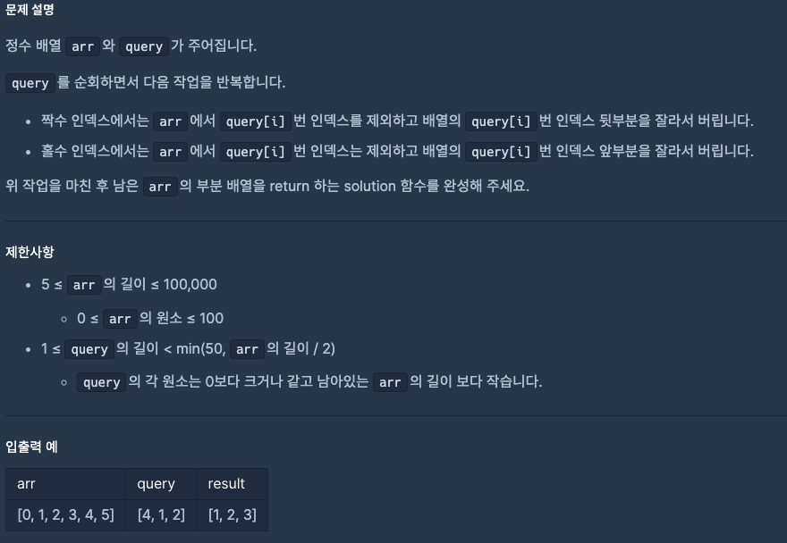

# 0812 공부내용 📖

## 매일매일 1일 면접 대비

### __실행 컨텍스트에 대해서 설명해주세요.__
-> 실행컨텍스트란, 자바스크립트에서 코드가 실행되는 환경을 의미한다.

자바스크립트 엔진이 코드를 실행할 때, 그 코드가 실행될 때의 환경을 정의하고 관리하기 위해 존재하는 것이 실행 컨텍스트이다.

- __전역 실행 컨텍스트__: 자바스크립트가 처음 실행될 때 생성되는 컨텍스트, 프로그램이 종료될 때까지 유지되며, 전역에 선언된 변수나 함수가 모두 포함된다. 전역 컨텍스트에서 선언된 변수와 함수는 프로그램 내 어디서든 접근이 가능하다.
기본적으로 자바스크립트는 싱글 스레드이기 때문에, 전역 실행 컨텍스트는 1개만 존재한다.

- __함수 실행 컨텍스트__: 실행 컨텍스트는 크게 변수 객체, 스코프 체인, this라는 구성 요소로 이루어져있다.

    - 변수 객체: 실행 컨텍스트 내에서 사용되는 변수와 함수 선언을 저장하는 공간이다, 전역 컨텍스트에는 전역 객체가 변수 객체의 역할을 하고, 함수 컨텍스트에서는  __활성 객체__ 가 변수와 매개변수를 관리한다.

    - 스코프체인: 현재 실행 중인 컨텍스트와 외부 렉시컬 환경의 연결을 유지한다. 변수를 참조할 때 현재 컨텍스트에서 찾지 못하면 외부 환경으로 범위를 넓혀가며 변수를 찾는다.

    - this: this는 실행 컨텍스트에서 따라 참조하는 객체가 달라진다. 전역 컨텍스트에서는 this가 전역 객체를 가르키며, 함수 컨텍스트에서는 함수 호출 방법에 따라 달라진다. 실행 컨텍스트는 구성 요소를 바탕으로 JS 코드가 실행되는 동안의 환경을 관리하고, 코드 실행 시 변수의 유효 범위나 함수 호출의 맥락을 결정 짓습니다.


## 오늘의 알고리즘 문제

### 1번 문제
```
태어난 년도를 입력받아 현재 나이를 계산하는 함수를 만들어보세요
function calculateAge(birthYear) {
  // 이곳에 코드를 작성합니다.
}

console.log(calculateAge(1995)); // 30이 출력되어야 함

Answer
function calculateAge(birthYear) {
  const NOW = 2025;
  return NOW - birthYear;
}

console.log(calculateAge(1995));

```

### 2번 문제
```
// 3. 과일 배열에서 특정 과일이 있는지 확인하는 함수를 만들어보세요
const fruits = ["사과", "바나나", "오렌지", "포도"];

function hasFruit(fruitArray, targetFruit) {
  return fruitArray.includes(targetFruit);
}

or 

function hasFruit(fruitArray, targetFruit) {
  for (let fruit of fruitArray) {
    if (fruit === targetFruit) {
      return true;
    }
  }
  return false;
}

console.log(hasFruit(fruits, "바나나")); // true
console.log(hasFruit(fruits, "딸기")); // false

```

### 3번 문제



```
function solution(arr, query) {
  for (let i = 0; i < query.length; i++) {
    if (i % 2 === 0) {
      // 짝수 인덱스 → query[i] 뒤쪽 버림
      arr = arr.splice(0, query[i] + 1);
    } else {
      // 홀수 인덱스 → query[i] 앞쪽 버림
      arr = arr.splice(query[i]);
    }
  }
  return arr;
}

// 예시 실행
let arr = [0, 1, 2, 3, 4, 5];
let query = [4, 1, 2];
console.log(solution(arr, query)); 
```
