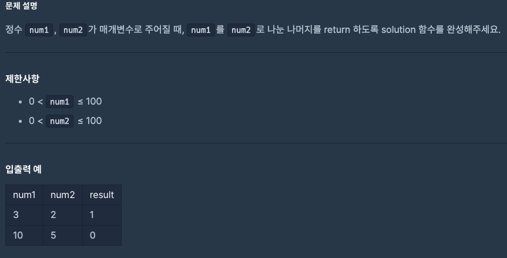

# 0819 공부내용 📖

## 매일매일 1일 면접 대비

### __React의 props와 state에 대해서 설명해주세요.__

- props: props는 __부모 컴포넌트가 자식 컴포넌트에 전달하는 데이터__ 이다.

  - props는 읽기 전용으로, 자식 컴포넌트는 props를 수정할 수 없다.
  이를 통해 컴포넌트 간의 데이터 흐름을 예측 가능하게 만들고, 컴포넌트의 재사용성을 높인다.

- state: state는 __컴포넌트 내부에서 관리되는 데이터__ 이다.
  - state는 동적으로 변경될 수 있으며, 컴포넌트의 렌더링에 영향을 미친다.
  - state를 변경하면 컴포넌트는 다시 렌더링되며, UI가 업데이트 된다.
  - state는 주로 사용자 입력이나 네트워크 요청의 응답에 따라 변하는 데이터를 관리할 때 사용된다.

#### props가 변하지 않는 이유는?

- props가 자식 컴포넌트에서 변하지 않는 이유는 리액트의 __단방향 데이터 흐름 원칙__
때문이다. 리액트는 부모 컴포넌트가 자식 컴포넌트에 데이터를 전달할 때 단방향으로 전달하도록 설계되어있다. 컴포넌트 간의 데이터 흐름을 예측 가능하고 일관성 있게 만들 수 있어 애플리케이션 상태 관리가 간단해 진다.

- props는 __읽기 전용__ 이기 때문에, 부모 컴포넌트에서 전달된 값이 자식 컴포넌트 내에서 임의로 변경되지 않는다. 이로 인해, 특정 상태가 어디서 어떻게 변했는지를 예측할 수 있어 버그 발생 가능성을 줄이고 디버깅을 쉽게 한다.

- 만약, ㅔorps가 변경될 수 있다면, 자식 컴포넌트는 독립적으로 동작하지 않게 되고, 재사용이 어려워질 수 있다. props가 불변으로 유지됨으로써 컴포넌트는 외부 입력에 의존할 뿐 내부적으로는 변경하지 않아 재사용성이 높아지고, 코드의 캡슐화가 강화된다.

#### 만약 자식 컴포넌트에서 부모 컴포넌트로부터 받은 props를 변경해야 한다면?

- 부모 컴포넌트에서 상태로 해당 데이터를 관리하고, 상태 변경 함수를 자식 컴포넌트로 전달하는 방식으로 구현해야한다. 이렇게 하면 데이터는 여전히 단방향으로 흐르고, 상태는 부모 컴포넌트가 관리하므로 일관성을 유지할 수 있다. 이러한 기법을 __상태 끌어올리기__ 라고 한다.

 ### 리액트의 Controlled Component와 Uncontrolled Component의 차이점에 대해서 설명해주세요.

 - Controlled Component는 리액트 상태 (state)를 통해 입력값을 제어하는 컴포넌트이다. 이 방식에서는 입력 요소의 값(value)을 리액트 상태와 동기화하고, 사용자가 입력을 변경할 때마다 onChange 이벤트 핸들러를 통해 상태를 업데이트한다.
 Controlled Component는 값이 리액트의 state로 관리되므로, 입력 시마다 값을 검증하거나, 값을 자유롭게 변경할 수 있으며, 복잡한 폼 로직을 처리하는 데 유용합니다.

 - Uncotrolled component는 입력 값을 리액트의 상태로 관리하지 않고, DOM을 통해 입력 값을 제어하는 방식이다. 즉, 입력 요소의 값은 DOM에서 직접 관리, 리액트는 이를 제어하지 않는다. 이 방식에서는 useRef를 사용해 생성된 참조 객체인 ref를 사용하여 DOM 요소에 직접 접근하여 값을 읽거나 조작한다.
 Uncontrolled Component는 리액트 상태 관리에 따른 성능 비용이 없으므로 상대적으로 간단한 폼에서 주로 사용된다.

 #### Controlled Component와 Uncontrolled Component는 각각 어떤 상황에서 사용되나요?

 - 단순한 입력 필드가 포함된 폼에서는 입력 요소의 값을 리액트 상태로 관리할 필요성이 적으므로, Uncontrolled Component를 사용하는 것이 더 간단하고 성능이 좋다. 사용자가 제출 버튼을 클릭했을 때만 입력 값을 가져와도 충분한 경우를 예시로 들 수 있다. 반면, 값을 입력할 때마다 유효성 검증을 실시간으로 해주어야 하는 경우에는 Controlled Component를 사용해야 한다.

## 오늘의 알고리즘 문제

### 1번 문제


```
function solution(num1, num2) {
    let divide = num1 % num2;
    return divide;
}

```
### 2번 문제

```
function solution(age) {
    return 2022 - age + 1;
}
```

