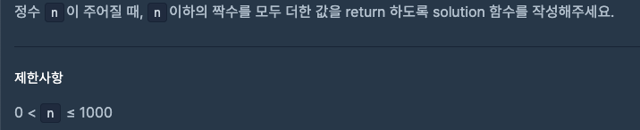
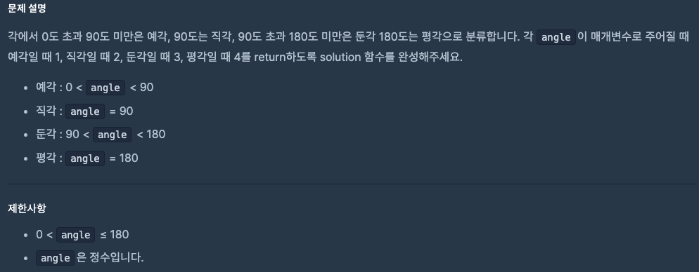

# 0819 공부내용 📖

## 매일매일 1일 면접 대비

### __브라우저 렌더링 파이프라인에 대해서 설명해주세요__
브라우저가 웹 페이지를 화면에 표시하기 위해 거치는 과정을 브라우저 렌더링 파이프 라인이라고 한다. 이 과정은 크게 6단계로 나눌 수 있다.

1. DOM 생성: 브라우저가 HTML파일을 받으면, 바이트 단위로 읽기 시작, 브라우저의 HTML Parser는 이 바이트들을 문자로 변환하고, 이 문자들을 다시 HTML 토큰으로 변환한다. 이 토큰들은 각각의 태그와 그 안에 포함된 텍스트, 속성 등을 의미하게 된다. HTML 토큰이 생성되면, 브라우저는 이를 기반으로 DOM 트리를 생성, 각 태그가 노드가 되어 부모-자식 관계를 형성하게 된다.

2. CSSOM 생성: 브라우저는 CSS 파일을 Parsing, 브라우저는 CSS 파일을 바이트 단위로 읽고 문자로 변환 뒤 CSS 규칙으로 나눈다. CSS 규칙은 선택자와 선언으로 구성, 선택자는 스타일을 적용할 HTML 요소를 정의하고, 선언은 적용할 스타일을 정의한다. 브라우저는 이 CSS 규칙들을 기반으로 CSSOM 트리를 생성.

3. 렌더 트리 생성: 브라우저는 DOM과 CSSOM을 결합하여 렌더 트리를 생성, 렌더 트리는 화면에 실제로 표시될 요소들로만 구성 ex) display: none;은 포함되지 않는다.
렌더 트리의 각 노드는 DOM 트리의 요소와 연결되며, CSSOM 트리에서 해당 요소에 적용된 스타일 정보를 포함, 즉, 렌더 트리는 HTML 문서의 구조와 각 요소의 스타일 정보를 모두 포함한 트리이다.

4. 레이아웃: 렌더트리가 생성된 후, 브라우저는 이 트리를 사용해 각 요소의 정확한 위차와 크기를 계산하는데 이것을 __레이아웃__ 이라고 한다. 레이아웃 과정에서는 렌더 트리의 각. ㅗ드가 화면의 어디에 위치할지, 얼마나 큰지를 계산하게 되는데 이 계산은 화면의 뷰포트 크기와 같은 정보에 의존하게 된다. 만약, 화면 크기가 변경되면 브라우저는 레이아웃 과정을 다시 수행해야 한다. 이를 Reflow라고 부르는데, Reflow는 성능에 영향을 줄 수 있으므로 최소화 하는것이 좋다.

5. 페인팅: 레이아웃이 완료되면, 브라우저는 각 요소를 실제로 화면에 그리는 작업을 시작, 페인팅 당계에서는 텍스트, 색상, 그림자, 이미지 등 모든 시각적 요소가 화면에 그려진다.
페인팅은 화면에 표시될 그래픽 요소를 생성하는 과정이기 때문에, 이 과정도 성능에 큰 영향을 줄 수 있다. 특히, 그래픽이나 애니메이션이 포함된 경우 페인트 작업이 많아져서 성능이 저하될 수 있다.

6. 컴포지팅: 브라우저는 화면에 그려질 요소들을 각각의 레이어로 분리하고, 이 레이어들을 결합하여 최종 화면을 구성한다. 이 과정에서는 GPU를 활용하여 각 레이어를 빠르게 합성한다.
transform이나 opacity 같은 속성은 레이아웃이나 페인트 과정을 거치지 않고, 이 컴포지팅 단계에서만 처리된다. 이 덕분에 속성을 사용하는 애니메이션은 더 부드럽고 빠르게 실행될 수 있다. 컴포지팅 단계는 GPU 가속을 활용하여 성능을 최적화하고, 화면에 최종적으로 표시되는 결과를 빠르게 생성하는 데 중요한 역할을 한다.


## 오늘의 알고리즘 문제

### 1번 문제


```
function solution(n) {
  let sum = 0;
  for (let i = 2; i <= n; i += 2) {
    sum += i;
  }
  return sum;
}
```
### 2번 문제


```
function solution(angle) {
  return angle < 90 ? 1 
       : angle === 90 ? 2 
       : angle < 180 ? 3 
       : 4;
}
```

## 오늘의 main 공부

