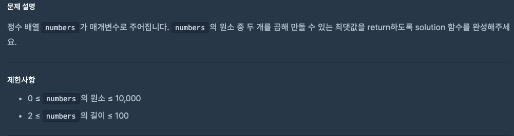
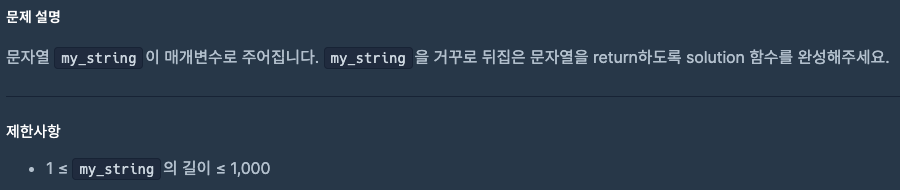

# 0821 공부내용 📖

## 매일매일 1일 면접 대비

### __리액트에서 성능 최적화를 위해 적용할 수 있는 방법들을 설명해주세요.__
- 메모이제이션: 리액트의 memo를 사용하여 컴포넌트를 메모이제이션할 수 있습니다. 컴포넌트의 props가 변경되지 않았을 때, 리렌더링을 방지하여 성능을 최적화합니다. 이는 특히 렌더링 비용이 큰 컴포넌트에서 유용합니다.

- useCallback과 useMemo를 활용. useCallback은 함수를 메모이제이션하여 불필요한 함수 재생성을 방지, useMemo는 값의 재계산을 방지하여 성능을 최적화, 이를 통해 자식 컴포넌트로 전달되는 함수나 값이 변경되지 않으면 리렌더링을 피할 수 있다.

- 코드 스플리팅: 큰 애플리케이션을 여러 개의 작은 청크로 나누어, 필요한 청크만 로드하게 하여 초기 로드 시간을 줄인다. React.lazy와 Suspense를 사용하여 동적으로 컴포넌트를 로드할 수 있다.

### 코드 스플리팅은 어떤 경우에 사용해야 할까요?
1. 초기 로딩 시간이 길어지는 경우, 애플리케이션이 커지면 초기 로딩에 모든 코드를 로드하는 것이 비효율적일 수 있다. 코드 스플리팅을 사용해 초기 로드 시 필요한 핵심 코드만 로드하고 추가적인 기능은 필요할 때 로드하면 초기 로딩 속도를 크게 개선할 수 있다.

2. 라우트별 코드 분할이 필요한 경우, SPA에서는 각 페이지가 별도의 기능과 UI를 가지므로, 라우트별로 필요한 코드만 분리하여 로드할 수 있다. 이 방식은 리액트의 React.lazy와 Suspense를 사용하여 라우트별 컴포넌트를 동적으로 불러올 때 유용하다.

### __인터넷 창에 www.google.com를 입력하면 무슨 일이 일어나는지 설명해주세요.__
1. DNS조회: 사용자가 www.google.com을 입력하면, 브라우저는 먼저 이 도메인 이름을 IP 주소로 변환해야 한다. 이 과정을 DNS 조회(DNS Lookup)이라고 한다. 브라우저는 캐시된 DNS 기록을 먼저 확인하고, 없으면 로컬 DNS 서버에 요청하여 www.google.com에 해당하는 IP 주소를 얻는다.

2. TCP 연결 수립: IP주소가 확인되면 브라우저는 서버와 TCP 연결을 수립한다. TCP(Transmission Control Protocol)는 데이터를 신뢰성 있게 전달하기 위한 프토로콜이다.
이 과정에서 브라우저는 서버와 3-way handshake를 수행한다. 즉, 브라우저가 SYN 패킷을 보내고, 서버가 SYN-ACK 패킷을 보내며, 다시 브라우저가 ACK 패킷을 보내는 과정이다.


* SYN 패킷: 연결을 시작하는데 사용되며, 일련번호를 포함한다. 이 번호는 클라이언트가 전솔할 데이터의 시작점을 나타낸다.
* SYN-ACK: 클라이언트의 SYN 패킷을 수신했고, 연결을 받아들였으며 다음 통신에 대비하기 위해 ACK(승인)을 포함한다. ACK 값은 클라이언트가 기존에 보낸 SYN 패킷의 Sequence Number에 1을 더한 값.

* 3-way Handshake를 사용하는 이유는? : 
  * 클라이언트와 서버간의 정확한 연결 설정을 보장하여 데이터 전송의 신뢰성을 높인다.
  * 각 패킷의 일련번호를 통해 데이터의 순서를 보장하여 올바른 조립과 응용프로그램의 전달을 가능하게 한다.
  * 각 단계에서 패킷의 일련번호를 동기화하여 중복된 연결 요청을 방지하고, 연결 상태를 정확히 파악한다.

3. HTTP요청: TCP 연결이 수립되면, 브라우저는 HTTP 또는 HTTPS 요청을 보낸다. 이 요청은 "GET / HTTP/1.1" 같은 형식으로, 웹페이지를 요청하는 메시지이다. 만약 HTTPS를 사용할 경우, 이 단계 이전에 SSL/TLS 핸드셰이크도 수행된다. 이 과정에서는 브라우저와 서버가 암호화된 연결을 설정하기 위해 보안 인증서를 교환하고, 암호화 키를 협상한다.
  * SSL/TLS 핸드셰이크란?:

4. 서버의 응답: 서버는 요청을 받고, 해당 리소스 (HTML, CSS, JS, 이미지 등)를 브라우저에게 응답을 보낸다. 이 응답은 HTTP 응답코드와 함께 전달되고 마지막으로 받은 리소스들을 바탕으로 브라우저 랜더링 파이프라인을 진행한다. DOM과 CSSOM을 생성하고, 랜더 트리를 구성한 뒤, 레이아웃과 페인트 단계를 통해 웹페이지가 화면에 표시 된다.
## 오늘의 알고리즘 문제

### 1번 문제


```
function solution(numbers) {
  // 배열 오름차순 정렬
  numbers.sort((a, b) => a - b);

  const n = numbers.length;
  // 가장 큰 두 수 곱, 가장 작은 두 수 곱 비교
  const max1 = numbers[n - 1] * numbers[n - 2];
  const max2 = numbers[0] * numbers[1];

  return Math.max(max1, max2);
}
```

### 2번 문제


```
function solution(my_string) {
  return my_string.split("").reverse().join("");
}
```

___________
## 오늘의 main 공부

### HTML
  ## 다양한 input 태그
**체크박스 `checkbox`**

**한 항목만 선택하는 경우**

아래 예시에서는 "동의합니다"에 체크하는 경우 `agreement`의 값이 `on`이라는 문자열로 지정된다.

```
html

<label>
  <input name="agreement" type="checkbox">
  동의합니다
</label>

```

**여러 항목 중에서 몇 항목을 선택하는 경우**

`<input>` 태그에 `value` 속성으로 값을 지정해 주면, 선택된 항목의 지정된 값이 쓰인다. 예를 들자면 아래 코드에서는 "액션"이랑 "코미디"를 선택했을 때 `film`의 값으로 `action`과 `comedy`라는 문자열이 지정된다. 폼을 전송했을 때 쿼리 문자열에서는 `&film=action&film=comedy`처럼 전송된다.

```html

<label for="film">좋아하는 영화 장르</label>
<label>
  <input type="checkbox" name="film" value="action">
  액션
</label>
<label>
  <input type="checkbox" name="film" value="comedy">
  코미디
</label>
<label>
  <input type="checkbox" name="film" value="romance">
  로맨스
</label>

```

**날짜 `date`**

선택한 날짜로 값을 지정할 수 있다.

```html

<input name="birthdate" type="date">

```

**파일 `file`**

정말 자주 쓰이는 타입이어서 이건 따로 기억해두자. 파일을 선택할 수 있는 인풋

```html

<input name="avatar" type="file">

```

**파일 형식 지정하기**

`accept`라는 속성을 써서 허용할 파일 확장자들을 정해 줄 수 있다.

```html

<input name="avatar" type="file" accept=".png,.jpg">

```

 **파일 개수 지정하기**

`multiple`이라는 참/거짓 속성을 사용하면 여러 개 또는 한 개만 선택하도록 정할 수 있다.

```html

<input name="photos" type="file" multiple> <!-- 여러 개 선택 가능 -->
<input name="avatar" type="file"> <!-- 한 개만 선택 가능 -->

```

**이메일 `email`**

텍스트를 입력할 수 있는 건 똑같지만, 버튼을 눌러서 폼을 전송할 때 올바른 이메일 형식인지 자동으로 검사해준다.

```html

<input name="email" type="email">

```

**숫자 `number`**

숫자를 입력하고, 최소 최대 값이나 버튼을 눌렀을 때 증가, 감소할 양을 정할 수 있다.

```html

<input type="number">

<!-- 100에서 1000사이 -->
<input type="number" min="100" max="1000">

<!-- 100에서 1000사이, 버튼을 눌렀을 때 100씩 증가, 감소 -->
<input type="number" min="100" max="1000" step="100">

```

**비밀번호 `password`**

값을 입력했을 때 입력한 내용이 가려준다.

```html

<input type="password">

```

**라디오 `radio`**

동그란 선택 버튼입니다. 체크박스와 다르게 여러 항목 중 하나의 항목만 선택할 수 있다. **`value`** 속성과 같이 사용하면, 같은 **`name`**을 가진 **`<input>`** 태그들 중에, 선택한 **`<input>`**의 **`value`** 값을 입력하도록 할 수 있다. 예를 들어서 아래 코드에서 "좋음"을 선택하면 **`feeling`**의 값으로 **`3`**이라는 값이 들어가게 된다.

```html

<input id="very-bad" name="feeling" value="0" type="radio">
<label for="very-bad">아주 나쁨</label>
<input id="bad" name="feeling" value="1" type="radio">
<label for="bad">나쁨</label>
<input id="soso" name="feeling" value="2" type="radio">
<label for="soso">보통</label>
<input id="good" name="feeling" value="3" type="radio">
<label for="good">좋음</label>
<input id="very-good" name="feeling" value="4" type="radio">
<label for="very-good">아주 좋음</label>

```

**범위 `range`**

범위 안에서 선택할 수 있는 인풋아다.

```html

<label for="signup-feeling">현재 기분</label>
<input id="signup-feeling" name="feeling" min="1" max="10" type="range">

```

**텍스트 `text`**

인풋 타입의 기본 값. 일반적인 텍스트를 입력할 때 사용한다.

```html

<input name="nickname" type="text">

```

**옵션 선택 `<select>`**

미리 정해져 있는 여러 값들 중에서 하나를 선택할 수 있는 태그이다. `<select>` 태그 안에 `<option>` 태그를 `value`와 함께 사용하면 되는데, 예를 들어서 아래 코드에서 드라마를 선택하면 `genre`의 값이 `drama`가 된다.

```html

<label for="genre">장르</label>
<select id="genre" name="genre">
  <option value="korean">한국 영화</option>
  <option value="foreign">외국 영화</option>
  <option value="drama">드라마</option>
  <option value="documentary">다큐멘터리</option>
  <option value="vareity">예능</option>
</select>

```

**긴 글 `<textarea>`**

긴 글을 입력할 수 있는 인풋입니다. `<input>` 태그와 달리 반드시 종료 태그(`</textarea>`)를 써 주어야 한다.

```html

<textarea name="content"></textarea>
```

**값이 비어있을 때 보여주는 값 `placeholder`**

값이 비어있는 인풋에 설명이 적혀있는 것 보신 적 있나요? 예를 들자면 아래 구글 로그인 화면에 있는 "이메일 또는 휴대전화" 같은 건데, 이런 걸 "플레이스홀더"라고 부른다.

[구글 로그인의 플레이스홀더 예시](https://bakey-api.codeit.kr/api/files/resource?root=static&seqId=5735&directory=input-attrs-00.png&name=input-attrs-00.png)

이런 값을 추가하려면 `placeholder`라는 속성을 쓰면 된다.

```html

<input name="username" placeholder="이메일 또는 휴대전화">

```

이때 `placeholder` 의 디자인을 바꾸려면 CSS 선택자로 `::placeholder` 를 활용하면 된다.

```css

input::placeholder {
  color: #dddddd;
}

```

# **반드시 입력해야 하는 값 `required`**

폼에서 반드시 입력해야 하는 값이 있다면 `required` 속성을 써주면 된다. 만약 `required`인 인풋의 값이 비어있다면, 전송 버튼을 눌러도 전송되지 않는다.

```html

<input name="email" type="email" required>

```

**자동 완성 `autocomplete`**

[구글 크롬의 자동 완성 예시](https://bakey-api.codeit.kr/api/files/resource?root=static&seqId=5735&directory=input-attrs-01.png&name=input-attrs-01.png)

예전에 입력한 값들을 보여주는 인풋을 보신 적 있나요?  이건 `autocomplete`이라는 속성을 써서 그런 건데요. 이 속성을 지정해 두면 폼이 전송될 때마다 입력한 값을 웹 브라우저에 저장해 두고, 나중에 인풋에 값을 입력할 때 추천해 줍니다.

참고로 `required`와 달리 `on`이라는 값을 지정해 주어야 동작하니까 꼭 기억해 주세요.

```html

<input name="search" type="text" autocomplete="on">

```


### CSS
# 포지셔닝 정리

# **`position` 속성**

글의 흐름에서 벗어나서 요소를 자유롭게 배치할 때 쓰는 속성입니다. `position`에 따라서 위치를 정하는 기준이 달라집니다.

기본 값은 `static`이고, `static`인 경우 원래 있어야 할 위치에 배치됩니다.

# **위치 정하기**

위치를 정하는 기준에 대해서 `top`, `right`, `bottom`, `left` 속성으로 위치를 정할 수 있습니다.

[0](https://bakey-api.codeit.kr/api/files/resource?root=static&seqId=5763&directory=positioning-summary-0.png&name=positioning-summary-0.png)

값이 모두 똑같은 경우  `inset` 속성을 씁니다.

[1](https://bakey-api.codeit.kr/api/files/resource?root=static&seqId=5763&directory=positioning-summary-1.png&name=positioning-summary-1.png)

# **`relative` 포지션**

요소의 원래 위치를 기준으로 배치합니다. 이때 요소의 원래 자리는 그대로 차지하고 있습니다.

[2](https://bakey-api.codeit.kr/api/files/resource?root=static&seqId=5763&directory=positioning-summary-2.png&name=positioning-summary-2.png)

```css

.green {
  position: relative;
  top: 15px;
  left: 10px;
}

```

# **`absolute` 포지션**

가장 가까운 포지셔닝이 된 조상 요소를 기준으로 배치됩니다. 이때 포지셔닝이 되었다는 건 `static`이 아니라는 (`position` 속성을 지정했다는) 의미입니다. 아래 예시에서는 `.red`가 `relative` 포지션이어서 `.blue`는 `.red`를 기준으로 배치됩니다. 이때 글의 흐름에서 완전히 빠져서, 요소의 원래 자리는 차지하지 않습니다.

[3](https://bakey-api.codeit.kr/api/files/resource?root=static&seqId=5763&directory=positioning-summary-3.png&name=positioning-summary-3.png)

```css

.red {
  position: relative;
  top: 0;
  left: 10px;
}

.blue {
  position: absolute;
  right: 10px;
  bottom: 15px;
}

```

# **`fixed` 포지션**

브라우저 화면을 기준으로 고정된 배치입니다. 글의 흐름에서 완전히 빠져서, 요소의 원래 자리는 차지하지 않습니다. 그래서 내비게이션을 만들거나 할 때 겹치지 않도록 마진을 넣어주기도 했었죠.

```css

.red {
  position: fixed;
  top: 0;
  left: 0;
  width: 100%;
}

```

# **`sticky` 포지션**

`static`처럼 원래 위치에 배치되어 있다가, 정해진 위치에 브라우저가 스크롤되면 그때부터 `fixed`처럼 고정되어 배치됩니다. 기본적으로는 `static`처럼 배치되기 때문에 요소의 원래 자리를 차지합니다.

```css

.red {
  position: sticky;
  top: 0;
  left: 0;
  width: 100%;
}

```

# **`z-index`값**

앞뒤 순서를 정할 때 쓰는 값입니다. 순서기 때문에 단위 없이 씁니다. 값이 높을수록 화면에서 앞쪽입니다. 값이 같으면 코드에서 아래 줄에 있는 요소가 앞쪽에 보입니다.

### JS

## 연산자 우선순위

하나의 연산식에 둘 이상의 연산자가 있는 경우, 실행 순서는 연산자의 우선순위(precedence)에 따라 결정됩니다. `5 + 3 * 6`이라는 기본적인 사칙 연산의 식이 있을 때 곱셈이 먼저, 그 후에 덧셈이 일어난다는 것을 알고 계시죠? 이런 개념이 바로 **연산자 우선순위**입니다. 여기서 곱셈은 덧셈보다 더 높은 우선순위를 가진다고 할 수 있는 것이죠. 그리고 우리가 의도적으로 우선순위를 조절 하고 싶을 때도 사칙 연산처럼 괄호를 사용하면 됩니다. `(5 + 3) * 6`라는 식에서는 곱셈보다 덧셈을 먼저 하는 것처럼 말이죠.

자바스크립트에는 기본적인 사칙 연산 외에도 다양한 연산자가 있습니다. 그리고 이 모든 연산자에는 우선순위가 매겨져 있는데요. **우선순위 숫자가 클수록 먼저 실행**됩니다.  순위가 같으면 대부분은 **왼쪽부터 시작해서 오른쪽으로 연산이 수행**됩니다. (간혹 `=` 이나 `**` 같이 몇몇 연산은 반대로 하는 경우도 있습니다.)

| **우선순위** | **연산자 유형** | **기호** |
| --- | --- | --- |
| **21** | **그룹** | **(...)** |
| **...** |  |  |
| **17** | **논리 NOT** | **! ...** |
| **17** | **typeof** | **typeof ...** |
| **16** | **거듭제곱** | **... ** ...** |
| **15** | **곱셈** | **... * ...** |
| **15** | **나눗셈** | **... / ...** |
| **15** | **나머지** | **... % ...** |
| **14** | **덧셈** | **... + ...** |
| **14** | **뺄셈** | **... - ...** |
| **...** |  |  |
| **12** | **미만** | **... < ...** |
| **12** | **이하** | **... <= ...** |
| **12** | **초과** | **... > ...** |
| **12** | **이상** | **... >= ...** |
| **11** | **동등** | **... == ...** |
| **11** | **부등** | **... != ...** |
| **11** | **일치** | **... === ...** |
| **11** | **불일치** | **... !== ...** |
| **...** |  |  |
| **6** | **논리 AND** | **... && ...** |
| **5** | **논리 OR** | **... II ...** |
| **...** |  |  |
| **3** | **할당** | **... = ...** |

다음 예시를 봅시다.

```jsx

typeof (6 * 2 === 11 || 13 - 7 < 7 && !true);

```

일단 우선순위가 꽤 높은 `typeof` 연산자가 나오긴 했지만, 가장 높은 우선순위인 괄호가 있으니 괄호 내부를 먼저 연산해야 합니다.
그런데 괄호 내부에서도 다양한 연산자가 있습니다. 그럼 다시 이 괄호 내부에서 가장 높은 우선순위인 NOT 연산자를 먼저 해결합시다. `true`의 NOT 연산이니, `false`가 되겠죠?

```jsx

typeof (6 * 2 === 11 || 13 - 7 < 7 && false);

```

그 다음으로 높은 우선순위는 사칙 연산이 되겠네요. 위 식에서는 곱셈과 뺄셈이 있으니 각각의 연산을 실행하면 아래와 같은 코드가 되겠죠?

```jsx

typeof (12 === 11 || 6 < 7 && false);

```

이제 남은 연산자들 중에서 우선 순위가 가장 높은 것은 비교 연산자입니다. 일치와 미만 먼저 연산하면 아래와 같은 결과가 됩니다.

```jsx

typeof (false || true && false);

```

이제 남은건 논리 연산입니다. 자칫 AND와 OR가 같은 우선순위라고 착각할 수 있는데요. 우선순위 표를 자세히 살펴보면 AND 연산이 OR 연산보다 우선순위가 한 단계 높습니다.

```jsx

typeof (false || false);

```

`true && false`의 연산 결과는 `false`이니까, 결과적으로 괄호 내부의 마지막 연산은 `false || false`가 됩니다.

```jsx

typeof false;

```

결국 이 연산의 마지막은 `typeof false`가 되고, 이 모든 연산의 결괏값은 문자열 `'boolean'`이 됩니다. 이렇게 복잡한 연산식을 작성할 때는 각 연산자들의 우선순위를 고려해서 작성해야 본인이 의도한 결괏값을 확실하게 얻어낼 수 있습니다. 또는 다른 사람이 작성한 연산식을 마주할 때도, 우선순위를 생각해서 이해해야 작성자의 의도를 명확하게 파악할 수 있습니다.

# 매일 1강씩 읽는 모던 자바스크립트 Deep Dive
  ## 변수란 무엇인가? 왜 필요한가?
  - 변수란?: 하나의 값을 저장하기 위해 확보한 메모리 공간 자체 또는 그 메모리 공간을 식별하기 위해 붙인 이름을 말한다.
    - 메모리 공간에 저장된 값을 식별할 수 있는 고유한 이름을 __변수명__
    - 변수에 저장된 값 __변수값__
    - 변수에 값을 저장하는 것을 __할당__ 이라고 한다.
  
  변수에 저장된 값의 의미를 파악할 수 있는 변수 이름은 가독성을 높이는 부수적인 효과도 있다.


