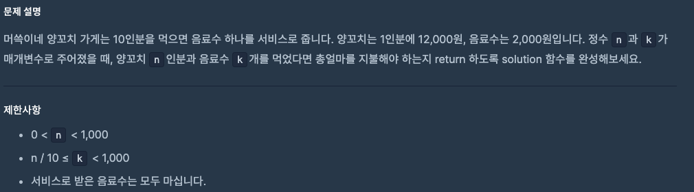

# 0821 공부내용 📖

## 매일매일 1일 면접 대비

### __React의 Strict Mode에 대해서 설명해주세요__
- Strict Mode는 주로 개발 중 발생할 수 있는 잠재적인 문제를 사전에 감지하고 예방하기 위해 사용된다.

  - __오래된 라이프사이클 메서드와 비권장 API 사용을 감지__ ex) componentWillMount(), componentWillReceiveProps()와 같은 메서드는 더 이상 사용을 권장하지 않는데, StrictMode는 이러한 메서드들이 코드에 포함된 경우 경고를 표시해준다. 이를 통해 개발자가 최신 React API를 사용하여 보다 안정적이고 효율적인 코드를 작성하도록 돕는다.

  - __의도치 않은 부수 효과를 방지__ 리액트는 컴포넌트의 렌더링이 예측 가능하고 순수하게 이루어지기를 기대하는데 StrictMode는 이를 검증하기 위해 useEffect(), useState() 등 일부 훅이나 메서드를 두번씩 실행한다. 그 이유는 동일한 결과가 나오는지 확인함으로써 컴포넌트가 사이드 이펙트를 일으키지 않고 순수하게 동작하는지를 검사하기 위함이다.
  이러한 검증이 중요한 이유는 예기치 않은 동작이나 버그를 사전에 방지하기 위함이다.
  개발 환경에서 두번씩 실행해봤을 때 문제가 발생하지 않으면, 프로덕션에서도 안전하게 실행된다는 신호라고 불 수 있다. 이 과정에서 부수 효과가 감지되면 개발자는 코드를 수정해야 한다.

### 코드가 두번씩 실행되면 성능에 문제가 발생하지 않나요?
- 두 번씩 실행되는 현상은 개발 모드에서만 발생하고, 실제 프로덕션 빌드에서는 정상적으로 한번만 실행되기 때문에 성능에 영향을 미치지 않는다.


## 오늘의 알고리즘 문제

### 1번 문제


``` js
function solution(n, k) {
  let meatPrice = n * 12000;
  let drinkPrice = (k - Math.floor(n / 10)) * 2000;
  return meatPrice + drinkPrice;
}
```

### 2번 문제


```jsx
function solution(sides) {
  // 배열에서 가장 긴 변을 찾는다.
  let max = Math.max(...sides);

  // 배열 안 모든 변의 길이를 합친다.
  let sum = sides.reduce((a, b) => a + b, 0);

  // 삼각형 조건:
  // "가장 긴 변 < 나머지 두 변의 합"
  // 나머지 두 변의 합 = 전체 합 - 가장 긴 변
  // 조건을 만족하면 1(삼각형 가능), 아니면 2(삼각형 불가능) 반환
  return max < (sum - max) ? 1 : 2;
}
```

## 오늘의 main 공부
  ### HTML
  **기본적인 폼의 형태**

```html

<form>
  <label for="username">아이디</label>
  <input id="username" name="username">
  <label for="password">비밀번호</label>
  <input id="password" name="password" type="password">
  <button>로그인</button>
</form>

```

**라벨**

`<label>` 태그로 `<input>`을 감싸면 라벨을 클릭했을 때 인풋에 포커싱이 된다.

```html

<label>
  아이디
  <input name="...">
</label>

```

혹은 라벨의 `for` 속성과 인풋의 `id` 속성을 일치시키면 클릭했을 때 인풋에 포커싱이 된다.

```html

<label for="username">아이디</label>
<input id="username" name="...">

```

**인풋 `<input>`**

`name` 속성은 폼을 전송했을 때 입력한 값에 매칭되는 이름이다. 예를 들어서 아래 코드에서는 인풋에 입력한 값이 `username`이라는 이름에 매칭된다.

```html

  <label for="...">아이디</label>
  <input id="..." name="username">

```

`type` 속성을 사용하면 다양한 인풋을 사용할 수 있다. 대표적으로 입력한 값을 가려주고 싶을 때는 `type="password"`를 사용한다.

```html

<label for="password">비밀번호</label>
<input id="password" name="password" type="password">
```


  ### CSS
  #### 다양한 크기 단위
  
  - 절대적인 단위 : px

  - 상대적인 단위: %, em, rem
  %: 부모 태그에 대해서 상대적인 크기 , 크기를 바꾸고 싶을때 부모의 크기만 바꾸면 됨

  ex) 


  er, rem: 글자 크기를 기준으로 상대적인 크기

  em: 인쇄에서 전통적으로 대문자 M의 크기, CSS에서 1em = 부모 태그의 font-size

  ex) 


  rem: 최상위 태그의 font-size (<html>)

  ex)


  페이지의 글자크기를 전체적으로 다루고 싶다면

  ```css
  html {
    font-size: 16px;

  }

  h1 {
    font-size: 2rem;
  }

  h2 {
    font-size: 1.5rem;
  }
  ```
  처럼 가장 큰 html에 지정하여 사용할 수 있다.

  ### JS
  # 변수의 scope (짱중요)

scope: 범위, 영역

변수가 선언되면 어디까지 유효한가 ?

```jsx
// Scope: 범위, 영역
function myFunction() { //블록문 (Block Statement)
	let x = 3; //로컬 변수, 지역변수 (Local Variable) 블록문 내에서만 사용 가능
	console.log(x);
}

myfunction();
console.log(x); 

let x = 3; // 글로벌 변수, 전역 변수 (Global Variable) 블록문 외에서 선언한 변수
function myFunction() { //블록문 (Block Statement)
	console.log(x);
}

myfunction();
console.log(x);

let x = 3;
function myFunction() { //블록문 (Block Statement)
	let x = 5;
	console.log(x);
}

myfunction();
console.log(x);

로컬 변수와 글로벌 변수가 둘 다 있을경우 블록문은 블록문 내에서 먼저 변수를 찾고 없다면 글로벌 변수를
출력, 블록문 내에 로컬 변수가 있다면 로컬 변수를 출력하겠죠 ?
```
  ### 매일 1강씩 읽는 모던 자바스크립트 Deep Dive

- 매일 1강씩 읽는 모던 자바스크립트 Deep Dive
  - 