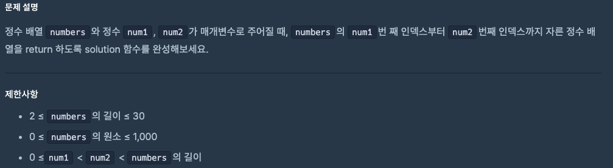
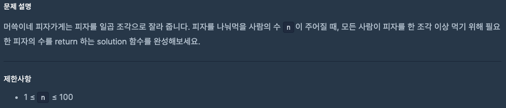
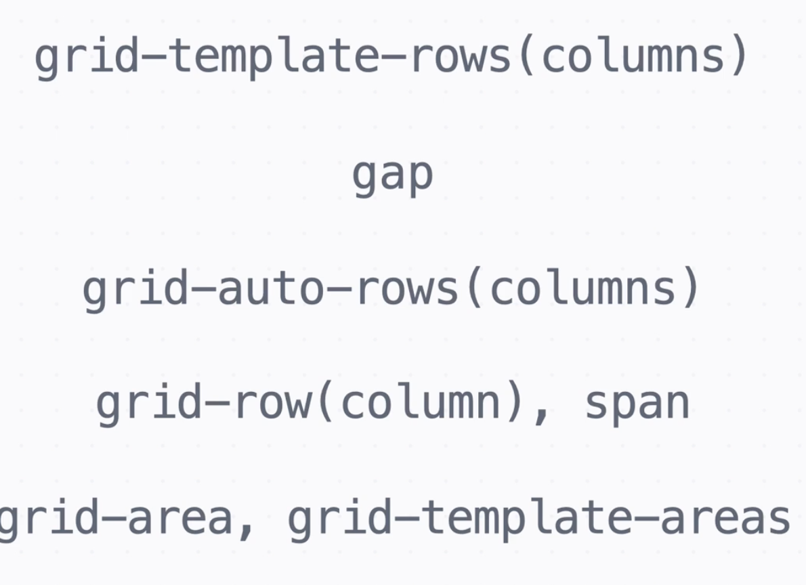
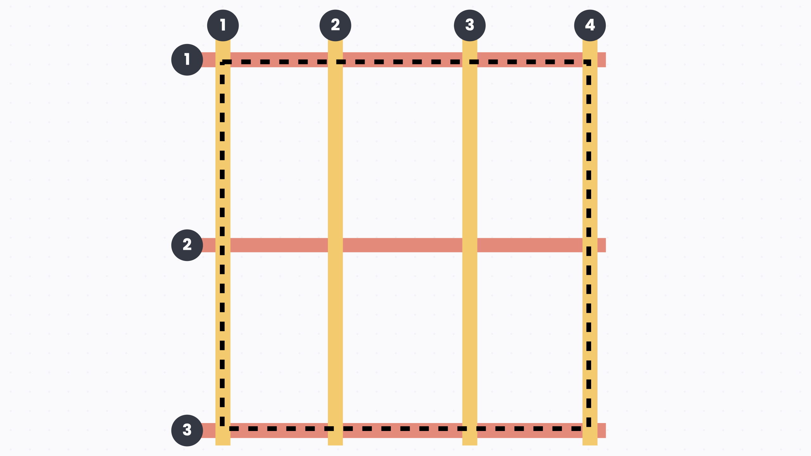
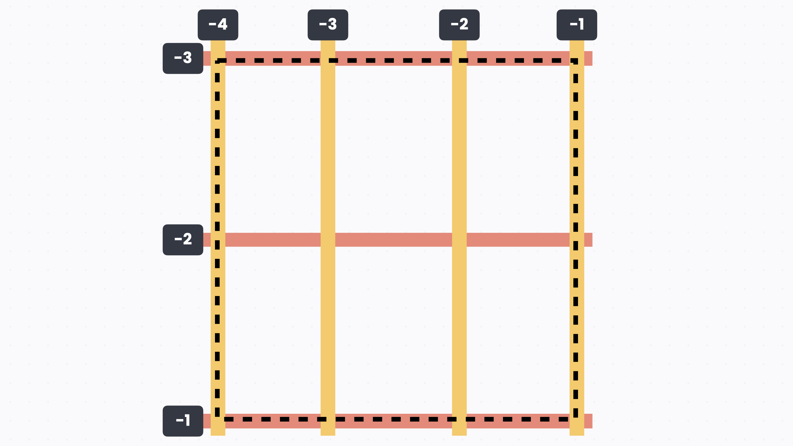
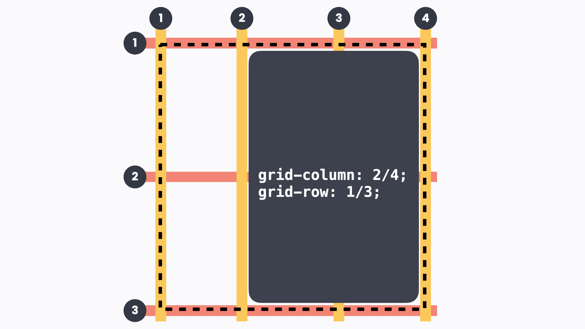
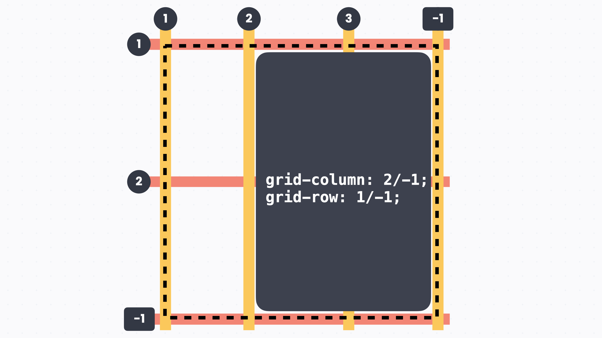
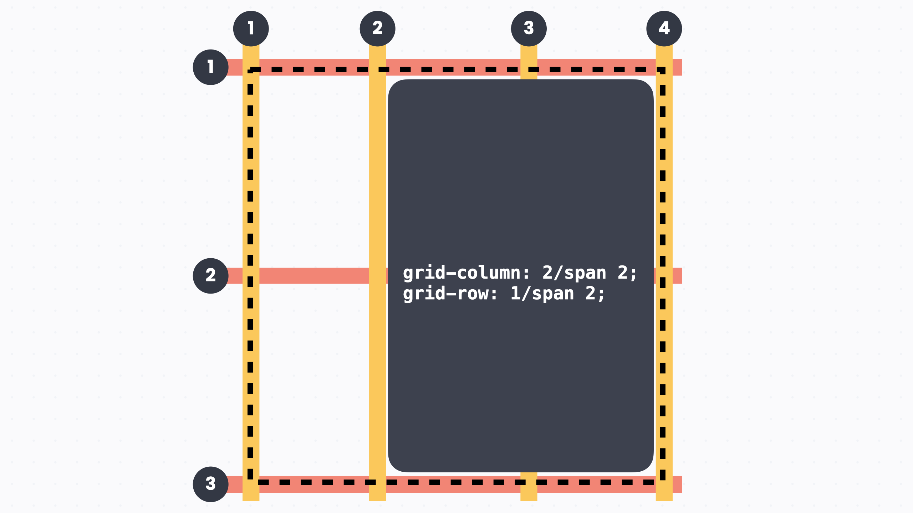
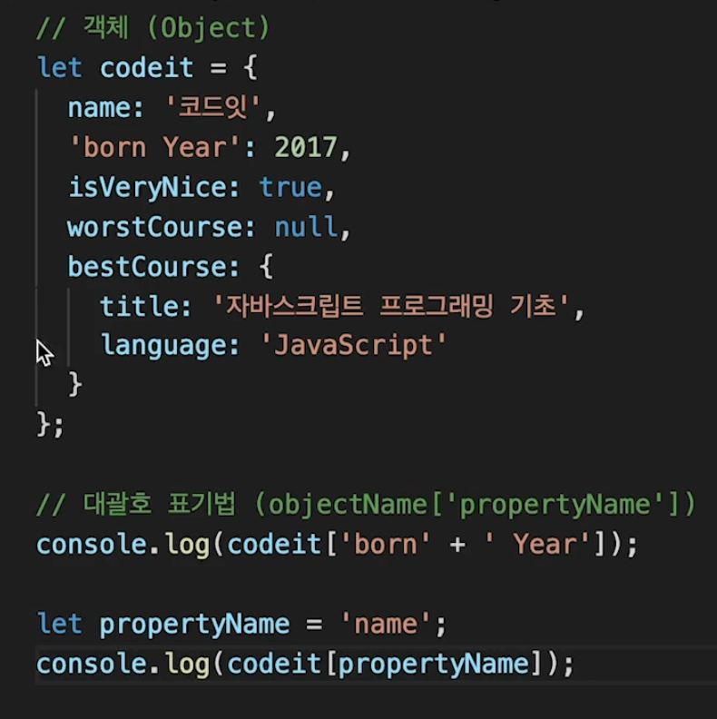

# 0821 공부내용 📖

## 매일매일 1일 면접 대비

### __리액트의 render phase와 commit phase에 대해서 설명해주세요__

- render phase는 리액트가 변화된 상태나 Props에 따라 어떤 UI가 변경되어야 할지를 결정하는 단계이다. 이 과정에서는 실제로 DOM을 업데이트하지 않고, 변경사항을 가상 DOM에서 계산하여 비교합니다. 이 단계는 순수하게 계산과정이기 때문에 성능에 영향을 주지 않도록 중단되거나 다시 실행될 수 있으며, React 18에서 도입된 Concurrent Mode를 통해 비동기적으로 처리될 수도 있다.

- commit phase는 실제로 변화된 UI를 DOM에 반영하는 단계이다. 리액트는 가상 DOM에서 계산된 결과를 실제 DOM에 적용하고, 변화된 UI를 브라우저에 랜더링한다. DOM 업데이트 이후에는 useEffect와 같은 사이드 이펙트를 발생시키는 훅들이 실행된다.

- 즉, render phase는 변화된 UI를 결정하는 계산 과정이고, commit phase는 그 계산된 결과를 실제로 반영하는 단계이다.

### __render phase와 commit phase가 동기화될 때의 특징이 있을까요?__
- __단계적 진행__ 과 __병목 관리__

- 단계적 진행: render phase가 완료되면 리액트는 즉시 commit phase를 실행하지 않고, __다른 높은 우선순위 작업이 있다면 먼저 처리한 후 나중에 commit phase를 실행__할 수 있다. 이러한 단계적 진행을 통해 React는 동기화가 필요한 작업을 효율적으로 관리하여 사용자 경험을 개선한다.

- 병목 관리: render phase에서 모든 변경 사항이 Fiber Tree에 준비된 상태에서 commit phase로 넘어가므로, render와 commit 단계의 일관성이 유지된다. 이렇게 두 단계는 순차적으로 작동하여 UI가 정확하게 동기화되고 불필요한 재렌더링을 방지한다.

## 오늘의 알고리즘 문제

### 1번 문제


```jsx
function solution(numbers, num1, num2) {
  // num1 ~ num2 까지 자른 배열 반환
  return numbers.slice(num1, num2 + 1);
}
```

slice(start, end) : 배열을 start 인덱스부터 end-1 인덱스까지 잘라서 반환

문제에서는 num2 번째 인덱스까지 포함해야 하므로 end 자리에 num2 + 1을 넣어야 한다.

### 2번 문제


```jsx
function solution(n) {
  return Math.ceil(n / 7);
}
/*Math.ceil은 무조건 위의 정수로 올려주는 메소드이다*/

/*if문으로 풀수는 없을까?*/
function solution(n) {
  // 몫과 나머지를 구한다
  let pizza = Math.floor(n / 7); // 나눗셈의 몫
  let rest = n % 7;              // 나머지

  // 나머지가 있으면 1판 더 필요
  if (rest > 0) {
    pizza += 1;
  }

  return pizza;
}
```


## 오늘의 main 공부
  ### HTML

  #### **시맨틱 태그**
  `<div>`와 기능은 똑같지만, 의미가 담겨있는 태그들을 '시맨틱 태그'라고 합니다. 엄격한 사용법이 있는 건 아니고, 작성하는 사람의 의도가 중요합니다. 시맨틱 태그를 잘 활용하면 검색 엔진 최적화(SEO)나 접근성(Accessibility)을 높이는데 도움이 됩니다.

| **태그 이름** | **용도** |
| --- | --- |
| **`<header>`** | **영역 위쪽에서 로고나 제목, 메뉴 같은 걸 담고 있는 도입부** |
| **`<main>`** | **사이트의 본격적인 내용으로 페이지에서 딱 한 번만 사용 가능** |
| **`<footer>`** | **영역 아래쪽에서 여러 가지 연락처나 관련 정보를 담고 있음** |
| **`<article>`** | **하나의 완성된, 독립적인 내용을 나타내는 영역** |
| **`<section>`** | **어떤 것의 일부분을 나타내는 영역** |
| **`<figure>`** | **이미지와, 이미지 설명을 담고 있는 영역** |

  ### CSS

  # GRID




# **그리드 나누기**

`display` 속성을 `grid` 로 하고 `grid-template-columns` 속성으로 컬럼을, `grid-template-rows` 속성으로 로우를 나눌 수 있습니다. 예를 들어서 3 x 2 그리드를 만드는데, 컬럼 너비는 각각 100px, 200px 100px이고 로우 너비는 150px 200px이라면 아래와 같이 쓸 수 있죠.

```css

display: grid;
grid-template-columns: 100px 200px 100px;
grid-template-rows: 150px 200px;

```

# **유연한 크기 단위**

`fr` 이라는 단위를 사용하면 플렉스박스처럼 전체 크기에 대해 상대적인 값을 지정할 수 있습니다. 예를 들어서 3 x 2 그리드에서 컬럼의 너비를 1 : 1 : 1로 하고 싶다면 아래처럼 할 수 있습니다.

```css

display: grid;
grid-template-columns: 1fr 1fr 1fr;
grid-template-rows: 150px 200px;

```

# **반복되는 값을 한 번에 쓰기**

`repeat()`으로 반복할 횟수와 값을 쓰면 코드를 깔끔하게 쓸 수 있습니다.

```css

display: grid;
grid-template-columns: repeat(3, 1fr);
grid-template-rows: 150px 200px;

```

# **최소, 최대값으로 크기 정하기**

최솟값과 최댓값을 지정해두면 이 사이에서 유연하게 크기가 조절되도록 할 수 있습니다. 예를 들어서 아래 코드는 컬럼의 너비가 최소 200px인데요. 화면 너비가 작아지더라도 컬럼의 너비는 200px보다 작아지지는 않고, 화면 너비가 넓어지면 컬럼의 너비는 1 : 1 : 1 비율로 늘어납니다.

```css

display: grid;
grid-template-columns: repeat(3, minmax(200px, 1fr));
grid-template-rows: 150px 200px;

```

# **간격 넣기**

`gap` 속성으로 간격을 넣습니다. 플렉스박스와 마찬가지로 값을 한 개만 쓰면 세로 가로 모두 간격을 지정할 수 있고, 세로 그리고 가로 순으로 숫자를 두 개 쓰면 세로 간격이랑 가로 간격을 지정할 수 있습니다. 예를 들어서 아래 코드는 세로 간격 20px, 가로 간격 10px로 지정한 코드입니다.

```css

display: grid;
grid-template-columns: repeat(3, minmax(200px, 1fr));
grid-template-rows: 150px 200px;
gap: 20px 10px;

```

# **원하는 위치로 배치하기**

`grid-column` 과 `grid-row` 속성을 사용하면 원하는 위치에 요소를 배치할 수 있습니다.

## **그리드 라인 번호**

컬럼 라인은 왼쪽에서부터 오른쪽으로 1, 2, 3, … 이렇게 번호를 붙이고, 로우 라인은 위에서부터 아래로 1, 2, 3, … 이렇게 번호를 붙입니다. 이때 테두리도 그리드 라인에 포함된다는 점에 주의하세요. 테두리부터 1번입니다. 예를 들어서 3 x 2 그리드리드에서는 컬럼 라인은 1, 2, 3, 4 이렇게 네 개가 있고, 로우 라인은 1, 2, 3 이렇게 세 개가 있습니다.


## **배치하기**

예를 들어서 2번 컬럼 라인에서 시작해서 4번 컬럼 라인에서 끝나고, 1번 로우 라인에서 시작해서 3번 로우 라인에서 끝나는 배치를 생각해 보겠습니다. 시작 라인과 끝 라인을 슬래시로 구분해서 적어주면 됩니다.



음수 값의 라인 넘버를 섞어서 써도 됩니다.



`span` 이라는 키워드를 쓰면 시작하는 라인 번호와 차지할 크기를 적어 줄 수 있습니다. 예를 들어서 아래의 경우 컬럼 2칸, 로우 2칸을 차지하니까 각각 `span 2`로 써 줬습니다.



# **이름으로 배치하기**

`grid-area` 로 영역에 이름을 붙이고, `grid-template-areas` 로 이름을 사용해 배치할 수 있습니다. 아래 코드는 2 x 2 그리드를 만들고 `.sidebar` 와 `.main` 그리고 `.player` 를 배치한 예시입니다. 참고로 셀을 비워놓고 싶다면 이름 대신 마침표(`.`)를 쓰면 됩니다.

```css

body {
  grid-template-areas:
    's m'
    'p p';
}

.sidebar {
  grid-area: s;
}

.main {
  grid-area: m;
}

.player {
  grid-area: p;
}
```

  ### JS

  ## 객체와 프로퍼티

여러가지 값을 한번에 저장하고 싶다면 객체를 사용하면 된다.

프로퍼티 네임은 string값을 갖고있다

Property Name 주의사항!

1. 첫 번째 글자는 반드시 문자, 밑줄, 달러 기호 중 하나로 시작
2. 띄어쓰기 금지
3. 하이픈(-) 금지

### 객체에서 데이터 접근하기



```jsx
let codeit = {
  name:'코드잇',
  'born Year': 2017,
  isVeryNice: true,
  worstCourse: null,
  bestCourse: {
    title: '자바스크립트 프로그래밍 기초',
    language: 'JavaScript'
  }
}

// 객체도 결국 값이기 때문에 객체를 다루기 위해선 
// 변수에 할당해서 이름을 만들어 줘야한다 

// 점 표기법
console.log(codeit.name);

//하지만 점 표기법을 사용하면 따옴표를 사용해야하는
//객체 네임에는 접근할 수 없다.

//대괄호 표기법
console.log(['born Year']);
//좀 더 유연하게 객체 네임을 정할 수 있다.

//객체 안의 객체에 접근할 때는 . . . [] [] [] 이런식으로 이어가면 된다.

 
```

## 객체 다루기

```jsx
객체 수정하기

해당 프로퍼티에 접근해서 값을 재할당해준다.

let codeit = {
  name:'코드잇',
  'born Year': 2017,
  isVeryNice: true,
  worstCourse: null,
  bestCourse: {
    title: '자바스크립트 프로그래밍 기초',
    language: 'JavaScript'
  }
};

console.log(codeit.name);
codeit.name = 'codeit';

마찬가지로 객체를 추가하고 싶다면

console.log(codeit.ceo);
codeit.ceo = 'codeit';
console.log(codeit.ceo);

-> 첫번째 콘솔.로그는 undefined가 뜨지만 그 다음줄에 객체를 추가해줌으로써 그 다음 콘솔.로그는 강영훈이
뜨게 된다.

객체 프로퍼티 삭제하기

let codeit = {
  name:'코드잇',
  'born Year': 2017,
  isVeryNice: true,
  worstCourse: null,
  bestCourse: {
    title: '자바스크립트 프로그래밍 기초',
    language: 'JavaScript'
  }
};

console.log(codeit.worstCourse);
delete codeit.worstCourse;
console.log(codeit.worstCourse);

//'propertyName' in Object
console.log('name' in codeit); 
//불린값으로  리턴, 이해하기 쉽고 프로퍼티를 확인할때 더 안전하게 하기 위해
//불린값을 리턴하기 때문에 if문의 조건부분에도 사용하기 용이하다.

```

## 객체와 메소드

```jsx
// 메소드 (Method)
연관성 있는 여러 함수를 함께 묶고싶을때 사용
let greetings = {
  sayHello: function() {
    console.log('Hello');
  },
  sayHi: function() {
    console.log('Hi');
  },
  sayBye: function() {
    console.log('Bye')
  }
};
//프로퍼티 값으로 함수를 넣어주면 된다, 이것을 객체의 메소드 라고 부른다.
//함수의 이름은 프로퍼티 네임이 대신해준다.
//그냥 함수를 사용해도 될탠데 왜 메소드를 만들어서 사용하는걸까?
//메서드는 어떤 객체의 고유한 동작으로서 함수에 의미를 부여할 수 있기 때문이다.

ex) 
let rectAngle = {
  width: 30,
  height: 50,
  getArea: function() {
    return rectAngle.width * rectAngle*height;
  }
};

let triAngle ={
  width: 15,
  height: 40,
  getArea: function() {
    return triAngle.width * triAngle.height / 2
  }
}

같은 getArea 함수지만 어떤 객체의 메소드냐에 따라서 그 객체에 맞는 동작을 할때 메소드를 사용
//만약 일반적인 함수였다면 함수 이름이 중복되지 않게 신경도 써야하고
//함수 내부를 상황에 따라 다르게끔 복잡하게 정의해야한다
//메소드를 활용하면 중복을 피할수있고 객체에 집중해서 정의할수 있다 고유한 동작으로 
//구분할수있기 때문에 조금 더 의미있는 코드로 활용이 가능한 장점이 있다

한 가지 조심해야 될 부분은 파라미터로 다른 변수에 담긴 값을 가져올 때는 대괄호 표기법을 
사용해 주어야 한다는 겁니다.
```

## for..in 반복문
```jsx
// for..in

let codeit = {
  name:'코드잇',
  'born Year': 2017,
  isVeryNice: true,
  worstCourse: null,
  bestCourse: {
    title: '자바스크립트 프로그래밍 기초',
    language: 'JavaScript'
  }
};

for (let key in codeit) {
	console.log(key);
}

for (변수 in 객체) {
	동작부분
}

//객체 안에 있는 프로퍼티 값들을 가지고 반복적인 동작을 수행할 때 사용
//객체의 프로퍼티 네임이 변수에 할당되고 객체의 프로퍼티 갯수만큼 동작부분이 실행된다.

// for..in

let codeit = {
  name:'코드잇',
  'born Year': 2017,
  isVeryNice: true,
  worstCourse: null,
  bestCourse: {
    title: '자바스크립트 프로그래밍 기초',
    language: 'JavaScript'
  }
};

for (let key in codeit) {
	console.log(key); //객체 내의 프로퍼티에 접근
	console.log(codeit[key]); //객체 내의 프로퍼티 값에 접근하는 것
}
```
  ### 매일 1강씩 읽는 모던 자바스크립트 Deep Dive
  