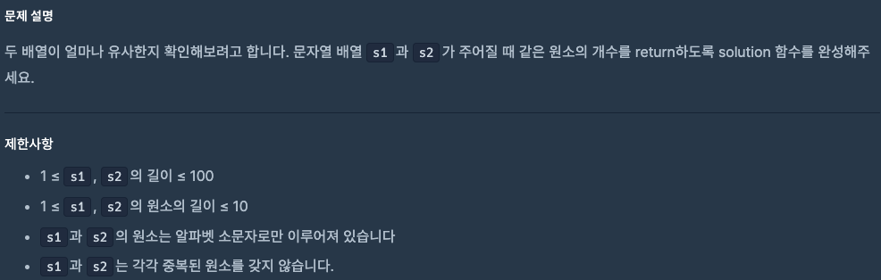
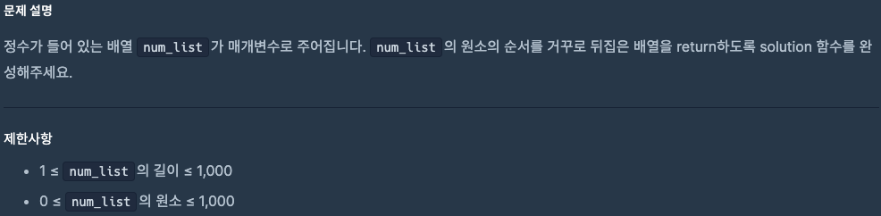
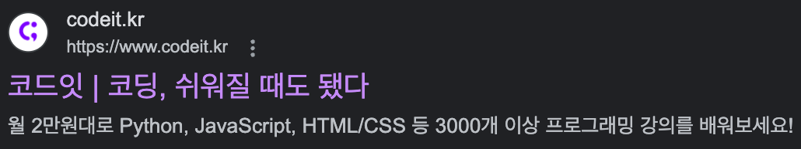
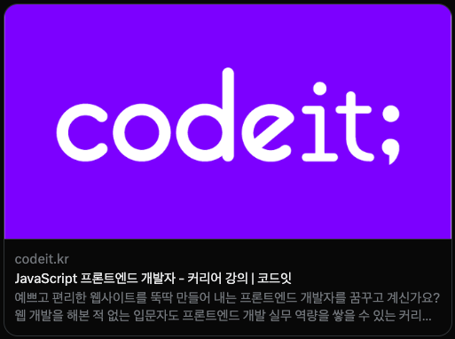
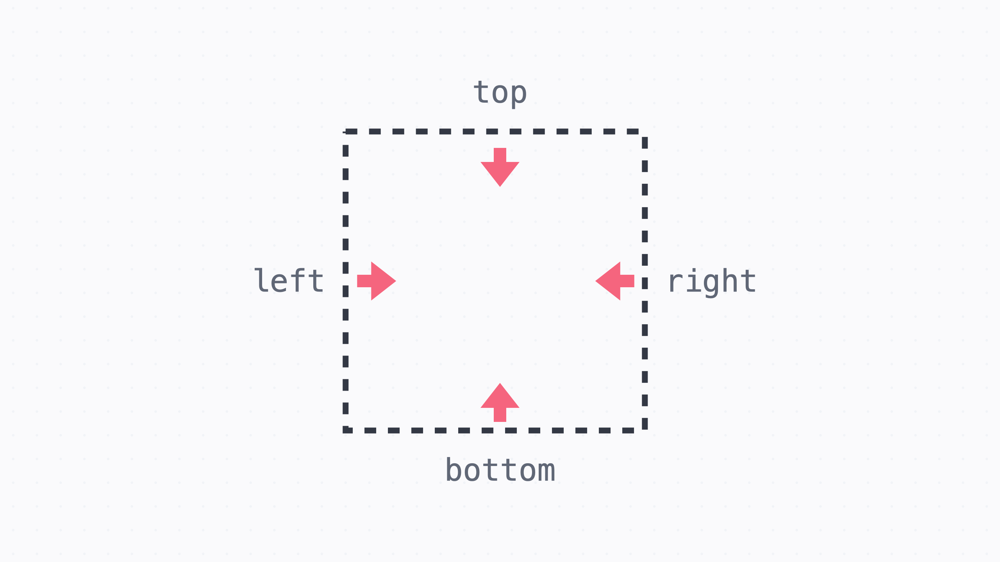
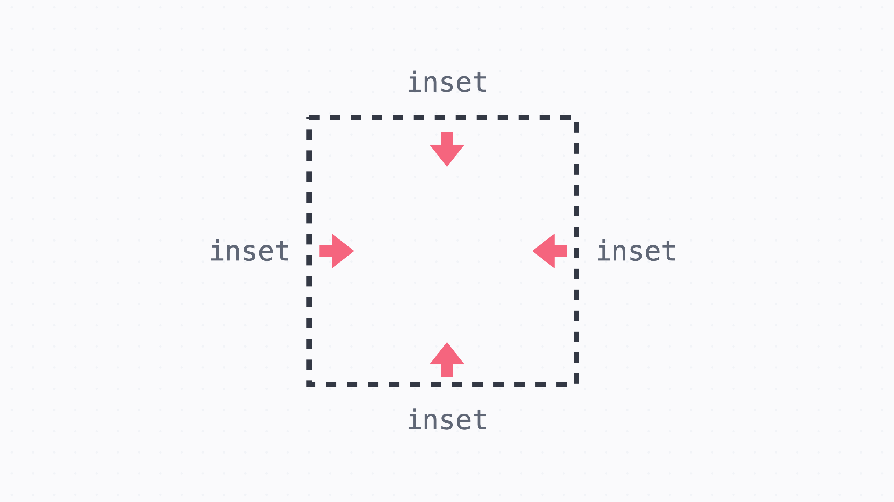
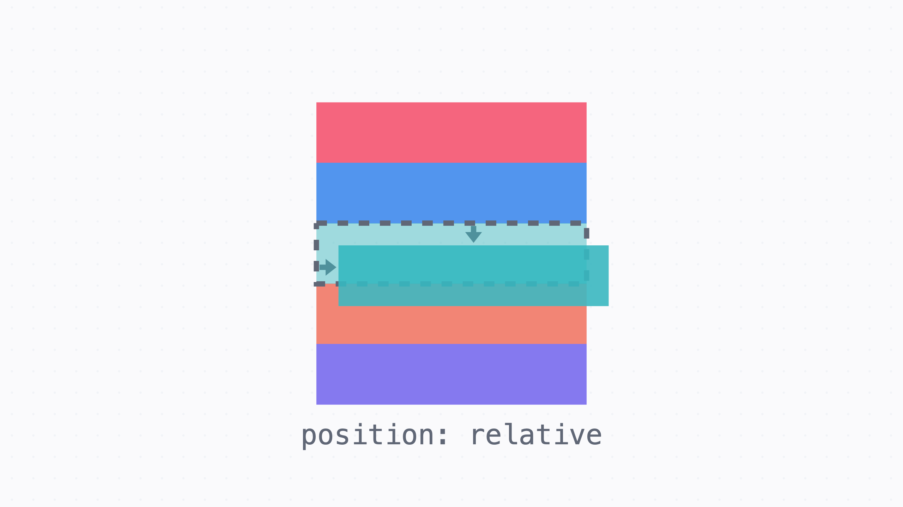
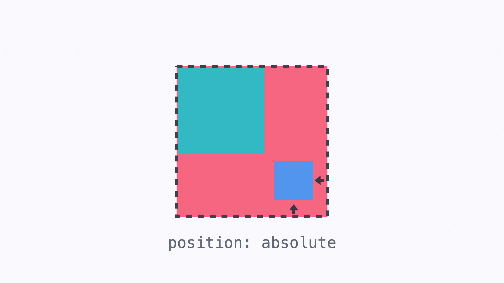
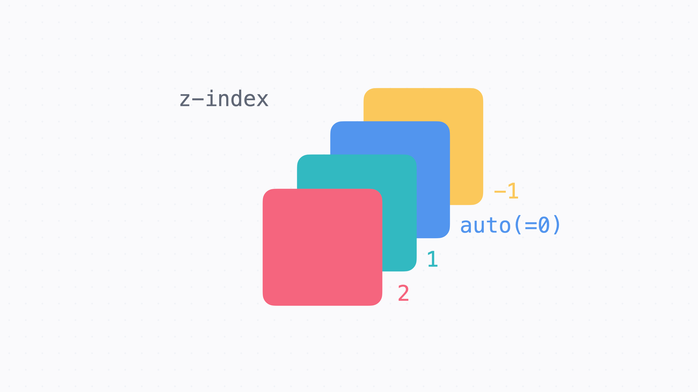

# 0821 공부내용 📖

## 매일매일 1일 면접 대비

### __자바스크립트 호이스팅에 대해서 설명해주세요.__
- __호이스팅__ 은 자바스크립트가 __코드를 실행하기 전에 변수와 함수 선언이 코드의 최상단으로 끌어올리는 것처럼 동작__ 하는 특징이다. 이 때문에 코드의 선언된 위치보다 상단에서 변수에 접근할 수 있는 것처럼 보일 수 있다.

- 호이스팅은 할당된 값까지 끌어올리지는 않는다. 예를 들어 var로 선언된 변수는 선언과 초기화는 끌어올려지지만 값 할당은 끌어올려지지 않기 때문에, 값 할당이 이루어지기 전까지는 undefined로 평가 된다 

```jsx
console.log(myVar); // undefined

var myVar = 10;
console.log(myVar); // 10
```

- 함수 선언식은 함수 자체가 호이스팅되기 때문에 함수 호출을 선언 이전에 해도 문제가 없다.

```jsx
console.log(myFunction()); // 'Hello World' 출력

function myFunction() {
  return 'Hello World';
}
```

- let과 const는 선언문 이전에 접근하려고 하면 ReferenceError가 발생한다.
- TDZ(Temporal Dead Zone) 이라는 개념 때문인데 이는 __변수가 선언되었지만 초기화되기 전까지의 구간__ 을 말한다.
let과 const로 선언된 변수에는 TDZ가 존재하며, 이 구간에서는 변수에 접근할 경우 ReferenceError가 발생한다. TDZ는 코드에서 변수가 선언된 시점부터 초기화될 때까지의 구간에서 변수를 사용하지 못하게 막아주는 역할을 한다.
```jsx
console.log(myLet); // ReferenceError 발생

let myLet = 10;
```


## 오늘의 알고리즘 문제

### 1번 문제


```jsx
function solution(s1, s2) {
  let set2 = new Set(s2);
  return s1.filter(item => set2.has(item)).length;
}
```

### 2번 문제


```jsx
function solution(num_list) {
    let arrayRevers = num_list.reverse()
    return arrayRevers
}

//원본을 유지한채로 뒤집고 싶다면

function solution(num_list) {
    return [...num_list].reverse(); 
}
```


## 오늘의 main 공부
  ### HTML
  # 메타태그란

메타 태그란 __meta__ 로 작성하는 HTML 태그로 메타데이터를 나타냅니다. 메타데이터는 데이터를 설명하는 데이터

즉, HTML 데이터를 설명하는 데이터를 갖는 태그입니다.

웹페이지에서 주로 설정하는 메타 태그입니다.

```h

<meta charset="utf-8">
HTML 문서의 문자 인코딩을 utf-8로 지정해요.
브라우저가 웹페이지를 해석하는 방식을 지정해서 문서의 깨짐이 없도록 해요.

<meta name="viewport" content="width=device-width, initial-scale=1, minimum-scale=1, maximum-scale, user-scalable=no">

/* name="viewport"  설정으로 반응형 웹 사이트를 제작

width=device-width: 장치의 화면 너비를 따르도록 페이지 너비를 설정

initial-scale=1: 브라우저에서 페이지를 처음 로드할 때 배율을 1로 설정

minimum-scale=1: 최소사이즈를 1배로 처리해서 축소를 못하게 막음

maximum-scale=1: 최대사이즈를 1배로 처리해서 확대를 못하게 막음

user-scalable=no: 사용자크기변화를 no로 처리해서 크기변화를 못하게 막음.

<meta http-equiv="X-UA-Compatible" content="IE=edge">
인터넷 익스플로러에서 최신 표준 모드로 보여주는 코드에요.

<meta name="robots" content="noindex">
name="robots" 설정으로 크롤러의 동작에 대해 규칙을 정할 수 있어요.
검색결과에 이 페이지, 미디어 또는 리소스를 표시하지 않아요. 이 규칙을 지정하지 않으면 페이지, 미디어 또는 리소스가 색인 생성되어 검색결과에 표시될 수 있어요.
*/

```


# **사이트를 설명하는 데 사용하는 메타 태그**



```html

<title>코드잇 | 코딩, 쉬워질 때도 됐다</title>
<meta
    name="description"
    content="월 2만원대로 Python, JavaScript, HTML/CSS 등 3,000개 이상 프로그래밍 강의를 배워보세요!"
>
```

## **SNS 공유할 때 링크 미리 보기에 사용**

- 페이스북
    

    

```html

<meta property="og:image" content="/static/images/brand/og_tag.png">
<meta property="og:title" content="코드잇 | 코딩, 쉬워질 때도 됐다">
<meta
    property="og:description"
    content="월 2만원대로 Python, JavaScript, HTML/CSS 등 3,000개 이상 프로그래밍 강의를 배워보세요!"
>
<meta property="og:url" content="https://www.codeit.kr">

```

- 트위터
    

    
    ```html
    
    <meta name="twitter:card" content="summary_large_image">
    <meta name="twitter:image" content="/static/images/brand/og_tag.png">
    <meta
        name="twitter:title"
        content="JavaScript 프론트엔드 개발자 - 커리어 강의 | 코드잇"
    >
    <meta
        name="twitter:description"
        content="예쁘고 편리한 웹사이트를 뚝딱 만들어 내는 프론트엔드 개발자를 꿈꾸고 게신가요? ..."
    >
    ```
    

# **어떻게 사용할까?**

`<head>` 안에 문서를 설명하는 `<meta>` 를 넣습니다. 메타 태그는 닫는 태그가 없습니다.

메타 태그의 특성은 [해당 링크](https://developer.mozilla.org/ko/docs/Web/HTML/Element/meta)를 통해 확인할 수 있습니다. 그리고, 메타 태그에 `name` 으로 설정 가능한 값들은 [해당 링크](https://developer.mozilla.org/ko/docs/Web/HTML/Element/meta/name)를 통해 확인할 수 있습니다.

OG 태그는 아래와 같이 사용하고, OOO 자리는 원하는 속성을, XXXX 자리에는 속성에 해당하는 값을 입력하면 됩니다.

```html

<meta property="og:OOO" content="XXXX">

```

[링크를 참고](https://ogp.me/)하면 OG 태그에 대한 자세한 규약을 알 수 있습니다.

Twitter 태그도 아래와 같이 OOO자리에는 원하는 속성을, XXXX 자리에는 속성에 해당하는 값을 입력하면 됩니다.

```html

<meta name="twitter:OOO" content="XXXX" >

```

[링크를 참고](https://developer.twitter.com/en/docs/twitter-for-websites/cards/overview/abouts-cards)하면 Twitter 태그에 대한 자세한 안내를 확인할 수 있습니다.

또한 디버거를 활용하면, 내가 제대로 태그를 설정했는지 빠르게 확인할 수 있습니다.

- [카카오톡 디버거](https://developers.kakao.com/tool/debugger/sharing)
- [페이스북 디버거](https://developers.facebook.com/tools/debug/)
- [트위터](https://cards-dev.twitter.com/validator)

## **동적인 OG 태그 (Twitter 태그도 동일)**

```jsx

<head>
    <meta property="og:title" content={data?.title}>
</head>
```

웹 페이지 데이터 요청 시 HTML이 최초로 만들어지고 난 뒤, 추가로 데이터를 요청하고 받아와서 동적으로 OG 태그를 만드는 것은 불가능합니다. 위의 예를 보면, 브라우저가 최초로 사이트에 데이터 요청할 때, `data?.title`의 값은 `undefined` 인 상태로 HTML을 받고, 이후 브라우저가 데이터를 요청해서 `data?.title` 값이 채워집니다. 하지만, SNS 공유에서 링크 미리 보기를 만들 때는 한 번의 요청으로 받아온 데이터를 기준으로 미리 보기를 만들고 끝나기 때문에 `content=undefined` 인 상태로 링크 미리 보기를 만들어서 미리 보기가 보이지 않거나 원하는 데이터를 볼 수 없습니다.

그래서 이런 경우엔 `data?.title` 에 해당하는 데이터를 먼저 받고 나서 HTML을 생성해야 합니다. 이를 위해서 프론트엔드 서버에서 데이터를 받아서 HTML을 생성한 뒤 전달하거나, 소스 코드를 빌드하는 단계에서 미리 데이터를 받아 HTML을 생성하는 방법이 있습니다.

현재 진도에서 이해하기 힘들 수 있는데, 일단 넘어가고 추후 데이터 요청 및 응답에 대해 학습한 뒤 다시 보면 비교적 쉽게 이해할 수 있습니다.

## **카카오톡 링크 미리 보기가 동작하지 않는 경우**

[카카오톡 scrap(url 미리 보기) 안될 때 체크 리스트](https://devtalk.kakao.com/t/scrap-url/116202)

  ### CSS
# **`position` 속성**

글의 흐름에서 벗어나서 요소를 자유롭게 배치할 때 쓰는 속성입니다. `position`에 따라서 위치를 정하는 기준이 달라집니다.

기본 값은 `static`이고, `static`인 경우 원래 있어야 할 위치에 배치됩니다.

# **위치 정하기**

위치를 정하는 기준에 대해서 `top`, `right`, `bottom`, `left` 속성으로 위치를 정할 수 있습니다.



값이 모두 똑같은 경우  `inset` 속성을 씁니다.



# **`relative` 포지션**

요소의 원래 위치를 기준으로 배치합니다. 이때 요소의 원래 자리는 그대로 차지하고 있습니다.


```css

.green {
  position: relative;
  top: 15px;
  left: 10px;
}

```

# **`absolute` 포지션**

가장 가까운 포지셔닝이 된 조상 요소를 기준으로 배치됩니다. 이때 포지셔닝이 되었다는 건 `static`이 아니라는 (`position` 속성을 지정했다는) 의미입니다. 아래 예시에서는 `.red`가 `relative` 포지션이어서 `.blue`는 `.red`를 기준으로 배치됩니다. 이때 글의 흐름에서 완전히 빠져서, 요소의 원래 자리는 차지하지 않습니다.


```css

.red {
  position: relative;
  top: 0;
  left: 10px;
}

.blue {
  position: absolute;
  right: 10px;
  bottom: 15px;
}

```

# **`fixed` 포지션**

브라우저 화면을 기준으로 고정된 배치입니다. 글의 흐름에서 완전히 빠져서, 요소의 원래 자리는 차지하지 않습니다. 그래서 내비게이션을 만들거나 할 때 겹치지 않도록 마진을 넣어주기도 했었죠.

```css

.red {
  position: fixed;
  top: 0;
  left: 0;
  width: 100%;
}

```

# **`sticky` 포지션**

`static`처럼 원래 위치에 배치되어 있다가, 정해진 위치에 브라우저가 스크롤되면 그때부터 `fixed`처럼 고정되어 배치됩니다. 기본적으로는 `static`처럼 배치되기 때문에 요소의 원래 자리를 차지합니다.

```css

.red {
  position: sticky;
  top: 0;
  left: 0;
  width: 100%;
}

```

# **`z-index`값**

앞뒤 순서를 정할 때 쓰는 값입니다. 순서기 때문에 단위 없이 씁니다. 값이 높을수록 화면에서 앞쪽입니다. 값이 같으면 코드에서 아래 줄에 있는 요소가 앞쪽에 보입니다.


### JS
## 배열

```jsx
let courseRanking = [
	'자바스크립트 프로그래밍 기초',
	'Git으로 배우는 버전관리',
	'컴퓨터 개론',
	'파이썬 프로그래밍 기초'
];

순서가 더 중요할 때 
//배열의 순서를 index라고 부르고 
//index = propertyName이라고 생각하면 된다.

//배열에 접근하는 것을 Indexing이라고 부른다.
//index는 0부터 시작한다.
console.log(courseRanking[0]);
시리즈 물, 순서가 있는 것들..?
let dataType = ['number', 'string', 'boolean', 'null', 'undefined', 'object'];

// 여기에 코드를 작성하세요
for (let i = 0, i <= 5, i++) {
  console.log(${dataType[i]});
}
```

## 배열 다루기

```jsx
let members =['쿤갈레', 'Zerrad66', 
'우리생각해써', '흙토끼', 'End Miracle'];

console.log(members.length);
console.log(members['length']);

//배열의 마지막 요소에 접근하는 방법
console.log(members[members.length - 1]);

//배열의 요소를 추가하거나 수정하는법
members[5] = 'NiceCodeit'
console.log(members[5]);

//주의할 것은 배열의 length값을 뛰어 넘는 숫자를 넣으면
//자동으로 undefined 값이 추가로 생성된다.

//배열을 조금 더 효과적이고 안전하게 다루려면 메소드를 이용해야한다.

```

## 배열 메소드 I

```jsx
//배열의 완전한 삭제
let members =['쿤갈레', 'Zerrad66', 
'우리생각해써', '흙토끼', 'End Miracle'];

console.log(members);
delete members[4];
console.log(members);
-->[ '쿤갈레', 'Zerrad66', '우리생각해써', '흙토끼', 'End Miracle' ]
[ '쿤갈레', 'Zerrad66', '우리생각해써', '흙토끼', <1 empty item> ] 

empty item이라고 나올뿐 배열 자체가 삭제되지는 않았다
완전하게 삭제하려면 **splice 메소드**를 사용해야한다.

//splice

members.splice(4);
console.log(members);
-> [ '쿤갈레', 'Zerrad66', '우리생각해써', '흙토끼' ]

members.splice(1, 2); -> 1번 인덱스 다음의 2개를 삭제하겠다는 뜻.

splice (startIndex, deleteCount, item)
members.splice(1, 1, 'NiceCodeit', 'HiCodeit');
console.log(members);
-> 'NiceCodeit', 'HiCodeit'이 들어가게 된다.

```

## 배열의 메소드 II

```jsx
let members =['쿤갈레', 'Zerrad66', 
'우리생각해써', '흙토끼', 'End Miracle'];

console.log(members);

//splice (startIndex, deleteCount, item)
//배열의 첫 요소를 삭제
members.splice(0, 1);

// 배열의 마지막 요소를 삭제
members.splice(members.length-1, 1);

//배열의 첫 요소로 값 추가
members.splice(0, 0, 'NiceCodeit');

//배열의 마지막 요소로 값 추가
members.splice(members.length-1, 0, 'HiCodeit');

조금 더 간결하게 하려면 어떻게 해야할까?

//배열의 첫 요소를 삭제 :shift();
members.shift();
members.splice(0, 1);

// 배열의 마지막 요소를 삭제:pop();
members.pop();
members.splice(members.length-1, 1);

//배열의 첫 요소로 값 추가:unshift(value);
members.unshift('NiceCodeit');
members.splice(0, 0, 'NiceCodeit');

//배열의 마지막 요소로 값 추가: push(value);
members.push('HiCodeit');
members.splice(members.length-1, 0, 'HiCodeit');

function range(start, count, step) {
  let arr = [];

  for (let i = 0; i < count; i++) {
    arr.push(start + i * step)
  }

  return arr;
}

// 테스트 코드
console.log(range(1, 10, 3));
```

## 배열의 메소드 TIP

# **배열에서 특정 값 찾기 (indexOf / lastIndexOf)**

배열에서 특정 값을 찾으려면 `indexOf` 메소드를 사용하면 됩니다. `array.indexOf(item)`을 하면 `array` 배열에 `item`이 포함되어 있는지 확인할 수 있습니다.

1. 만약 포함되어 있다면, `item`이 있는 인덱스가 리턴됩니다.
2. 포함되어 있지 않다면, `1`이 리턴됩니다.
3. 여러 번 포함되어 있으면, 처음 발견된 인덱스가 리턴됩니다.

```jsx

let brands = ['Google', 'Kakao', 'Naver', 'Kakao'];

console.log(brands.indexOf('Kakao'));
console.log(brands.indexOf('Daum'));

```

```

1
-1

```

그리고 비슷하게 `lastIndexOf`라는 메소드가 있는데요. `indexOf`와는 반대로 탐색을 뒤에서 부터 하게 됩니다. 그러니깐 방금과 같은 경우에 `'Kakao'`를 `lastIndexOf` 메소드로 찾게 되면 마지막에 있는 인덱스가 리턴되겠죠?

```jsx

let brands = ['Google', 'Kakao', 'Naver', 'Kakao'];

console.log(brands.lastIndexOf('Kakao'));
console.log(brands.lastIndexOf('Daum'));

```

```

3
-1

```

# **배열에서 특정 값이 있는지 확인하기 (includes)**

`indexOf/lastIndexOf`는 특정 값을 찾아서 해당 값의 **index**를 알려줍니다.
하지만, 때로는 그냥 그 값이 배열안에 있는지, 그 여부만 확인하고 싶을 수도 있는데요. 그럴때는 `includes` 라는 메소드를 활용하면 됩니다.

`array.includes(item)`을 하게되면 `array`배열에 `item`이 있을 경우 `true`를, 없을 경우 `false`를 리턴합니다.

```jsx

let brands = ['Google', 'Kakao', 'Naver', 'Kakao'];

console.log(brands.includes('Kakao'));
console.log(brands.includes('Daum'));

```

```

true
false

```

# **배열 뒤집기 (reverse)**

`reverse`라는 메소드를 활용하면, 배열의 순서를 뒤집을 수도 있습니다.

```jsx

let brands = ['Google', 'Kakao', 'Naver', 'Kakao'];
console.log(brands);

brands.reverse();
console.log(brands);

```

```

(4) ["Google", "Kakao", "Naver", "Kakao"]
(4) ["Kakao", "Naver", "Kakao", "Google"]

```


## for..of 반복문

```jsx
//for...of
//배열의 요소가 변수에 할당
for (변수 of 배열) {
  동작부분;
}

let influencer = ['suwonlog', 'small.tiger',
'Mianm.ludens', 'cu_con24'];

for (let i = 0; i<influencer.length; i++) {
  console.log(influencer[i]);
}

for (let element of influencer) {
  console.log(element);
}

//for..in문은 객체에 조금 더 최적화 되어 있기 때문에 배열에 쓰지 않는 것을 추천

// 투표 결과 리스트
let votes = [
  '이재식', '이재식', '이규하', '이규하', '이규하',
  '이재식', '이재식', '이규하', '이규하', '이재식',
  '이규하', '이규하', '이규하', '이규하', '이재식',
  '이재식', '이규하', '이재식', '이재식', '이재식',
  '이재식', '이재식', '이규하', '이규하', '이규하',
  '이규하', '이규하', '이재식', '이규하', '이규하',
  '이규하', '이규하', '이재식', '이규하', '이규하',
  '이규하', '이재식', '이재식', '이재식', '이규하',
];

// 후보별 득표수 객체
let voteCounter = {};

// votes 배열을 이용해서 voteCounter 객체를 정리하기
for (let name of votes) {
  // 여기에 코드를 작성하세요
  if (voteCounter[name]) {
    voteCounter[name] += 1;
  } else {
    voteCounter[name] = 1;
  }

}

// 후보별 득표수 출력
console.log(voteCounter);
```

## 다차원 배열

```jsx
//다차원 배열
let twoDimensional = [[1,2], [3,4]];

console.log(twoDimensional[0][1]);

//어떨때?

값들의 의미보단 위치나 순서가 더 중요할때
여러값들의 의미가 중요하다면 객체가 더 효과적

```