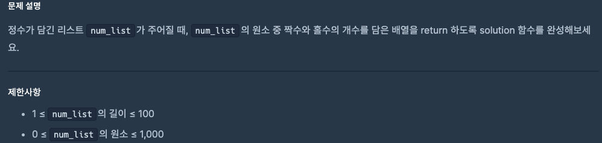

# 0827 공부내용 📖

## 매일매일 1일 면접 대비

### __자바스크립트 배열에 대해서 설명해주세요.__
자바스크립트의 배열은 __순서가 있는 리스트형 객체__ 로, 여러 값을 하나의 자료구조에 저장할 수 있다.

배열은 __제로 인덱스 기반__  으로, 배열의 각 값은 인덱스를 통해 접근할 수 있다.
```jsx
const arr =[1, 'apple', true, {key:'value'}];
```

배열은 위와 같이 숫자, 문자열, 불리언, 객체 등 다양한 타입을 저장할 수 있으며, 배열의 첫번째 요소는 array[0]으로, 두번째 요소는 array[1]로 접근할 수 있다.

배열의 중요한 특징 중 하나는 __동적 배열__ 이라는 점이다. 이는 배열의 크기를 미리 지정하지 않아도 되고, 요소를 추가할 때마다 배열의 크기가 자동으로 조정된다.

```jsx
const arr = [1, 2, 3];
arr.push(4);
console.log(arr); // [1, 2, 3, 4];
```
또한 배열의 특정 인덱스에 값을 할당하면, 배열이 자동으로 확장된다.

```jsx
arr[5] = 6;
console.log(arr); //[1, 2, 3, undefined, undefined, 6]
console.log(arr.length) //6
```
이처럼 자바스크립트 배열은 동적으로 크기가 조정되는 유연성을 제공한다. 요소를 추가하거나 특정 인덱스에 값을 할당하면 배열은 자동으로 확장된다.배열은 자바스크립트의 객체와 유사한 방식으로 관리되며 해시 테이블과 같은 자료구조로 구현되어 있다. 덕분에 배열 요소들은 메모리 상에서 연속적이지 않아도 되며, 배열 크기를 미리 지정하지 않고 유연하게 사용할 수 있다.
## 오늘의 알고리즘 문제

### 1번 문제


```jsx
function solution(num_list) {
  let even = 0;
  let odd = 0;

  for (let num of num_list) {
    if (num % 2 === 0) {
      even++;
    } else {
      odd++;
    }
  }

  return [even, odd];
}
```
### 2번 문제

```jsx
function solution(message) {
    return message.length*2
}

// 문자를 한개씩 세어보고 싶다면?

function solution(message) {
  let count = 0;

  for (let char of message) {
    count++; // 글자 하나(공백 포함)마다 카운트 증가
  }

  return count * 2; // 글자 수 × 2cm
}

//for...of는 문자열을 유니코드 단위로 순회하기 때문에 이모지 같은 것들도 잘 세어줄 수 있다.
```

## 오늘의 main 공부
  ### Git
  Git은 내부적으로 크게 3가지 종류의 작업 영역을 두고 동작합니다.

각 작업 영역의 이름은

1. **working directory**
2. **staging area**
3. **repository**

입니다. 

첫 번째 작업 영역인 **working directory**는 작업을 하는 프로젝트 디렉토리를 말합니다. 그러니까 지금 상황에서는 **MathTool 디렉토리**가 working directory입니다.

두 번째 작업 영역인 **staging area**는 **git add**를 한 파일들이 존재하는 영역입니다. 커밋을 하게되면 **staging area**에 있는 파일들만 커밋에 반영됩니다.

세 번째 작업 영역인 **repository**는 working directory의 변경 이력들이 저장되어 있는 영역입니다. 그러니까 커밋들이 저장되는 영역이라는 뜻인데요.

- working directory에서 뭔가 작업을 하고,
- 작업한 파일들을 **git add** 해주고,
- 커밋을 하면 staging area에 있던 파일들의 모습이 마치 영화의 한 장면, 스냅샷(snapshot)처럼 이 repository에 저장되는 겁니다.


왼쪽부터 순서대로 working directory, staging area, repository가 있습니다. 다음과 같은 작업을 한 상태를 나타내는 그림인데요.

1. working directory에서 A.txt 파일과 B.txt 파일을 작성하고
2. **git add A.txt**와 **git add B.txt**를 실행해서 A.txt, B.txt 둘다 staging area에 올렸습니다.
3. 그 다음 **git commit -m "Ver_1"**를 실행해서 **staging area에 있는 파일들을 가져와 커밋으로 남겼습니다.**


1. working directory에서 A.txt 파일 내용에 Python~이라는 단어를 추가, B.txt 파일 내용에 Morning!이라는 단어를 추가했습니다.
2. 그런데 이번에는 **git add B.txt**만 실행해서 B.txt 파일만 staging area에 올렸습니다.
3. 그 다음 **git commit -m "Ver_2"**로 두 번째 커밋을 했습니다.

**이전 그림과 다른 점은 A.txt는 staging area에 올리지 않고, B.txt만 staging area에 올렸다는 점입니다.** 그랬더니 지금 repository에서 그 결과가 어떤가요? Ver_2 커밋을 보면 지금

- A.txt는 staging area에 있던 모습, 그러니까 **수정하기 이전의 모습**이 Ver_2 커밋에 반영되었고
- B.txt도 staging area에 있던 모습, 하지만 A.txt와는 달리 **수정한 이후의 모습**이 Ver_2 커밋에 반영되었습니다.

A.txt, B.txt 둘다 working directory에서 수정했다는 사실은 같지만, **staging area에 올렸는지 여부에 따라 그 최신 모습이 커밋에 반영되는지가 달라지는 겁니다.** 바로 이 점이 Git을 사용할 때 잘 알고 기억해야하는 부분입니다.

staging area가 굳이 왜 필요할까요? working directory에서 작업을 하고 git add할 필요없이 바로 커밋해버리는 구조가 더 편할 것 같은데 말이죠. 하지만 꼭 그렇지는 않습니다. 방금처럼 A.txt와 B.txt 파일을 둘다 수정했더라도 두 파일 모두 그 최신 모습을 다음 커밋에 반영하고 싶지 않을 수도 있습니다. 방금처럼 B.txt의 최신 모습만 그 다음 커밋에 반영하고 싶을 수도 있는 거죠. 이런 상황은 실제로 꽤 자주 있습니다. 만약 staging area가 없다면 원하는 것들만 선별적으로 커밋에 반영할 수 없게 됩니다. 그럼 좀더 세밀한 버전 관리를 할 수 없게 되는 거죠. 왜 staging area가 필요한지 알겠죠?

  ### JS
## id로 태그 선택하기

```jsx
document.getElementById('id');

<!DOCTYPE html>
<html lang="ko">
<head>
  <meta charset="UTF-8">
  <title>JS with Codeit</title>
  <link rel="stylesheet" href="style.css">
</head>
<body>
  <div id="myNumber">0</div>
  <div id="btns">
    <div>
      <button id="decrease">-</button>
      <button id="increase">+</button>
    </div>
    <div>
      <button class="color-btn red" data-color="#FF0000"></button>
      <button class="color-btn orange" data-color="#FFA500"></button>
      <button class="color-btn yellow" data-color="#FFFF00"></button>
      <button class="color-btn green" data-color="#008000"></button>
      <button class="color-btn blue" data-color="#0000FF"></button>
      <button class="color-btn indigo" data-color="#4B0082"></button>
      <button class="color-btn purple" data-color="#800080"></button>
      <button class="color-btn black" data-color="#000000"></button>
    </div>
  </div>
  <script src="index.js"></script>
</body>
</html>

--js--

const myTag1 = document.getElementById('myNumber');
console.log(myTag1);

const myTag2 = document.getElementById('btns');
console.log(myTag2);

const myTag3 = document.getElementById('codeit');
console.log(myTag3);
```

## class로 태그 선택하기

```jsx
//class로 태그 선택하기

document.getElementsByClassName('color-btn');
```


배열처럼 보이지만 완전한 배열은 아니라서 배열의 메소드인 push, splice, pop등은 쓸 수 없지만

```jsx
console.log(myTag[1]); //대괄호 표기법
console.log(myTag.length); //렝스
for(let tag of myTags) {
	console.log(tag);
}

는 쓸 수 있다.

그래서 유사배열이라고 부른다.

구조의 깊이와 상관없이 위에서 아래의 순서로 나온다

Ex)

<div>
	<div>
		<div>
			<div>
			      <button class="color-btn red" data-color="#FF0000"></button>
			</div>
		</div>
	</div>	

      <button class="color-btn orange" data-color="#FFA500"></button>
      <button class="color-btn yellow" data-color="#FFFF00"></button>
      <button class="color-btn green" data-color="#008000"></button>
      <button class="color-btn blue" data-color="#0000FF"></button>
      <button class="color-btn indigo" data-color="#4B0082"></button>
      <button class="color-btn purple" data-color="#800080"></button>
      <button class="color-btn black" data-color="#000000"></button>
    </div>
이렇게 아무리 자식요소로 깊이 넣어놔도 결과는 같다
```


클래스가 하나밖에 없는 접근하려고 하면 배열의 인덱스로 접근해야한다.

없는 클래스를 선택하면 HTMLCollection [] 빈 값이 나온다. null값이 아닌 진짜로 말 그래도 비어있는HTMLCollection[]

# **유사 배열(Array-Like Object)이란?**

앞에서도 설명한 것처럼 이름 그대로 **배열과 유사(類似)한 객체**를 **유사 배열**, 영어로는 **Array-Like Object**라고 부릅니다.
하지만 마냥 모양만 비슷하다고 해서 모두 유사 배열이라고 부르진 않는데요. 유사 배열에도 최소한 갖춰야 할 조건과 특징들이 있습니다.

## **1. 숫자 형태의 indexing이 가능하다.**

[유사배열-1](https://bakey-api.codeit.kr/api/files/resource?root=static&seqId=3773&directory=%E1%84%8B%E1%85%B2%E1%84%89%E1%85%A1%E1%84%87%E1%85%A2%E1%84%8B%E1%85%A7%E1%86%AF&name=%E1%84%8B%E1%85%B2%E1%84%89%E1%85%A1%E1%84%87%E1%85%A2%E1%84%8B%E1%85%A7%E1%86%AF)

배열은 각 요소에 0부터 순서대로 매겨진 index를 통해 요소끼리의 관계도 파악할 수 있고 그 index를 통해 요소에 접근할 수도 있다는 특징이 있죠?
유사 배열도 마찬가지로 배열이라는 이름에 걸맞게 각 요소에

**0부터 시작하는 숫자 형태의 index가 있어야**

합니다.

## **2. length 프로퍼티가 있다.**

[유사배열-2](https://bakey-api.codeit.kr/api/files/resource?root=static&seqId=3773&directory=%E1%84%8B%E1%85%B2%E1%84%89%E1%85%A1%E1%84%87%E1%85%A2%E1%84%8B%E1%85%A7%E1%86%AF-2&name=%E1%84%8B%E1%85%B2%E1%84%89%E1%85%A1%E1%84%87%E1%85%A2%E1%84%8B%E1%85%A7%E1%86%AF-2)

객체가 가지고 있는 요소의 갯수를 저장하는

```
length
```

프로퍼티도 역시 배열의 특징이라고 할 수 있는데요. 유사 배열 역시

```
length
```

프로퍼티가 있어야 비로소 유사 배열이라고 할 수 있습니다. 숫자 형태의 index가 있더라도

```
length
```

프로퍼티가 없다면 유사 배열이라기보단 그냥 숫자 형태의 key로 구성된 일반적인 객체라고 볼 수 있습니다.

## **3. 배열의 기본 메소드를 사용할 수 없다.**

[유사배열-3](https://bakey-api.codeit.kr/api/files/resource?root=static&seqId=3773&directory=%E1%84%8B%E1%85%B2%E1%84%89%E1%85%A1%E1%84%87%E1%85%A2%E1%84%8B%E1%85%A7%E1%86%AF-3&name=%E1%84%8B%E1%85%B2%E1%84%89%E1%85%A1%E1%84%87%E1%85%A2%E1%84%8B%E1%85%A7%E1%86%AF-3)

상황에 따라서 직접 구현할 수도 있겠지만, 유사 배열이 완전한 배열이 아닌 가장 큰 이유는 바로

**기본적인 배열의 메소드를 사용할 수 없다**

는 점 때문입니다. 배열의 메소드를 활용할 수 없다는 특징이 유사 배열을 활용하는 목적이 되기도 하는데요. indexing을 통해 유사 배열의 요소에 접근하는 건 쉽지만 수정하거나 삭제하는 작업이 까다롭습니다.
그래서 내부의 요소들은 배열처럼 다룰 수 있게 하면서 배열의 메소드 사용을 막고 싶거나, 혹은 일반 배열에는 없는 특별한 메소드를 제공하고 싶을 때 유사 배열을 만들어 활용하기도 합니다!

## **4. Array.isArray(유사배열)은 false다.**

[유사배열-4](https://bakey-api.codeit.kr/api/files/resource?root=static&seqId=3773&directory=%E1%84%8B%E1%85%B2%E1%84%89%E1%85%A1%E1%84%87%E1%85%A2%E1%84%8B%E1%85%A7%E1%86%AF-4&name=%E1%84%8B%E1%85%B2%E1%84%89%E1%85%A1%E1%84%87%E1%85%A2%E1%84%8B%E1%85%A7%E1%86%AF-4)

```
Array
```

객체의

```
isArray
```

메소드는 파라미터로 전달한 값이 배열인지 아닌지를 평가해서 그 결과를 불린 형태의 값으로 리턴해주는 메소드입니다.
유사 배열은 배열과 비슷하지만 배열은 아니기 때문에 결괏값이

```
false
```

입니다.

# **주의사항: 유사 배열은 다양하다!**

유사 배열은 위의 특징들을 가진 대부분의 형태를 가리키는 포괄적인 개념이기 때문에 정말 다양한 형태로 존재할 수 있습니다.
예를 들어 지난 시간에 봤던 HTMLCollection의 경우 for..of 문을 활용하는 데 문제는 없었지만 어떤 유사 배열의 경우에는 for..of문을 활용할 수 없는 경우도 있습니다.
배열의 기본 메소드를 사용할 수 없다고 했지만, 직접 구현해서 마치 배열처럼 사용할 수 있도록 만들 수도 있습니다.
하지만 직접 유사 배열을 만드는 게 아니라 이미 만들어진 유사 배열에 접근하는 경우에는 대부분 위 4가지 특징을 모두 가지고 있으니깐 잘 기억해 두시면 좋을 것 같습니다!

## CSS선택자로 태그 선택하기

```jsx

// css 선택자로 태그 선택하기
//Id선택자
const myTag = document.querySelector('#myNumber');
console.log(myTag);
console.log(document.querySelector('#list li')); // 자식요소 선택 가능

const myTag2 = document.getElementById('myNumber');
console.log(myTag2);

//class 선택자
const myTag3 = document.querySelector('.color-btn');
console.log(myTag3);
-> 같은 클래스들의 가장 첫번째 요소만 선택된다.

const myTags1 = document.querySelectorAll('.color-btn');
console.log(document.querySelectorAll('.language')[0]); // 인덱싱 선택 가능
console.log(myTags1);
-> Nodelist(@)로 출력된다, 요소가 하나라도 NodeList를 반환한다
왜 HTMLCollection이 아닐까?

const myTags2 = document.getElementsByClassName('color-btn');
console.log(myTags2);
```

  ### 매일 1강씩 읽는 모던 자바스크립트 Deep Dive
  