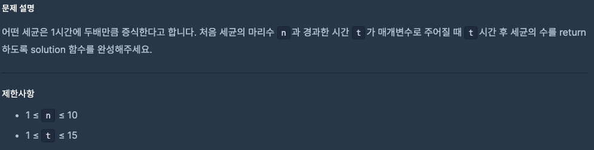
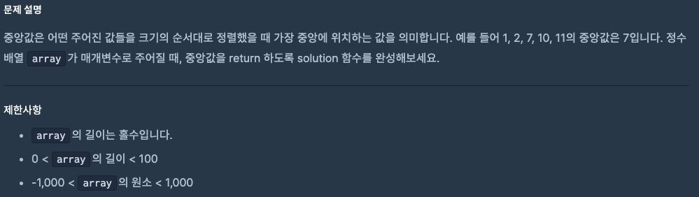

# 0821 공부내용 📖

## 매일매일 1일 면접 대비

### __자바스크립트 함수에 대해서 아는대로 설명해주세요.__
1. 자바스크립트 함수는 __일급 객체__ 이다.
  - 자바스크립트에서 함수는 값처럼 취급될 수 있으며, 변수에 할당하거나, 다른 함수의 인자로 전달하거나, 함수의 반환값으로 사용할 수 있다. 이를 통해 유연하게 코드를 작성할 수 있으며, 고차 함수를 포함한 다양한 패턴을 구현할 수 있다.
  ```js
  const sayHello = function() { return 'Hello'; };
  console.log(sayHello()); // 'Hello'

  const executeFunction = function(fn) {
    return fn();
  };
  console.log(executeFunction(sayHello)); // 'Hello'
  ```

2. __익명함수__ 와 __함수 표현식__ 이다.
  - 자바스크립트에서는 __이름 없는 함수, 즉 익명 함수__ 를 정의 할 수 있다. 익명 함수는 함수 표현식에서 주로 사용되며, 필요에 따라 함수에 이름을 지정하지 않아도 된다.
  ```js
  const add = function(a, b) {
  return a + b;
  };
  console.log(add(2, 3)); // 5
  ```

  3. __호이스팅__
  - 함수 선언식을 통해 선언한 함수는 코드가 실행되기 전에 호이스팅되어, 함수 선언 이전에 호출할 수 있다. 반면, 함수 표현식은 변수에 할당된 후에 사용할 수 있다.
  ```js
  console.log(declaredFunction()); // 'Declared Function'
  function declaredFunction() {
    return 'Declared Function';
  }

  // 함수 표현식은 할당 후에만 사용할 수 있음
  const expressedFunction = function() {
    return 'Expressed Function';
  };
  console.log(expressedFunction()); // 'Expressed Function'
  ```

  4. __클로저__
  - 자바스크립트 함수로는 클로저를 구현할 수 있다. 클로저는 함수가 __자신이 선언된 스코프__ 를 기억하고 해당 환경에 접근할 수 있는 기능(특징)이다. 이를 통해 함수는 자신이 선언된 당시 스코프 내의 변수에 참조할 수 있다.
  ```js
  function outer() {
  const outerVar = 'I am outer!';
  
  return function inner() {
    return outerVar; // 외부 변수에 접근 가능
  };
  }
  const innerFunction = outer();
  console.log(innerFunction()); // 'I am outer!'
  ```

  5. __고차 함수__
  - 자바스크립트에서는 함수가 일급 객체이기 때문에 고차 함수, 즉 __다른 함수를 인자로 받거나 반환하는 함수__ 를 정의할 수 있다. 이는 함수형 프로그래밍 패턴을 가능하게 한다.
  ```js
  function multiplyBy(factor) {
  return function(num) {
    return num * factor;
  };
  }
  const double = multiplyBy(2);
  console.log(double(5)); // 10
  ```

  6. __화살표 함수__
  - 화살표 함수는 더 간결한 문법을 제공하고, 특히 this 바인딩에서 기존 함수와 다른 동작을 한다. 화살표 함수는 선언된 위치의 this 값을 유지하므로, 일반 함수와 달리 별도로 this를 바인딩할 필요가 없다.
  ```js
  const obj = {
  value: 42,
  method: function() {
    setTimeout(() => {
      console.log(this.value); // 42 (Arrow 함수는 obj의 this를 유지)
    }, 1000);
  }
  };
  obj.method();
  ```
## 오늘의 알고리즘 문제

### 1번 문제

```js
function solution(n, t) {
  return n * (2 ** t);
}
```
### 2번 문제


```js
function solution(array) {
  // 1. 배열 정렬
  array.sort((a, b) => a - b);

  // 2. 중앙값 구하기
  const mid = Math.floor(array.length / 2);

  return array[mid];
}
```
