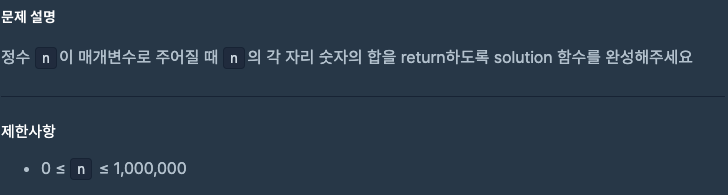
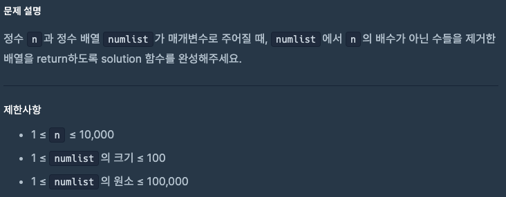

# 0901 공부내용 📖

## 매일매일 1일 면접 대비

### __Common JS와 ES Module의 차이점에 대해서 설명해주세요.__
- Common JS: 주로 Node.js 환경에서 사용되며 모듈을 동기적으로 불러온다. 즉, 모듈이 로드될 때까지 다음 코드가 실행되지 않는 방식이다. Common JS는 require 키워드를 사용해 모듈을 가져오고 module.exports를 통해 내보낸다. 이 방식은 주로 서버측에서 사용됐지만 클라이언트 환경에서도 번들러를 통해 사용할 수 있다.

- ES Module: 자바스크립트의 공식 표준 모듈 시스템으로 ECMAScript 2015(ES6)부터 도입되었다. ESM은 브라우저와 Node.js 환경에서 모두 사용할 수 있으며 모듈을 비동기적으로 로드한다. 모듈을 가져올때는 import 키워드를 사용하고 내보낼때는 export를 사용한다. 또한, ESM은 정적 분석이 가능해트리 쉐이킹과 같은 최적화 작업에도 유리하다.

즉, Common JS는 주로 동기적이고 서버측에서 많이 사용되며 ESM은 비동기적이고 브라우저와 서버 모두에서 사용할 수 있다.

하지만 Node.js에서도 최근에는 ESM 사용이 증가하고 있는 추세이다. Node.js는 버전 12부터 네이티브로 ESM을 지원하기 시작했으며 브라우저와 서버 간의 모듈 호환성을 위해 풀스택 애플리케이션 개발에서도 ESM을 많이 사용되고 있다. 특히 ESM은 비동기적 로딩과 트리 쉐이킹 같은 최적화 작업에 유리하다는 점에서 점점 더 선호 되고 있다.

*트리쉐이킹이란? : 사용하지 않는 코드를 제거하는 방식을 말한다.
```js
import utils for 'utils-lib'

let count = 0;

const handlePlus = (a) => {
  count += a;
};

utils.parseResult(handlePlus(5));
```

누적값 앞뒤로 스트링 메세지가 감싸져 리턴값을 돌려주는 utils.parseResult() 메서드가 있다고 가정하고, utils 라이브러리에는 위와 같이 표출을 도와주는 많은 메서드들을 가지고 있는 모듈이다. 하지만 위에서 사용하는 메서드는 parseResult() 하나 뿐이다.

이런 경우 트리쉐이킹을 통해 사용하지 않는 모듈을 흔들어 떨어트릴 수 있는 것.

```js
import {parseResult} fron 'utils-lib'

let count = 0;

const handlePlus = (a) => {
  count += a
};

parseResult(handlePlus(5));
```

*트리쉐이킹 시 고려해야 할 점 : 프로젝트의 모듈들이 사이드 이펙트를 발생시키는지 여부를 확인해야한다.

*안전한 트리쉐이킹이란? : 예측 가능한 입력을 가지고 동일하게 함수의 스코프 밖에 어떤것도 변경하지 않으면서 예측 가능한 결과를 반환하는 모듈이 안전하게 트리쉐이킹 할 수 있는 디펜던시이다.

웹팩 설정을 통한 사이드 이펙트 옵션체킹
```js
{
    "name": "project",
    "version": "1.0.0",
    "sideEffects": false
}
```
특정 파일을 지정하여 사이드 이펙트의 영향을 받지 않도록 설정
```js
{
    "name": "project",
    "version": "1.0.0",
    "sideEffects": [
        ".src/utils/utils.js"
    ]
}
```

## 오늘의 알고리즘 문제

### 1번 문제

```js
function solution(n) {
  return String(n) // 숫자를 문자열로 변환
    .split("")      // 한 글자씩 분리 → 배열
    .map(Number)    // 다시 숫자로 변환
    .reduce((a, b) => a + b, 0); // 합계 구하기
}
```
### 2번 문제

```js
function solution(n, numlist) {
  return numlist.filter(num => num % n === 0);
}

// for문으로 풀이

function solution(n, numlist) {
  let result = [];
  
  for (let i = 0; i < numlist.length; i++) {
    if (numlist[i] % n === 0) {
      result.push(numlist[i]); // n의 배수일 때만 추가
    }
  }
  
  return result;
}
```