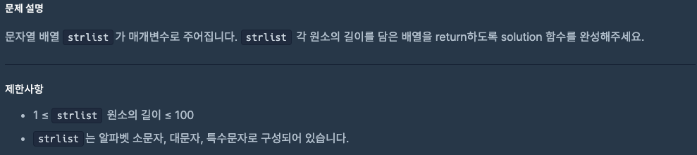

# 0902 공부내용 📖

## 매일매일 1일 면접 대비

### __이벤트 전파에 대해서 설명해주세요.__
1. 캡처링 단계: 이벤트가 DOM 트리의 최상위 요소 (document)에서 시작하여 이벤트가 발생한 요소로 향해 내려가는 단계이다. 이 과정에서 상위 요소들에 이벤트 리스너가 있으면 그 순서대로 실행될 수 있다.

2. 타겟 단계: 이벤트가 실제로 발생한 타겟 요소에 도달하는 단계이다. 타겟 요소에 등록된 이벤트 리스너가 이 시점에 실행된다.

3. 버블링 단계: 타겟 요소에서 이벤트가 발생한 후 다시 DOM 트리의 상위 요소들로 이벤트가 전파되어 올라가는 단계이다. 이 과정에서 상위 요소들에 등록된 이벤트 리스너들이 실행될 수 있다. 기본적으로 대부분의 이벤트는 버블링을 통해 전파되지만 addEventListner()의 세번째 인자로 { capture: true } 를 전달하면 캡처링 단계에서도 이벤트를 처리할 수 있다.

이벤트 전파는 웹 페이지에서 요소 간의 상호작용을 제어하는 데 중요한 역할을 한다. 다만 이러한 이벤트 전파가 정상 동작에 방해가 되는 경우, event.stopPropagation() 메서드를 사용하여 특정 단계에서 이벤트의 전파를 중단할 수 있다.

즉, 이벤트 전파는 DOM 구조에서 이벤트가 ㅓ떻게 상위와 하위 요소 간에 전달되는지를 정의하는 메커니즘이며 이를 통해 복잡한 사용자 상호작용을 효율적으로 관리할 수 있다.

## 오늘의 알고리즘 문제

### 1번 문제


```js
function solution(money) {
  const americanoPrice = 5500;
  const cups = Math.floor(money / americanoPrice); // 살 수 있는 잔 수
  const change = money % americanoPrice;           // 남는 돈
  return [cups, change];
}
```

### 2번 문제


```js
function solution(strlist) {
  let result = [];
  for (let i = 0; i < strlist.length; i++) {
    result.push(strlist[i].length);
  }
  return result;
}
```

## 오늘의 main 공부
  ### JS
  