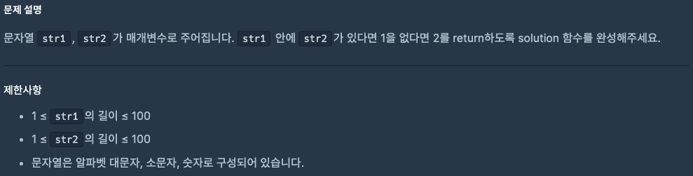

# 0903 공부내용 📖

## 매일매일 1일 면접 대비

### **웹 애플리케이션의 성능을 최적화할 수 있는 방법들에 대해서 아는대로 설명해주세요.**

1. **코드 스플리팅을 통해 자바스크립트 파일을 필요한 부분만 나누어 로드한다** 이렇게하면 모든 코드를 한꺼번에 불러오는 대신 사용자가 즉시 필요한 부분만 먼저 로드하여 페이지 로딩 속도를 개선할 수 있다.

2. **레이지 로딩 기법을 사용하여 페이지에 있는 이미지나 비디오 같은 무거운 리소스를 사용자가 실제로 볼 때만 로드하는 방식** 을 적용한다. 예를 들어 사용자가 페이지를 스크롤할 때 하단의 이미지가 필요해지면 그때 비로소 이미지를 불러오는 것이다. 이렇게 하면 불필요한 리소스 로딩을 줄여 성능을 높일 수 있다

3. 이미지에 대해서는 **파일의 물리적인 크기를 알맞게 줄이거나 WebP와 같은 가벼운 포맷으로 변환하는 방법** 이 있다. 이를 통해 불필요한 용량을 줄이고 로딩 속도를 향상시킬 수 있다.

4. **캐싱을 활용하면 한번 로딩된 리소스를 다시 다운로드하지 않고 브라우저가 캐시된 데이터를 재사용하여 성능을 크게 향상** 시킬 수 있다. 적절한 캐시 정책을 설정하는 것이 매우 중요하다.

5. 자바스크립트 로딩 시에는 **비동기 로딩(async)** 이나 **지연 로딩(defer)** 을 적용하여 자바스크립트가 DOM을 차단하지 않도록 할 수 있다. 이를 통해 페이지가 로딩되는 동안에도 자바스크립트 파일을 병렬로 불러오거나 적절한 타이밍에 로드하게 되어 사용자 경험어 더 쾌적해질 수 있다.

## 오늘의 알고리즘 문제

### 1번 문제


```js
function solution(n) {
  let result = [];
  for (let i = 1; i <= n; i++) {
    if (i % 2 !== 0) {
      result.push(i);
    }
  }
  return result;
}
```

### 2번 문제



```js
function solution(str1, str2) {
  return str1.includes(str2) ? 1 : 2;
}
```

## Deep Dive

### 자바스크립트의 조건문

- **if...else 문**: 표현식이 아닌 문이기 때문에 변수에 할당할 수 없다

  - 조건에 따라 실행해야 할 내용이 복잡하여 여러 줄의 문이 필요하다면 if...else문을 사용하는게 좋다

- **삼항조건연산자**: 값으로 평가되는 표현석을 만든다. 따라서 삼항 조건 연선자 표현석은 값처럼 사용할 수 있기 때문에 변수에 할당할 수 있다.

  - 조건에 따라 단순히 값을 결정하여 변수에 할당하는 경우 if...else 문보다 삼항 조건 연산자를 사용하는 편이 좋다

- **switch 문**: switch문의 표현식은 불리언 값보다는 문자열이나 숫자 값인 경우가 많다.
  swtich문은 논리적 참, 거짓보다는 다양한 상황(case)에 따라 실행할 코드 블록을 결정할 때 사용한다.
  - switch문은 case, default, break 등 다양한 키워드를 사용해야 하고 폴스루가 발생하는 등 문법도 복잡하다
  - 만약 if...else문으로 해결할 수 있다면 if...else문을 사용하고 조건이 너무 많아 복잡한 경우 switch문을 사용했을 때 더 가독성이 좋다면 switch문을 사용하는 것이 좋다.
