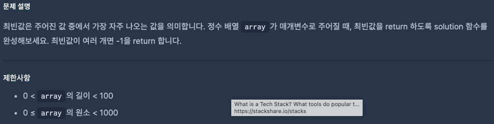

# 0904 공부내용 📖

## 매일매일 1일 면접 대비

### **디바운스와 쓰로틀에 대해서 각각 설명해주세요.**

**디바운스(devbounce)** 와 **쓰로틀(throttle)** 은 **이벤트 핸들러가 너무 자주 실행되지 않도록 조절하는 기법** 이다.

1. **디바운스**: 이벤트가 연속적으로 발생할 때 **마지막 이벤트가 발생한 후 일정 시간이 지나야 이벤트 핸들러가 실행** 되는 방식이다. 이를 통해 불필요하게 많은 이벤트 호출을 방지할 수 있다.

```js
function debounce(func, timeout = 300){
  let timer;
  return (...args) => {
    clearTimeout(timer);
    timer = setTimeout(() => { func.apply(this, args); }, timeout);
  };
}

function saveInput(){
  console.log('Saving data');
}
const processChanges = debounce(() => saveInput());

방문자가 첫 글자를 입력하고 키에서 손을 뗄 때, debounce는 우선 clearTimeout(timer)을 가지고 timer를 재설정. 이때, 스케줄에 잡은 것이 아무것도 없으니, 이 단계가 꼭 필수적이진 않는다. 이후 주어진 함수인 saveInput()을 300 밀리세컨드마다 실행되도록 스케줄 한다.

그런데 만일 방문자가 계속 작성하는 동안 키에서 손을 뗄 때마다 debounce가 한 번 더 실행된다고 해보자. 매번 timer를 재설정한다는 것은 다시 말해 saveInput()과 함께 직전에 예정한 것을 취소하고 이다음의 300 밀리세컨드라는 새로운 시간으로 다시 스케줄 한다는 것이다. 이는 방문자가 300 밀리세컨드 이내에 계속 키를 입력하는 한 지속된다.

마지막 스케줄은 제거되지 않으므로, 마침내 saveInput()이 호출된다.

```

2. **쓰로틀**: **일정 시간 간격 동안 발생한 이벤트 중 첫번째 또는 마지막 이벤트만 처리** 하는 방식이다. 즉, 이벤트가 계속해서 발생하더라도 설정된 시간 동안은 한번만 이벤트 핸들러가 실행된다.

\*쓰로틀링 구현 포인트 !

1. 함수가 실행 중인지 체크하는 타이머 변수를 생성
2. 함수를 호출하면 타이머를 동작시키기
3. 일정 시간 내에 함수가 다시 호출되면 실행되지 않게 처리를 해야 하므로 타이머 값이 없을 때만 함수 동작시키기
4. 함수가 완료되면 타이머를 다시 초기화하여 함수 호출이 가능하도록 처리하기

### **디바운스와 쓰로틀 중에서 무한 스크롤 구현 시 어떤 방식을 선택하실건가요? 그 이유는 무엇인가요?**

- 무한 스크롤 구현시에는 **쓰로틀**을 사용하는 것이 더 적합하다. 스크롤은 연속적인 동작이며 사용자가 페이지 하단에 도달했을 때 즉각적인 반응을 기대한다. **쓰로틀**은 스크롤이 **하단에 위치하게 된 순간 즉시 추가 데이터 요청을 수행**하므로 사용자에게 더 자연스러운 스크롤 경험을 제공할 수 있다. 반면 **디바운스**를 사용할 경우 사용자가 반복적으로 스크롤한다면 **마지막 스크롤이 멈춘 후에야 데이터를 불러오기 시작하므로 지연**이 발생할 수 있다.

## 오늘의 알고리즘 문제

### 1번 문제



```js
function solution(array) {
  const counts = array.reduce((acc, num) => {
    acc[num] = (acc[num] || 0) + 1;
    return acc;
  }, {});

  const maxCount = Math.max(...Object.values(counts));
  const modes = Object.keys(counts)
    .filter((key) => counts[key] === maxCount)
    .map(Number);

  return modes.length > 1 ? -1 : modes[0];
}

// for문
function solution(array) {
  let counts = {}; // 숫자별 등장 횟수 기록

  for (let num of array) {
    counts[num] = (counts[num] || 0) + 1;
  }

  let maxCount = 0;
  let mode = -1;
  let isDuplicate = false;

  for (let key in counts) {
    if (counts[key] > maxCount) {
      maxCount = counts[key];
      mode = Number(key);
      isDuplicate = false;
    } else if (counts[key] === maxCount) {
      isDuplicate = true; // 최빈값이 여러 개일 때
    }
  }

  return isDuplicate ? -1 : mode;
}
```

### 2번 문제


```js
function solution(n) {
  let pizzas = 1; // 최소 1판부터 시작
  while ((6 * pizzas) % n !== 0) {
    pizzas++;
  }
  return pizzas;
}
```

while문 → 조건을 검사하면서 계속 반복. 직관적으로 조건 만족할 때까지 반복하는 반복문

for문 → 반복 횟수를 세기 좋음. 여기서는 pizzas가 1씩 증가하니까 for문도 자연스럽게 맞지만 무한 루프에 빠질 수 있으니 조건식을 비워줘야한다.

## Deep Dive
