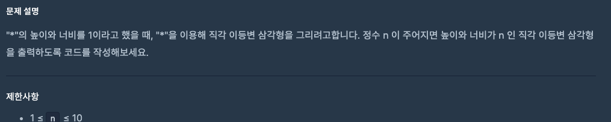

# 0905 공부내용 📖

## 매일매일 1일 면접 대비

### **리액테에서 index를 key값으로 사용하면 안되는 이유에 대해서 설명해주세요.**

리액트에서 index를 key값으로 사용하는 것이 권장되지 않는 이유는 배열의 요소들이 추가되거나 삭제될 때 배열의 순서가 바뀌는 경우 문제가 발생할 수 있기 때문이다.

리액트는 key값을 통해 리스트에서 어떤 요소가 변경, 추가, 삭제되었는지를 추적한다. 그러나 index를 key로 사용하면 배열의 순서가 변경될 때 리액트가 요소들을 잘못 인식할 수 있다. 예를들어, 배열에 새로운 요소가 추가되면 그 뒤에 있는 요소들의 인덱스가 모두 바뀌게 된다. 리액트는 이를 새로운 요소로 인식해 불필요하게 재랜더링을 하거나 요소의 상태를 잘못 처리할 수 있다.

이로 인해 성능 문제가 발생하거나 사용자 입력 상태 같은 요소가 의도치 않게 초기화 되는 등 예기치 않은 버그가 생길 수 있다. 그래서 배열의 순서나 요소 변경에 영향을 받지 않는 고유한 값을 key로 사용하는 것이 좋다.

### **key로 사용할 고유 값을 생성하는 방법에는 어떤것들이 있나요?**

key로 사용할 고유한 값을 생성하는 방법에는 여러 가지가 있다. 주로 데이터의 유일성을 보장하고 변하지 않는 값을 사용하는 것이 중요하다.

서버의 데이터베이스에서 제공하는 고유 ID를 사용하는 것이 가장 권장된다. 만약 이 방법이 불가능할 경우, ${item.title}, ${item.username}와 같은 형태로 여러 필드를 결합하여 고유 값을 생성할 수 있다. 혹은 렌더링 이전 시점에 UUID 혹은 랜덤 값을 생성하여 고유 값을 부여할 수 있다.

## 오늘의 알고리즘 문제

### 1번 문제


```js
function solution(price) {
  if (price >= 500000) {
    return Math.floor(price * 0.8); // 20% 할인
  } else if (price >= 300000) {
    return Math.floor(price * 0.9); // 10% 할인
  } else if (price >= 100000) {
    return Math.floor(price * 0.95); // 5% 할인
  } else {
    return price;
  }
}

// function solution(price) {
//   return price >= 500000 ? Math.floor(price * 0.8)
//        : price >= 300000 ? Math.floor(price * 0.9)
//        : price >= 100000 ? Math.floor(price * 0.95)
//        : price;
// }
```

### 2번 문제



```js
const readline = require("readline");
const rl = readline.createInterface({
  input: process.stdin,
  output: process.stdout,
});

let input = [];

rl.on("line", function (line) {
  input = line.split(" ");
}).on("close", function () {
  const n = Number(input[0]);
  for (let i = 1; i <= n; i++) {
    console.log("*".repeat(i));
  }
});
```

## Deep Dive
