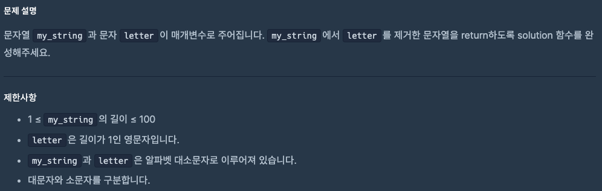
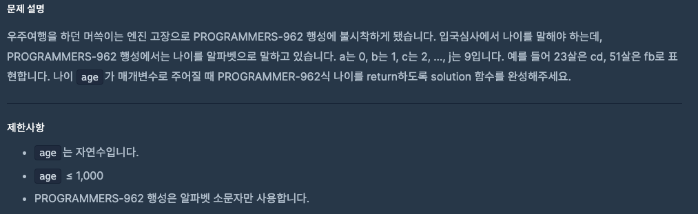

# 0909 공부내용 📖

## 매일매일 1일 면접 대비

### **자바스크립트에서 어떻게 호이스팅이 가능한지에 대해서 설명해주세요**

자바스크립트에서 호이스팅이 가능한 이유는 자바스크립트 엔진이 코드를 실행하기까지 **두 단계의 과정을 거치기 떄문**이다.

1. **컴파일 단계** : 자바스크립트 엔젠은 스크립트를 실행하기 전에 먼저 **컴파일 단계**를 거친다. 이 과정에서 **함수 및 변수 선언을 한 부분이 메모리에 할당**된다. 이떄 변수와 함수 선언을 미리 메모리에 올려두기 때문에 실제 코드에서 선언된 위치보다 앞에서 접근이 가능해지는 것이다. let, const가 아닌 var를 통해 선언되면 컴파일 단계에서 변수가 메모리에 올라가며, 이때 값은 undefined로 초기화된다. 이후 실행 단계에서 코드가 진행되면서 실제 할당된 값이 대입된다.

```js
console.log(myVar); // undefined
var myVar = 5;
console.log(myVar); // 5
```

2. **실행 단계** : 실행 단계란 **실제 코드가 실행되는 과정**으로 컴파일 단계에서 메모리에 할당된 변수와 함수가 실행된다. 여기서 변수가 할당된 값을 가지게 되고, 함수가 호출되면 그 안의 코드가 수행된다.

정리해보자면, 자바스크립트에서 호이스팅이 가능한 이유는 자바스크립트 엔진이 코드를 단순히 한 줄씩 바로 해석하고 실행하지 않고 먼저 컴파일 단계에서 코드를 파악하고 필요한 메모리를 확보하는 과정을 거치기 때문이다. 이를 통해 코드내에선 선언 위치와 상관없이 변수를 사용할 수 있는 유연성을 제공한다.

### **useEffect와 useLayoutEffect의 차이점에 대해서 설명해주세요.**

useEffect와 useLayoutEffect는 모두 렌더링된 후에 특정 작업을 수행하기 위해 사용되지만 **타이밍**과 **용도**가 다르다.

- **useEffect**: useEffect는 **렌더링이 완료된는 시점**에 **비동기적**으로 실행된다. 즉, 화면이 실제로 그려진 후에 useEffect가 실행되는 방식이다. 그래서 useEffect는 보통 데이터를 가져오는 작업이나 이벤트 리스너 추가 등 렌더링 후에 화면에 직접적인 영향을 주지 않는 작업에 주로 사용된다.

- **useLayoutEffect**: **렌더링 후 DOM이 업데이트되기 직전의 시점**에 **동기적**으로 실행된다. 여기서 동기적이라는 것은 화면에 내용이 그려지기 전에 모든 레이아웃 관련 작입어 완료된다는 의미이다. 예를 들어 **DOM의 크기를 측정**하거나 **위치를 조정해야 할** 때 useLayoutEffect를 사용하면 즉각적으로 그 변경사항이 반영되어 화면 깜빡임이나 불필요한 재렌더링을 방지할 수 있다.

즉, **렌더링 후 실행되는 비동기 작업**에는 useEffect가 적합하고 레이아웃 작업이나 DOM조작과 같이 **화면이 그려지기 전에 완료되어야 하는 작업**에는 useLayoutEffect가 적합하다.

useEffect는 사용자 데이터를 API로부터 가져오는 상황에 자주 사용한다. 데이터가 렌더링 후에 설정되면 화면이 자연스럽게 업데이트 되는것이다.

```jsx
useEffect(() => {
  fetchData().then((data) => setData(data));
}, []);
```

useLayoutEffect는 DOM의 크기를 측정해서 다른 요소의 위치를 조정해야 할 때 유용하다. 예를 들어, 어떤 요소의 높이를 측정해 그 높이에 맞춰 레이아웃을 맞추고 싶을 때 사용한다.

```jsx
useLayoutEffect(() => {
  const height = ref.current.offsetHeight;
  setHeight(height);
}, []);
```

단, useLayoutEffect 사용 시. **성능면 에서 주의할 점**이 있다. useLayoutEffect는 동기적으로 실행되기 때문에 너무 많은 작업이 실행되면 렌더링이 느려질 수 있다. 따라서 보통은 useEffect를 기본적으로 사용하고, 화면에 영향을 주는 작업만 useLayoutEffect로 처리하는 것이 좋다.

## 오늘의 알고리즘 문제

### 1번 문제



```js
function solution(my_string, letter) {
  return my_string.replaceAll(letter, "");
}
```

### 2번 문제



```js
function solution(age) {
  const mapping = ["a", "b", "c", "d", "e", "f", "g", "h", "i", "j"];
  return String(age) // 숫자를 문자열로 변환
    .split("") // 문자 배열로 변환
    .map((num) => mapping[num]) // 각 자리수를 알파벳으로 변환
    .join(""); // 다시 문자열로 합침
}
```

## Deep Dive
