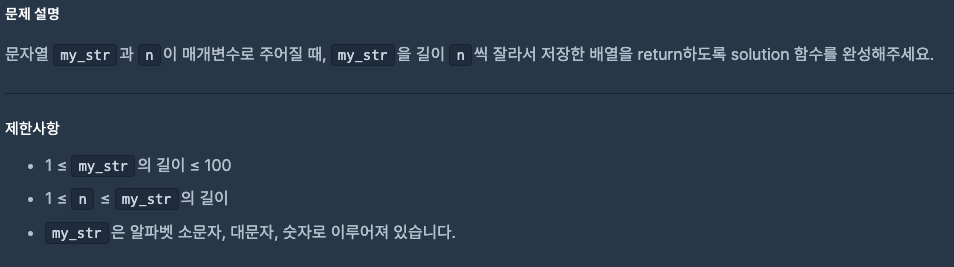
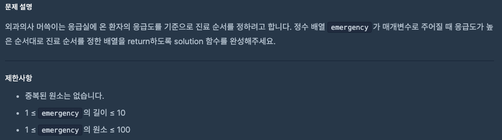

# 0910 공부내용 📖

## 매일매일 1일 면접 대비

### **웹 접근성의 개념과 개선 방법에 대해 설명해주세요.**

**웹접근성** : **장애인과 고령자 등 신체적 제약이 있는 사용자를 포함해 모든 사용자가 웹페이지를 동등하게 이용할 수 있도록 보장**하는 개념이다. 다만 웹접근성은 단순히 장애인만을 위한것은 아니다. 네트워크 속도가 느리거나 밝은 햇빛 아래 화면을 보는등 일상적인 제약 상황에서도 **모든 사용자가 제약없이 웹을 사용할 수 있도록 하는 것**이 웹 접근성의 궁극적인 목표이다.

웹접근성에는 다양한 방법이 있다.
**단순하고 명확한 HTML구조**와 **시맨틱 태그**가 필요하다. 시맨틱 태그는 웹 페이지의 구조와 의미를 명확하게 전달해 스크린 리더가 콘텐츠를 쉽게 이해하도록 도와준다. 또한 **ARIA 속성을 활용**하여 스크린 리더가 동적 콘텐츠나 복잡한 UI요소를 올바르게 인식할 수 있게 만들 수 있다. 마지막으로 **키보드로도 페이지를 탐색할 수 있도록 포커스를 명확히 지정**하여 키보드 사용자가 필요한 정보에 접근하기 쉽게 해야한다.

### **위와 같은 방법으로 개선하면 웹 접근성은 완벽해지는 걸까?**

모든 장애 유형을 완벽히 대응하는 것은 현실적으로 어렵다. 장애마다 고려해야 할 요소가 다르고 이를 100% 만족시키는 것이 어렵기 때문이다. 따라서 **단순히 많은 항목을 충족하는 데 매몰되기 보다는 우리 서비스에서 각 장애 유형 별로 사용자가 어떤 경험을 하고 있는지 파악**하는 것이 중요하다.

## 오늘의 알고리즘 문제

### 1번 문제



```js
function solution(my_str, n) {
  const result = [];

  for (let i = 0; i < my_str.length; i += n) {
    result.push(my_str.slice(i, i + n));
  }

  return result;
}
```

### 2번 문제



```js
function solution(emergency) {
  // 내림차순 정렬된 배열 복사본
  const sorted = [...emergency].sort((a, b) => b - a);

  // 원본 배열에서 순위 매기기
  return emergency.map((v) => sorted.indexOf(v) + 1);
}
```

## Deep Dive
