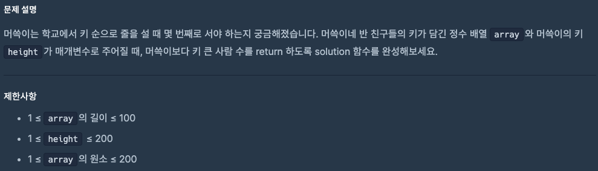
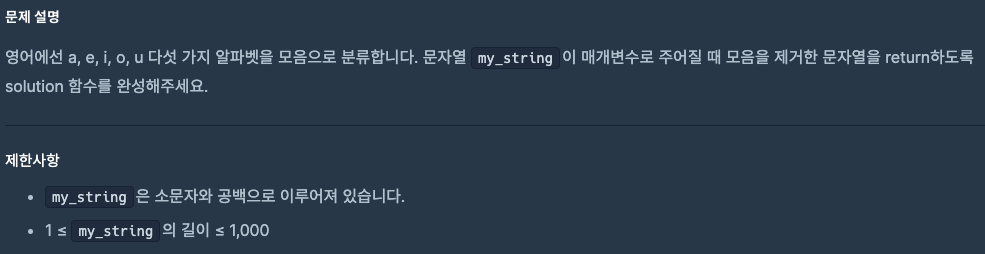

# 0911 공부내용 📖

## 매일매일 1일 면접 대비

### **SSR(Server Side Rendering)에 대해 설명해주세요.**

SSR(Server Side Rendering)은 **서버에서 완성된 정적 HTML을 클라이언트에 내려주는 방식**이다. 클라이언트 측에서는 해당 HTML을 파싱만 하여 화면을 그리게 된다.

CSR(Client Side Rendering)은 **브라우저가 서버로부터 비어있는 뼈대 HTML을 받아온 후 필요한 자바스크립트 번들을 다운로드하고 번들을 실행하여 동적으로 컨텐츠를 채우는 방식**이다.

Next.js에서는 SSR 방식으로 정적인 html을 내려주어 초기 화면을 빠르게 렌더한 이후 hydration을 통해 이벤트 리스너 부착 등의 자바스크립트 작업을 수행하여 정적인 화면을 동적으로 전환하는 작업을 수행하기도 한다.

- SSR의 장점

1. SEO 측면에서 유리하다. 화면이 동적으로 그려지는 CSR에 비해 크롤러가 컨텐츠를 쉽게 인식하며 초기 로드가 상대적으로 빨라 우선순위가 부여되어 상위에 노출될 가능성이 높아지기 때문이다. 이런점에서 SSR은 **블로그** **커머스** 등 SEO가 중요한 웹 애플리케이션에 특히 적합하다.

2. SSR 방식은 사용자가 **빠른 초기 로딩 속도**를 경험할 수 있다. CSR과 달리 SSR에서는 번들을 다운로드 받거나 번들을 실행하여 동적으로 화면을 그려야 할 필요가 없기 때문이다.

- SSR의 단점

1. 전통적인 SSR 방식에서는 클라이언트 사이드 라우팅이 불가능하기 때문에 빠르고 매끄러운 페이지 전환 경험을 제공하기 어렵다.
2. 단순히 정적인 리소스를 내려주는 것이 아니라 요청시마다 페이지를 동적으로 구성해서 내려주어야 하는 경우에는 WAS 서버 구동으로 인해 서버 비용이 증가할 수 있다.

- Next.js를 통한 최신의 방식으로 SSR을 구현할 경우의 단점

1. **hydration을 통해 동적인 화면으로 전환할 경우 상호작용 초기화가 비교적 느리다.** 이는 페이지가 표시되기까지 걸리는 시간(TTV)과 상호작용까지 걸리는 시간(TTI) 사이에 격차가 발생한다는 의미이다.
2. 상대적으로 **구현 복잡도가 높다**. 현대의 웹앱은 SSR과 CSR을 동시에 사용하는 경우가 많다. 이때 클라이언트 사이드 로직과 서버 사이드의 로직을 구분해가면서 구현해야 하기 때문에 상대적으로 구현 복잡도가 높다.

## 오늘의 알고리즘 문제

### 1번 문제



```js
function solution(array, height) {
  let count = 0;
  for (let i = 0; i < array.length; i++) {
    if (array[i] > height) count++;
  }
  return count;
}
```

### 2번 문제



```js
function solution(my_string) {
  // [aeiou] 모음 모두 제거, g: 전체, i: 대소문자 구분 없이
  return my_string.replace(/[aeiou]/gi, "");
}

// 예시
console.log(solution("hello world")); // "hll wrld"
console.log(solution("AEIOUabc")); // "bc"
```

## Deep Dive
