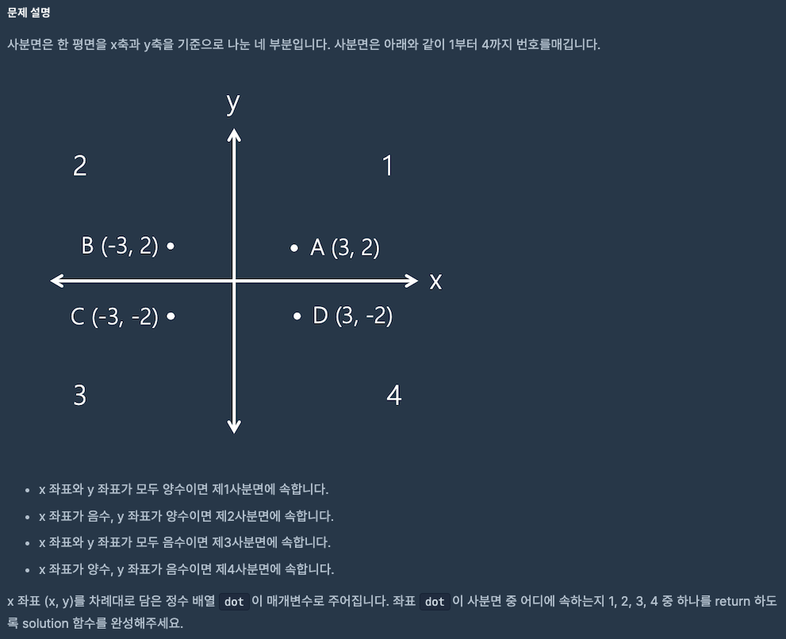
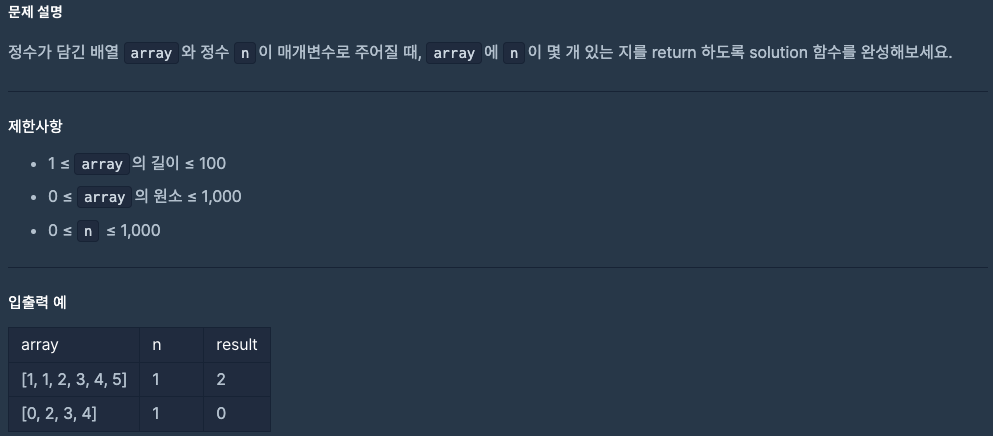

# 0912 공부내용 📖

## 매일매일 1일 면접 대비

### **CSS Flexbox와 Grid의 차이점에 대해서 설명해주세요.**

- Flexbox: **1차원 레이아웃 속성**으로 row또는 column 중 하나를 기준으로 요소를 정렬하고 배치하는 데 최적화되어 있다. 주로 행이나 열 중 하나의 방향으로 정렬해야 할 때 유용하며 복잡한 행과 열을 모두 포함하는 레이아웃에서는 다소 한계가 있다.

- Grid: **2차원 레이아웃 속성**으로 행과 열을 모두 사용해 요소를 배치할 수 있다. 따라서 복잡한 레이아웃을 구성하거나, 웹페이지의 젠처적인 구조를 잡는 데 적합하다.

- **사용목적의 차이**

  - Flexbox: **컨텐츠중심으로 콘텐츠가 추가되거나 줄어들 때 유연하게 대처**하기 좋다.
  - Grid: **레이아웃 중심으로 페이지 구조를 구성하는 데 최적화**되어 있다.

- **기본 동작의 차이**
  - Flexbox: 요소가 **컨테이너의 크기나 위치에 맞춰 자동으로 정렬**된다. justify-content와 align-itmes 속성을 사용해, 주 축 방향으로 요소들을 배치하고 여백을 조절할 수 있다.
  - Grid: **행과 열을 사전에 정의하고 그 격자에 요소를 배치하는 방식**이다. Grid는 grid-template-rows와 grid-template-column과 같은 속성으로 행과 열의 크기를 정의하고, 각 요소릐 위치를 세밀하게 설정할 수 있다.

## 오늘의 알고리즘 문제

### 1번 문제



```js
function solution(dot) {
  const [x, y] = dot; // 배열에서 x, y 꺼내기

  if (x > 0 && y > 0) return 1; // 제1사분면
  if (x < 0 && y > 0) return 2; // 제2사분면
  if (x < 0 && y < 0) return 3; // 제3사분면
  return 4; // 나머지는 제4사분면
}
```

### 2번 문제



```js
function solution(array, n) {
  let count = 0;

  for (let i = 0; i < array.length; i++) {
    if (array[i] === n) {
      count++;
    }
  }

  return count;
}
```

### Grid와 Felxbox의 차이점과 예시

# 📌 Flexbox vs Grid 정리

## 🔹 개념 차이

| 구분          | **Flexbox**                                                               | **Grid**                                                                    |
| ------------- | ------------------------------------------------------------------------- | --------------------------------------------------------------------------- |
| **기본 개념** | 1차원 레이아웃 → **한 줄(가로)** 또는 **한 열(세로)** 기준 배치           | 2차원 레이아웃 → **행(row) + 열(column)**을 동시에 배치                     |
| **축 (Axis)** | 메인 축(Main axis) + 교차 축(Cross axis)                                  | 행(Row) + 열(Column)                                                        |
| **사용 시점** | 아이템을 한 방향으로 정렬하고 싶을 때                                     | 페이지 전체나 복잡한 레이아웃을 짤 때                                       |
| **주요 속성** | `display: flex`<br>`flex-direction`<br>`justify-content`<br>`align-items` | `display: grid`<br>`grid-template-columns`<br>`grid-template-rows`<br>`gap` |
| **정렬 방식** | 순서 기반 → 아이템 순서대로 배치                                          | 좌표 기반 → 행/열 위치를 직접 지정                                          |
| **반응형**    | 내용 개수에 맞춰 유연하게 줄 세움                                         | 미리 정의한 칸 비율에 맞춰 배치                                             |
| **대표 예시** | 네비게이션 바, 버튼 그룹, 한 줄 카드 배치                                 | 페이지 전체 레이아웃, 사진 갤러리, 대시보드                                 |

---

## 🔹 코드 예시

### ✅ Flexbox 예시

```jsx
export default function FlexExample() {
  return (
    <div className="flex gap-4 p-4 bg-gray-100">
      <div className="flex-1 flex items-center justify-center h-32 bg-blue-300 rounded-xl shadow">
        A
      </div>
      <div className="flex-1 flex items-center justify-center h-32 bg-green-300 rounded-xl shadow">
        B
      </div>
      <div className="flex-1 flex items-center justify-center h-32 bg-pink-300 rounded-xl shadow">
        C
      </div>
    </div>
  );
}
```

➡️ flex-1로 남은 공간을 균등 분배하고, 한 줄로 정렬

✅ Grid 예시

```jsx
export default function GridExample() {
  return (
    <div className="grid grid-cols-3 gap-4 p-4 bg-gray-100">
      <div className="flex items-center justify-center h-32 bg-blue-300 rounded-xl shadow">
        A
      </div>
      <div className="flex items-center justify-center h-32 bg-green-300 rounded-xl shadow">
        B
      </div>
      <div className="flex items-center justify-center h-32 bg-pink-300 rounded-xl shadow">
        C
      </div>
    </div>
  );
}
```

➡️ grid-cols-3로 3개의 열을 만들고 아이템을 칸에 맞춰 배치

🔎 선택 가이드 (실무에서 유용)
✅ Flexbox 추천 상황

한 방향(가로 OR 세로)으로 정렬만 하면 될 때

아이템 개수가 동적으로 변할 때 (자동 줄바꿈 flex-wrap)

버튼 그룹, 네비게이션 바, 태그 리스트 등 단순 나열 UI

✅ Grid 추천 상황

레이아웃을 행+열 단위로 계획해야 할 때

카드 갤러리, 대시보드, 포트폴리오 같은 2D 배치

전체 페이지 틀(헤더/사이드바/메인/푸터) 만들 때
