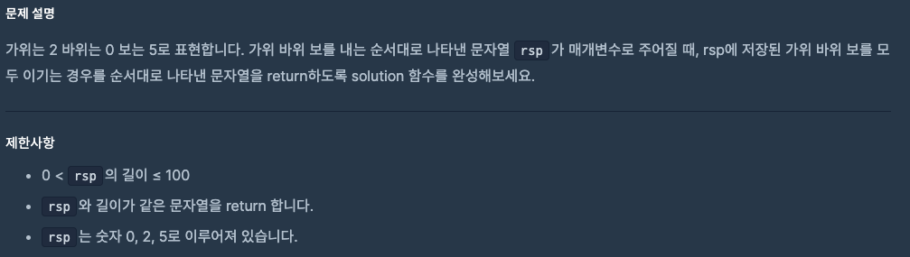
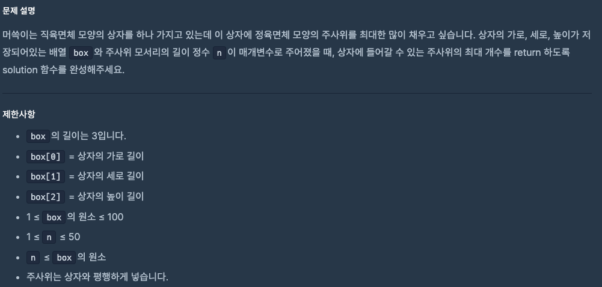

# 0915 공부내용 📖

## 매일매일 1일 면접 대비

### **프론트엔드 E2E 테스트에 대해서 설명해주세요.**

**프론트엔드 E2E(End-to-End) 테스트는 애플리 케이션의 사용자 경험을 처음부터 끝까지 시뮬레이션하여 테스트하는 방식**이다. 단위 테스트나 통합 테스트와 달리 E2E테스트는 사용자 관점에서 전체 애플리케이션이 의도한대로 작동하는지 검증한다. 브라우저 환경에서 실제 사용자 동작을 흉내내어 다양한 시나리오를 테스트하며 버틀 클릭, 페이지 이동, 데이터 입력 등을 포함한다. 보통 E2E 테스트는 **Cypress, Playwright**과 같은 도구를 이용해 작성한다.

E2E테스트를 진행하면 사용자와 동일한 방식으로 애플리케이션을 테스트하므로 **사용자에게 직접적인 영향을 미치는 오류를 조기에 발견**할 수 있다.

이는 프로덕트의 **안정성을 높이고, 실제 배포 후 발생할 수 있는 리스크를 줄인다** 따라서 E2E 테스트는 중요한 사용자 흐름이나 비즈니스 로직이 포함된 페이지에 적용하면 효과적이다.

### **유닛 테스트로도 충분히 안정성을 높일 수 있지 않을까?**

**유닛 테스트는 개별적인 코드 조각이 제대로 작동하는지는 확인하지만, 전체 시스템의 흐름과 사용자가 실제로 겪는 경험을 확인하지는 않는다.**

예를 들어 로그인 기능의 유닛 테스트는 올바른 사용자 정보를 입력했을 때 인증이 성공하는지를 확인할 수 있지만, 로그인 이후의 페이지 이동, 세션 유지, 렌더링 등은 확인하지 못한다.

반면, **E2E 테스트는 애플리케이션을 사용자 관점에서 처음부터 끝까지 검사하여, 모든 시스템이 통합적으로 잘 작동하는지** 확인한다. 이는 UI 상호작용, API 호출, 화면 전환 등 여러 구성 요소가 함께 작동하는 과정에서 발생할 수 있는 문제를 탐지할 수 있다. E2E 테스트를 통해 사용자가 실제로 겪게 될 시나리오를 점검함으로써 전체 시스템 관점에서의 오류를 조기에 발견할 수 있다.

따라서 **유닛테스트와 E2E 테스트를 상호 보완적으로 함께 활용**하는 것이 좋다. 유닛 테스트틑 개별 컴포넌트를 신속하고 정확하게 검사하여 디버깅 시간을 줄이고, 코드의 작은 변화가 의도한 대로 작동하는지 확인한다. 반면 E2E 테스트는 애플리케이션의 중요한 사용자 흐름을 점검하여 배포 후 발생할 수 있는 치명적인 문제를 예방한다. 이처럼 두 테스트를 함께 활용하면 애플리케이션의 **안정성과 신뢰성을 극대화**할 수 있다.

## 오늘의 알고리즘 문제

### 1번 문제



```js
function solution(rsp) {
  const winMap = {
    2: "0", // 가위 → 바위
    0: "5", // 바위 → 보
    5: "2", // 보 → 가위
  };

  return [...rsp].map((v) => winMap[v]).join("");
}
```

### 2번 문제



```js
function solution(box, n) {
  const [w, h, l] = box;
  const countW = Math.floor(w / n);
  const countH = Math.floor(h / n);
  const countL = Math.floor(l / n);

  return countW * countH * countL;
}
```

## 리액트 시리즈

### 📌 React: Your First Component

React에서 UI는 모두 **컴포넌트(Component)** 단위로 만들어집니다.  
컴포넌트는 재사용 가능하며, HTML, CSS, JS를 결합한 작은 UI 단위입니다.

---

### 1. 컴포넌트란?

- UI를 구성하는 **재사용 가능한 요소**
- HTML 태그처럼 JSX를 반환하는 함수
- 컴포넌트 단위로 UI 설계 → 코드 구조가 깔끔해짐

---

### 2. 함수형 컴포넌트 정의

```jsx
// Profile.js
export default function Profile() {
  return (
    <div className="profile">
      <h2>홍길동</h2>
      <p>React 개발자</p>
    </div>
  );
}
export default → 다른 파일에서 import 가능

대문자로 시작 → React가 HTML 태그가 아닌 컴포넌트로 인식

JSX 반환 (<div> 등)
```

### 3. 컴포넌트 사용하기

```jsx
코드 복사
// Gallery.js
import Profile from "./Profile";

export default function Gallery() {
  return (
    <section>
      <Profile />
      <Profile />
      <Profile />
    </section>
  );
}
다른 컴포넌트 안에서 JSX 태그처럼 사용 가능

부모 → 자식 컴포넌트로 props를 통해 데이터 전달 가능
```

### 4. 컴포넌트 계층 구조 예시

```scss

Gallery (부모 컴포넌트)
│
├─ Profile (자식 1)
├─ Profile (자식 2)
└─ Profile (자식 3)
컴포넌트를 중첩하여 UI 구성

구조를 그림으로 표현하면 계층 관계 이해 용이
```

### 5. 주의 사항

컴포넌트를 함수 내부에서 정의하는 것은 피하기

성능 문제, 버그 가능성

항상 **최상위 수준(top-level)**에서 정의

재사용성과 구조화를 위해 컴포넌트를 분리

### 6. 핵심 포인트

| 항목        | 설명                                        |
| ----------- | ------------------------------------------- |
| 정의        | UI를 구성하는 재사용 가능한 작은 단위       |
| 형태        | 함수형 컴포넌트 (JSX 반환)                  |
| 네이밍      | 대문자로 시작                               |
| 사용        | JSX 태그처럼 다른 컴포넌트 안에서 사용 가능 |
| 데이터 전달 | 부모 → 자식: `props` 활용                   |

### 7. 요약

React 앱의 모든 UI는 컴포넌트로 구성됨

컴포넌트는 함수, JSX 반환, 대문자로 시작

export/import로 재사용 가능

구조화된 컴포넌트 설계 → 유지보수 용이

계층 구조를 이해하면 앱 구조 파악이 쉬워짐
