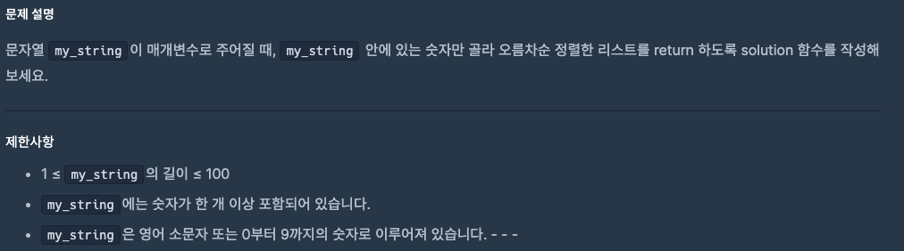
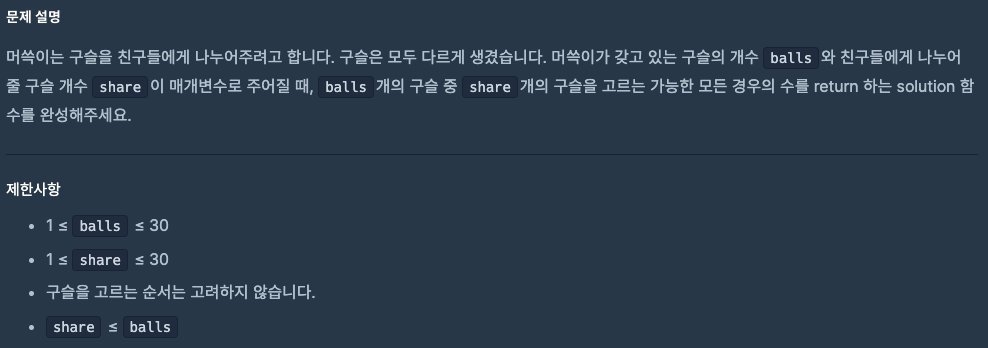

# 0916 공부내용 📖

## 매일매일 1일 면접 대비

### **이미지 크기가 클 경우 렌더링 속도가 느려질 텐데, 이를 개선하기 위한 방법들을 설명해주세요.**

1. **이미지 포맷 최적화**: 전통적인 JPEG나 PNG 대신 압출 효율이 높은 WebP 또는 AVIF와 같은 최신 포맷으로 변환할 수 있다. 이 포맷들은 이미지 품질을 유지하면서도 파일 크기를 크게 줄여준다. 단, 일부 구버전의 브라우저에서는 최신 이미지 포맷을 지원하지 않으므로 호환성을 고려할 필요가 있다.

2. **이미지 사이즈 조정**: 화면에 노출되는 크기에 비해 이미지가 과도하게 큰 경우 이미지를 작게 리사이징할 수 있다. 필요한 크기에 맞게 잘라 서버에서 내려줄 수 있다. 또한, 다양한 디바이스 해상도에 대응하기 위해 Responsive images기술 즉, srcset과 sizes 속성을 활용할 수 있다. 이 경우, 브라우저가 현재 화면 크기에 최적화된 이미지를 선택하여 로드할 수 있다.

3. **지연 로딩 (Lazy Loading)**: 사용자가 화면에 스크롤할 때 해당 위치에 도달하는 이미지가 로드되도록 설정하는 방법이다. 지연 로딩을 통해 초기 로딩 속도를 개선할 수 있다. HTML loading="lazy" 속성을 통해 구현할 수 있으며, 이를 통해 불필요한 이미지 로드를 방지할 수 있다.

4. **CDN(Content Delivery. Network)**: CDN을 적용하면 사용자가 지리적으로 가까운 서버에서 이미지를 다운로드하게 되어 로딩 속도를 단축시킬 수. ㅣㅆ다.

### **WebP나 AVIF는 모든 브라우저에서 지원하지 않는다고 하셨는데, 호환성 문제를 어떻게 해결할 수 있을까요?**

호환성 문제에 대비하기 위해 **HTML의 picture 요소를 통해 fallback 이미지를 적용 할 수 있다.** <picutre> 요소 내부에 WebP나 AVIF와 같은 고효율 포맷을 우선 설정하고, 브라우저가 이를 지원하지 않을 경우 JPEG나 PNG와 같은 기본 포맷을 로드하도록 할 수 있다.

```html
<picture>
  <source srcset="image.avif" type="image/avif" />
  <source srcset="image.webp" type="image/webp" />
  
</picture>
```

## 오늘의 알고리즘 문제

### 1번 문제



```js
function solution(my_string) {
  return my_string
    .match(/\d/g) // 모든 숫자 찾기 → ["1","2","3"]
    .map(Number) // 문자열 → 숫자 변환
    .sort((a, b) => a - b); // 오름차순 정렬
}
```

### 2번 문제



```js
function solution(balls, share) {
  let result = 1;
  for (let i = 1; i <= share; i++) {
    result *= balls--;
    result /= i;
  }
  return result;
}
```

## 리액트 시리즈

### 📦 React 컴포넌트의 Import와 Export

#### 🔍 개요

React에서는 컴포넌트를 다른 파일에서 재사용할 수 있도록 **import**와 **export**를 사용합니다. 이를 통해 코드의 재사용성과 유지보수성을 높일 수 있습니다.

#### 🧱 기본 개념

1. default export와 named export

   - default export: 파일당 하나만 가능하며, import 시 중괄호 없이 사용할 수 있습니다.

   - named export: 여러 개를 export할 수 있으며, import 시 중괄호를 사용하여 가져옵니다.

2. default export 사용 예시

```jsx
Hello.js

function Hello() {
  return <h1>Hello, World!</h1>;
}

export default Hello;

App.js
import Hello from './Hello';

function App() {
  return <Hello />;
}

export default App;
```

3. named export 사용 예시

```jsx
Hello.js;
export function Hello() {
  return <h1>Hello, World!</h1>;
}

App.js;
import { Hello } from "./Hello";

function App() {
  return <Hello />;
}

export default App;
```

4. named export와 default export 혼합 사용

```jsx
Hello.js
export function Hello() {
  return <h1>Hello, World!</h1>;
}

export default function Goodbye() {
  return <h1>Goodbye, World!</h1>;
}

App.js
import Goodbye, { Hello } from './Hello';

function App() {
  return (
    <div>
      <Hello />
      <Goodbye />
    </div>
  );
}

export default App;
```

📂 파일 구조 예시
src/
├── components/
│ ├── Hello.js
│ └── Goodbye.js
└── App.js

✅ 팁

default export는 파일당 하나만 가능하므로, 주로 주요 컴포넌트에 사용합니다.

named export는 여러 개를 export할 수 있어, 유틸리티 함수나 여러 컴포넌트를 export할 때 유용합니다.

혼합 사용은 잘못 사용하면 혼란을 줄 수 있으므로, 일관된 규칙을 정해 사용하는 것이 좋습니다.
