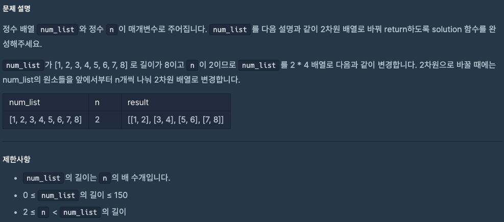
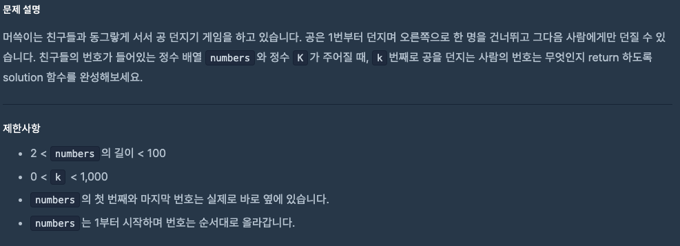

# 0917 공부내용 📖

## 매일매일 1일 면접 대비

### **낙관적 업데이트에 관하여 설명해주세요.**

**낙관적 업데이트**는 **성공적인 상태 업데이트가 이뤄질 거라는 가정 하에 서버 응답 이전에 UI를 미리 업데이트하는 방법**이다. 사용자 요청을 서버가 성공적으로 처리할 거라고 미리 예상하고 UI를 즉각적으로 변경해서 사용자에게 **빠른 반응**을 보여준다.

낙관적 업데이트의 대표적인 예시로 **좋아요 기능**을 들 수 있다. 예를 들어, 사용자가 좋아요 버튼을 클릭하면 서버 응답을 기다리지 않고 화면에 바로 좋아요 클릭에 대한 상태를 보여주는 것이다. 서버 응답이 성공적으로 돌아오면 그대로 두고 혹시나 실패하면 UI에서 해당 좋아요 상태를 다시 해제하거나 오류 메시지를 보여주는 방식이다.

**낙관적 업데이트의 장점**은 서버 응답 속도와 관계없이 즉각적인 피드백을 제공해서 사용자들이 시스템을 빠르게 쓸 수 있다는 점이다. 특히 네트워크 상태가 좋지 않거나 응답 시간이 길어도 사용자 겅혐에는 영향을 덜 미치게 된다.

다만 서버에서 오류가 발생하면 잠시동안 화면에 잘못된 정보가 표시될 수 있다. 따라서 이 경우를 대비한 오류 핸들링(롤백) 로직을 같이 설계해야 하는 주의점이 있다.

### **좋은 사용성을 위해서는 낙관적 업데이트를 가능한 한 많이 적용하는 것이 좋을까??**

많은 곳에 낙관적 업데이트를 적용하는 것이 항상 좋은것은 아니다. 낙관적 업데이트는 **요청이 성공할 가능성이 높고 사용자 경험을 즉시 개선하는 데 큰 장점이 있을 때** 사용하는게 적합하다.

예를 들어 결제나 거래 내역과 같이 중요한 데이터를 다루는 경우에는 낙관적 업데이트가 오히려 사용자 경험을 저해할 수 있다. 낙관적 업데이트를 적용했을 때 **요청에 실패한다면 민감도가 높은 정보가 순간적으로 잘못 표쇠**되면서 사용자 경험을 크게 저해할 수 있기 때문이다.

또한 **네트워크 환경이 불안정한 경우에는 요청에 대한 실패율이 높아지기 때문에 잦은 롤백**이 발생할 수 있다. 이 경우 역시 사용자 경험을 저해할 수 있기 때문에 오히려 서버 응답을 기다리는 것이 더 나은 판단일 수 있다.

_참고_

https://tecoble.techcourse.co.kr/post/2023-08-15-how-to-improve-ux-with-optimistic-update/

## 오늘의 알고리즘 문제

### 1번 문제



```js
function solution(num_list, n) {
  let result = [];

  for (let i = 0; i < num_list.length; i += n) {
    result.push(num_list.slice(i, i + n)); // i부터 i+n까지 잘라서 새 배열 추가
  }

  return result;
}
```

### 2번 문제



```js
function solution(numbers, k) {
  const index = ((k - 1) * 2) % numbers.length;
  return numbers[index];
}
```

## 리액트 시리즈

## Converting HTML to JSX

JSX는 HTML과 비슷하지만, 몇 가지 중요한 차이점이 있다.

| HTML 속성 | JSX 속성    | 설명                                                 |
| --------- | ----------- | ---------------------------------------------------- |
| `class`   | `className` | JSX에서는 예약어 `class` 대신 `className`을 사용     |
| `for`     | `htmlFor`   | `<label>`에서 `for` 대신 `htmlFor`                   |
| 속성 이름 | camelCase   | `tabindex` → `tabIndex`, `onclick` → `onClick`       |
| 속성 값   | `{}` 사용   | 숫자, 변수, 표현식은 중괄호로 감싸기                 |
| 태그 닫기 | 필수        | ``, `<br />` 등 self-closing 형태로 닫아야 함 |

---

### 변환 예시

```html
<!-- HTML -->
<label for="name" class="input-label">이름:</label>
<input type="text" id="name" tabindex="0" />

<!-- JSX -->
<label htmlFor="name" className="input-label">이름:</label>
<input type="text" id="name" tabindex="{0}" />
```

JSX 작성 시 주의할 점
중괄호 {} 로 자바스크립트 표현식을 넣는다.

문자열 속성은 따옴표 " " 로 감싸고, 숫자/불리언/함수 호출은 {}로 감싼다.

여러 단어로 된 속성은 camelCase 로 변환한다.
(단, data-_, aria-_ 속성은 변환하지 않고 그대로 사용)

인라인 스타일은 객체로 작성한다.

```jsx
<div style={{ backgroundColor: "red", fontSize: "14px" }}>Hello</div>
```
