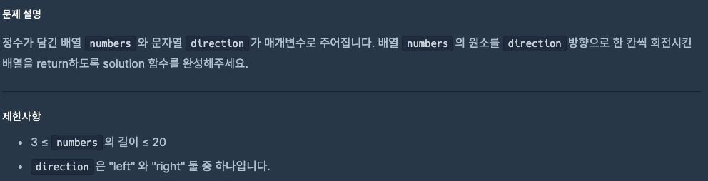

# 0918 공부내용 📖

## 매일매일 1일 면접 대비

### **자바스크립트는 싱글 스레드 언어인데, 어떻게 동시에 여러 작업들을 수행하나요?**

자바스크립트는 **싱글 스레드 언어**이다. 즉, 한번에 하나의 작업만을 처리할 수 있는 **단일 콜 스택**을 가진다. 하지만 브라우저나 Node.js 환경이 제공하는 비동기 처리 메커니즘 덕분에 여러 작업을 동시에 수행할 수 있다.

자바스크립트는 브라우저의 Web API나 Node의 libuv, 이벤트 루프, 테스크 큐를 이용하여 비동기 작업을 동시에 처리한다.

비동기 작업이 발생하면, 해당 작업은 브라우저의 Web API에 위임된다. 예를 들어 setTimeout이나 fetch와 같은 작업이 수행되면 자바스크립트 엔진은 이 작업들을 Web API에 넘기고 다른 코드 실행을 이어간다. Web API에서 비동기 작업이 완료되면 그 작업은 **태스크 큐**에 들어가 대기한다.

이후 **이벤트 루프**가 콜스택이 비어있는지 확인한 뒤 **태스크 큐**에서 대기 중인 작업을 콜스택으로 가져와 실행한다. 이러한 구조 덕분에 자바스크립트는 싱글 스레드임에도 비동기적으로 작업을 처리하여 다양한 작업을 효율적으로 관리할 수 있다. 이 매커니즘 덕분에 UI 인터랙션이 끊기지 않으며 대기 시간이 필요한 작업도 동시에 실행되는 것과 같이 동작하게 된다.

### **앞서 말씀하신 태스크 큐의 종류에는 어떤 게 있나요?**

자바스크립트의 태스크 큐는 크게 **매크로태스크 큐**와 **마이크로테스크 큐**로 나뉜다. 이 큐들은 비동기 작업의 우선순위를 관리하고 이벤트 루프가 적절한 시점에 콜백을 실행하기 위해 사용된다.

1. **매크로태스크 큐**: 일반적인 비동기 작업의 콜백이 저장되는 큐이다. setTimeout, setInterval, I/O작업, 이벤트 핸들러 등은 작업 완료 후 매크로태스크 큐에 콜백을 대기시킨다. 매크로태스크 큐는 이벤트 루프의 한번의 반복마다 하나의 태스크만 처리되므로 UI 업데이트나 다른 작업과 균형있게 진행된다.

2. **마이크태스크 큐**: 더 높은 우선순위가 필요한 비동기 작업들이 대기하는 큐이다. Promise.then, MutationObserver 등의 비동기 콜백이 여기에 저장된다. 이벤트 루프는 매크로태스크를 실행하기 전에 항상 마이크로태스크 큐를 먼저 확인하고 모든 마이크로태스크를 처리한 후. ㅐ크로태스크로 넘어간다. 이 방식으로 마이크로태스크 큐의 작업은 높은 우선순위로 처리된다.

## 오늘의 알고리즘 문제

### 1번 문제



```js
function solution(numbers, direction) {
  if (direction === "right") {
    // 마지막 요소 꺼내서 맨 앞에 넣기
    numbers.unshift(numbers.pop());
  } else {
    // 첫 요소 꺼내서 맨 뒤에 넣기
    numbers.push(numbers.shift());
  }
  return numbers;
}
```

### 2번 문제

```js
function solution(n) {
  let count = 0;

  for (let i = 1; i <= n; i++) {
    let divisorCount = 0;

    // 약수 개수 세기
    for (let j = 1; j <= i; j++) {
      if (i % j === 0) divisorCount++;
    }

    if (divisorCount >= 3) count++;
  }

  return count;
}
```

## 리액트 시리즈

### JSX에서 중괄호로 JavaScript 사용하기

React JSX에서는 **중괄호 `{}`** 를 사용해 자바스크립트 표현식을 넣을 수 있다.  
이를 통해 변수 값, 함수 결과, 객체, 연산 등을 마크업에 쉽게 삽입할 수 있다.

---

#### 1. 문자열 속성은 따옴표로 전달

속성이 단순 문자열이면 `" "` 또는 `' '` 로 감싼다.

```jsx

```

#### 2. 변수 참조는 중괄호 사용

JSX 안에서 변수나 상수를 사용하려면 {}로 감싼다.

```jsx
export default function Avatar() {
  const avatar = "https://i.imgur.com/7vQD0fPs.jpg";
  const description = "Gregorio Y. Zara";
  return (
    
  );
}
텍스트 내용에서도 사용 가능:
```

```jsx
const name = "Gregorio Y. Zara";

export default function TodoTitle() {
  return <h1>{name}'s To Do List</h1>;
}
```

#### 3. 함수 호출 & 연산

중괄호 안에서는 자바스크립트 표현식이 가능하다.
함수 호출, 산술 연산, 문자열 연결 등 모두 가능.

```jsx
const today = new Date();

function formatDate(date) {
  return new Intl.DateTimeFormat("ko-KR", { weekday: "long" }).format(date);
}

export default function TodoList() {
  return <h1>오늘은 {formatDate(today)} 입니다</h1>;
}
```

#### 4. 객체와 이중 중괄호

JSX 속성에 객체를 넘길 때는 이중 중괄호를 쓴다.
첫 번째 중괄호 → JSX 표현식 시작
두 번째 중괄호 → JS 객체 리터럴

```jsx

export default function TodoList() {
  return (
    <ul style={{ backgroundColor: "black", color: "pink" }}>
      <li>공부하기</li>
      <li>코딩하기</li>
      <li>휴식하기</li>
    </ul>
  );
}
객체를 변수로 선언해놓고 넘길 수도 있다.
```

```jsx
const person = {
  name: "Gregorio Y. Zara",
  theme: {
    backgroundColor: "black",
    color: "pink",
  },
};

export default function TodoList() {
  return (
    <div style={person.theme}>
      <h1>{person.name}'s Todos</h1>
      <ul>
        <li>React 공부</li>
        <li>JSX 연습</li>
        <li>프로젝트 진행</li>
      </ul>
    </div>
  );
}
```

#### ⚠️ 주의할 점

- **중괄호 안에는 반드시 표현식(expression)이 와야 한다.**
- 속성 값에 `=` 뒤 중괄호를 쓰면 JS로 평가
- 인라인 스타일 속성은 camelCase로 작성

#### 핵심 요약

| 상황          | 문법          | 예시                               |
| ------------- | ------------- | ---------------------------------- |
| 문자열 고정값 | `" "`         | ``                |
| 변수/표현식   | `{}`          | `<h1>{title}</h1>`                 |
| 객체 리터럴   | `{{ }}`       | `<div style={{ color: "red" }} />` |
| 인라인 스타일 | camelCase key | `backgroundColor`, `fontSize`      |

이렇게 작성하면 JSX 안에서 데이터를 동적으로 표현할 수 있고,
HTML 템플릿을 JS 코드와 자연스럽게 연결할 수 있다.

## JavaSript의 재귀함수

# 🌀 JavaScript 재귀 함수(Recursive Function) 정리

재귀 함수란 **자기 자신을 호출하는 함수**를 의미한다.  
큰 문제를 작은 문제로 나누어 해결할 때 자연스럽게 사용되며, 트리 탐색, 백트래킹, 분할정복 등에 자주 쓰인다.

---

## 1️⃣ 재귀 함수의 기본 구조

재귀 함수는 크게 두 가지로 구성된다:

1. **Base Case (종료 조건)**

   - 더 이상 재귀 호출을 하지 않고 값을 반환하는 조건
   - 필수! 없으면 무한 재귀 → Stack Overflow

2. **Recursive Case (재귀 단계)**
   - 문제를 더 작은 동일 문제로 줄여서 자기 자신을 호출
   - 반환값을 조합하여 최종 결과 생성

```js
function recurse(params) {
  if (종료조건) return 값; // base case
  const result = recurse(작은문제); // recursive case
  return combine(result);
}
```

2️⃣ 콜 스택(호출 스택) 이해
재귀 호출은 스택 구조로 관리된다:

```text

factorial(4)
 -> factorial(3)
    -> factorial(2)
       -> factorial(1) // base case
    <- 반환 2
 <- 반환 6
<- 반환 24
각 호출마다 자기만의 로컬 변수와 반환 지점을 가진다.

base case에 도달하면 차례대로 반환되면서 결과를 조합한다.
```

3️⃣ 재귀 함수 예제 (간단)
3-1. 팩토리얼

```js
function factorial(n) {
  if (n <= 1) return 1;
  return n * factorial(n - 1);
}
```

3-2. 배열 합

```js
function sumArray(arr) {
  if (arr.length === 0) return 0;
  return arr[0] + sumArray(arr.slice(1));
}
```

3-3. 문자열 뒤집기

```js
function reverseString(str) {
  if (str.length <= 1) return str;
  return reverseString(str.slice(1)) + str[0];
}
```

3-4. 피보나치 수열

```js
function fibonacci(n) {
  if (n <= 1) return 1;
  return fibonacci(n - 1) + fibonacci(n - 2);
}
```

4️⃣ 장점과 단점
장점 단점
코드가 간결하고 가독성이 좋음 호출마다 스택이 쌓여 메모리 사용 많음
트리, 그래프, 백트래킹에 자연스러움 깊은 재귀 → Stack Overflow 위험
문제를 분할정복으로 직관적으로 표현 가능 일부 문제는 반복문으로 바꾸는 것이 효율적

5️⃣ 고급 개념
메모이제이션 (Memoization)

이미 계산한 결과를 캐싱하여 중복 호출 방지

피보나치 재귀에서 많이 사용

꼬리 재귀 (Tail Recursion)

재귀 호출이 함수의 마지막 동작일 때

일부 언어에서 최적화 가능 (JS에서는 대부분 지원 X)

재귀 → 반복 변환

깊은 재귀는 명시적 스택 사용으로 반복문 변환 가능

```js
// 트리 inorder iterative
function inorder(root) {
  const stack = [];
  let cur = root;
  const res = [];
  while (cur || stack.length) {
    while (cur) {
      stack.push(cur);
      cur = cur.left;
    }
    cur = stack.pop();
    res.push(cur.val);
    cur = cur.right;
  }
  return res;
}
```

6️⃣ 재귀 사용 팁
항상 종료 조건을 명확히 작성

재귀 깊이가 너무 깊으면 반복문 또는 명시적 스택 사용

재귀 내에서 전역 변수 수정은 최소화 → 디버깅 용이

작은 입력으로 먼저 테스트 → 호출 스택 흐름 확인

7️⃣ 요약(치트시트)
재귀 = 문제를 점점 작은 문제로 나누고 자기 자신을 호출

Base Case 필수!

중복 계산이면 메모이제이션

깊은 재귀 시 스택 오버플로우 주의 → 반복문으로 변환 가능

트리, 그래프, 백트래킹, 분할정복 문제에 강점
