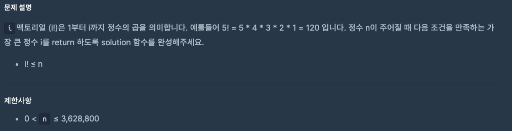
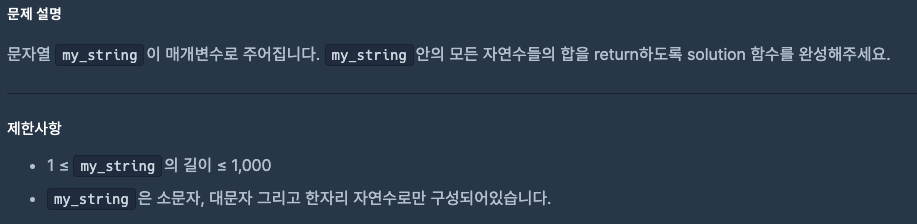

# 0919 공부내용 📖

## 매일매일 1일 면접 대비

### **타입스크립트의 타입과 인터페이스의 차이점을 설명해주세요.**

**interface**는 **객체의 형태를 확장**하는 데 용이한 반면 **type**은 튜플, 인터섹션, 유니온 등을 이용하여 더 **복잡한 타입 정의 및 조합을 표현**하는 데 용이하다.

먼저, **interface**는 선언 병합을 지원해 여러번 선언할 수 있어 주로 객체 타입을 **확장**할 때 유리하다. 동일한 이름을 가진 interface를 여러번 선언하면 이 속성들이 자동으로 합쳐진다.

ex)

```js
interface Person {
  age: number;
  name: string;
  isBirthday: boolean;
}

interface Person {
  address: string;
}

const person1: Person = {
  age: 1,
  name: "abcd",
  isBirthday: false,
  address: "1010",
};
```

위 예제에서 Person interface를 여러 번 선언할 수 있으며 결과적으로 하나의 interface로 병합된다.

반면 **type**으로 선언한 경우에는 동일한 이름을 중복 선언하면 에러가 발생한다. 대신 **type**은 튜플과 같은 **복잡한 타입 표현**이 가능하며 **복잡한 타입 조합**을 위해 인터센셕(&)과 유니온(|) 연산자를 지원한다.

예를 들어 type을 이용해 여러 타입을 조합하는 방식은 다음과 같다

```ts
type BasicInfo = {
  name: string;
  age: number;
};

type ContactInfo = {
  email: string;
  phone: string;
};

// 인터섹션 타입 (&)을 사용해 두 타입을 결합하여 하나의 타입으로 생성
type PersonInfo = BasicInfo & ContactInfo;

const person2: PersonInfo = {
  name: "John",
  age: 30,
  email: "john@example.com",
  phone: "123-456-7890",
};
```

즉, **interface**는 선언 병합을 통해 여러번 선언이 가능하여 주로 객체 타입읠 **확장**하는 데 유리하고 **type**은 튜플 등 복잡한 타입을 사용하고 유연한 연산자를 통해 복잡한 타입 조합을 **표현**하는 데 적합하다.

## 오늘의 알고리즘 문제

### 1번 문제



```js
function solution(n) {
  function find(i, factorial) {
    // (i+1)!이 n보다 크면 현재 i가 답
    if (factorial * (i + 1) > n) return i;
    return find(i + 1, factorial * (i + 1));
  }

  return find(1, 1); // i=1, factorial=1부터 시작
}
```

### 2번 문제



```js
function solution(my_string) {
  return my_string
    .split("") // 문자열 -> 문자 배열
    .map((ch) => (ch >= "0" && ch <= "9" ? Number(ch) : 0)) // 숫자면 변환, 아니면 0
    .reduce((a, b) => a + b, 0); // 합산
}
```

## 리액트 시리즈

## React - Passing Props to a Component (컴포넌트에 Props 전달하기)

React에서 **props**는 부모 → 자식 컴포넌트로 데이터를 전달하는 방법이다.  
HTML 속성과 비슷하게 보이지만 객체, 배열, 함수 등 모든 JavaScript 값을 전달할 수 있다.

---

## 1. Props 전달하기

부모 컴포넌트에서 자식 컴포넌트로 데이터를 보낼 때 속성(attribute) 형태로 작성한다.

```jsx
<Avatar
  person={{ name: "Lin Lanying", imageId: "1bX5QH6" }}
  size={100}
/>
person, size는 props 이름이다.

{{...}}, 100은 props 값이다.
```

## 2. Props 읽기 (자식 컴포넌트)

자식 컴포넌트 함수에서 props 매개변수로 값을 받는다.

```jsx
// props 객체 전체로 받기
function Avatar(props) {
  return ;
}

// 구조 분해 할당 (추천)
function Avatar({ person, size }) {
  return ;
}
```

구조 분해 할당을 사용하면 코드가 깔끔해진다.

## 3. 기본값 설정

부모가 props를 넘기지 않았거나 undefined일 때 사용할 기본값을 지정할 수 있다.

```jsx
function Avatar({ person, size = 100 }) {
  return ;
}
```

⚠️ null이나 0은 기본값이 적용되지 않는다. 오직 undefined일 때만 적용된다.

## 4. JSX Spread 문법으로 props 전달

여러 props를 한 번에 전달할 수 있다.

```jsx
const avatarProps = { person, size: 100 };

<Avatar {...avatarProps} />;
```

⚠️ 너무 많이 사용하면 가독성이 떨어지고 불필요한 props까지 전달될 수 있으므로 주의해야 한다.

## 5. children Prop

컴포넌트 태그 안에 JSX를 넣으면, 해당 내용은 자식 컴포넌트의 children prop으로 전달된다.

```jsx
function Card({ children }) {
  return <div className="card">{children}</div>;
}

// 사용 예시
<Card>
  <Avatar person={...} size={...} />
</Card>
```

## 6. Props의 불변성 (Immutability)

props는 읽기 전용이다.

자식 컴포넌트에서 props를 수정할 수 없다.

값이 변해야 한다면 부모에서 새로운 props를 내려주거나 useState로 상태를 관리해야 한다.

## 실습 예제 코드

아래 예시는 App 컴포넌트가 Avatar에 props를 전달한다.
버튼 클릭 시 size 값이 바뀌어 Avatar가 다시 렌더링된다.

```jsx
import { useState } from "react";

function Avatar({ person, size = 100 }) {
  return (
    <div style={{ textAlign: "center" }}>
      
      <p>{person.name}</p>
    </div>
  );
}

function App() {
  const [size, setSize] = useState(100);
  const person = { name: "Lin Lanying", imageId: "1bX5QH6" };

  return (
    <div style={{ textAlign: "center", marginTop: 30 }}>
      <Avatar person={person} size={size} />
      <button onClick={() => setSize(size + 20)}>크기 키우기</button>
      <button onClick={() => setSize(100)}>초기화</button>
    </div>
  );
}
export default App;
```

## 실행 결과

초기 렌더링 시 size=100으로 표시된다.

"크기 키우기" 버튼 클릭 시 size가 증가하고 Avatar가 다시 렌더링된다.

props는 부모에서 값이 변해야만 다시 적용된다.

## 요약

부모 → 자식으로 데이터 전달할 때 props를 사용한다.

props는 읽기 전용이다.

구조 분해 할당으로 받으면 코드가 깔끔해진다.

기본값(=)을 설정할 수 있다.

여러 props는 spread 문법({...props})으로 한 번에 전달할 수 있다.

중첩 JSX는 children prop으로 전달된다.

값 변경이 필요하면 부모에서 새로운 값을 내려주거나 state를 사용해야 한다.
