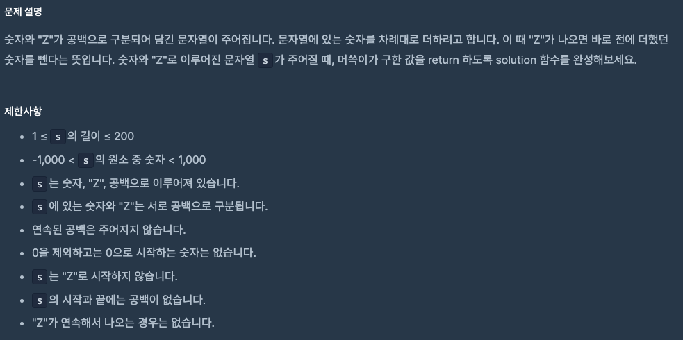

# 0922 공부내용 📖

## 매일매일 1일 면접 대비

### **시맨틱 마크업이란 무엇이며, 왜 중요한가요?**

**시맨틱 마크업**은 HTML요소를 사용하는 방식으로 단순히 시각적 목적이 아닌 **요소의 의미를 잘 나타내도록 작성**하는 방식이다. `<div>와 <span> 같은 비시맨틱 태그가 아닌 <header>, <main>, <section>, <footer>`와 같은 시맨틱 태그를 사용하여 문서 구조와 콘텐츠의 역할을 명확하게 하는 것이다.

**시맨틱 마크업**이 중요한 이유는 크게 두가지이다.

1. **접근성을 개선하기 위함이다.** 시맨틱 요소들은 스크린 리더와 같은 접근성 도구에서 콘텐츠의 구조를 더욱 잘 해석할 수 있게 해주어 시각장애인이나 노인 등 다양한 사용자층이 사이트를 효과적으로 탐색할 수 있게 한다. 이러한 요소를 올바르게 사용하면 더 많은 사람들에게 접근 가능한 웹 환경을 제공할 수 있다.

2. **SEO(검색 엔진 최적화)에 유리하다.** 검색 엔진은 HTML의 시맨틱 구조를 통해 페이지의 구성을 파악한다. 그렇기에 시맨틱 마크업을 적절히 적용하면 검색 엔진이 페이지를 올바르게 파악할 수 있고 그에 따라 검색 결과에서 페이지가 더 잘 노출될 가능성이 높아진다.

따라서 시맨틱 마크업은 단순한 코드 작성 컨벤션을 넘어 **웹 접근성**과 **SEO**를 위한 중요한 요소로 현대 웹 개발에서 필수적인 기술이다.

### **CSR(Client Side Rendering)에서도 시맨틱 마크업이 SEO에 영향을 미친다고 보시나요? 만약 그렇다면, 왜 그렇다고 생각하시나요?**

CSR환경에서는 시맨틱 마크업이 SEO에 주는 영향이 다소 제한적일 수 있지만, 여전히 중요한 역할을 한다.

CSR에서는 대부분의 콘텐츠가 클라이언트 측에서 렌더링되기 때문에 검색 엔진이 페이지를 크롤링할 때 페이지의 초기 컨텐츠만 인식할 가능성이 크다. 그렇더라도 **최근 검색 엔진들은 JavaScript 렌더링을 지원하는 방향으로 진화하고 있으며 페이지의 시맨틱 구조를 어느 정도 파악**할 수 있다. 따라서 시맨틱 마크업을 제대로 적용하면 CSR에서도 검색 엔진이 콘텐츠의 중요한 부분을 더 쉽게 인식하게 되어 검색 결과에 긍정적인 영향을 미칠 수 있다.

## 오늘의 알고리즘 문제

### 1번 문제


```js
function solution(n) {
  if (n <= 1) return [];

  const primes = [];

  // 2로 나누어지는 경우 처리 (짝수)
  if (n % 2 === 0) {
    primes.push(2);
    while (n % 2 === 0) n = n / 2;
  }

  // 홀수 후보로 나눠보기 (3,5,7,...)
  for (let p = 3; p * p <= n; p += 2) {
    if (n % p === 0) {
      primes.push(p);
      while (n % p === 0) n = n / p;
    }
  }

  // 남은 n이 1보다 크면 그 수 자체가 소수 (마지막 소인수)
  if (n > 1) primes.push(n);

  return primes;
}
```

1. 소인수분해 문제
   자연수 n을 소인수로 분해하고 오름차순으로 반환하기

배운 개념:
소수/소인수 개념 이해

반복문으로 나누기 → 나누어떨어질 때까지 나누기 (while 반복 활용)

시간 복잡도 최적화: p \* p <= n까지만 검사해도 충분

마지막 남은 n이 1보다 크면 소수 → 추가

코드 사고 방식:
단순 for문으로 2부터 시작해서 나눠보기

중복되는 소인수는 while로 한 번에 처리

결과는 push 해서 오름차순 배열로 반환

학습 포인트:
수학적 아이디어 + 반복문을 합쳐 문제 해결

최적화 아이디어: 전부 검사하지 않고 √n까지만 확인

while 반복문으로 같은 소인수를 여러 번 제거하는 패턴 익히기

### 2번 문제



```js
function solution(s) {
  const stack = [];

  s.split(" ").forEach((v) => {
    if (v === "Z") {
      stack.pop();
    } else {
      stack.push(Number(v));
    }
  });

  return stack.reduce((a, b) => a + b, 0);
}
```

2. "Z"가 있는 문자열 합 문제

숫자와 "Z"가 들어있는 문자열 → 숫자 더하기, Z면 직전 숫자 빼기

배운 개념:
스택(stack) 활용 → "마지막 넣은 것 제거" 문제에서 유용

배열의 push(), pop() 메서드 활용

마지막에 reduce()로 합 계산

한 번의 순회로 합을 바로 구하는 방식 → 시간 효율 고려

코드 사고 방식:
문자열 → 배열로 분리 (split(" "))

숫자면 push, "Z"면 pop

마지막에 스택 합계 계산

더 효율적으로 → sum 변수를 유지해 pop 시 바로 빼기

학습 포인트:
자료구조 스택의 개념을 문제에 적용

split, forEach, reduce 등 배열 메서드 활용

에러 방지: pop 전에 배열이 비어있는지 체크 (안전한 코드 작성)

## 리액트 시리즈

## React 조건부 렌더링 (Conditional Rendering)

React에서는 UI를 조건에 따라 다르게 보여줘야 할 경우가 많다  
이 문서에서는 여러 방법으로 조건부 렌더링하는 패턴들을 설명하고 예시를 통해 비교해봤다

---

## 조건부로 JSX 반환하기 (if / else)

컴포넌트의 prop이나 state 등의 조건(`isPacked` 같은)을 검사해서, JSX를 다르게 반환했다

```jsx
function Item({ name, isPacked }) {
  if (isPacked) {
    return <li className="item">{name} ✅</li>;
  }
  return <li className="item">{name}</li>;
}
```

true일 때와 아닐 때의 렌더링 트리가 완전히 다를 수 있다

null 반환하기
어떤 경우에는 컴포넌트가 아무것도 렌더링하지 않도록 하고 싶을 때가 있다
이럴 땐 null을 반환하면 된다

```jsx
function Item({ name, isPacked }) {
  if (isPacked) {
    return null;
  }
  return <li className="item">{name}</li>;
}
```

isPacked === true면 UI 상에 그 Item 컴포넌트는 표시 안 되고, 완전히 무시된다

조건부로 JSX 포함 또는 제외하기 (&& 연산자)
부울 조건이 true일 때만 일부 JSX를 렌더링하고, false이면 아무것도 렌더링 안 한다

```jsx
function Item({ name, isPacked }) {
  return (
    <li className="item">
      {name} {isPacked && "✅"}
    </li>
  );
}
```

isPacked && '✅' → isPacked가 참이면 오른쪽 '✅' 렌더, 아니면 false → React는 false를 렌더 안 한다

조건 쪽이 숫자 0이면 0이 화면에 보여질 수 있어서, 비교 연산자(messageCount > 0 && ...)처럼 부울값으로 만드는 게 안전하다

### 삼항 연산자 (? :)

조건이 참인지 아닌지에 따라 둘 중 하나의 JSX를 선택한다

```jsx
function Item({ name, isPacked }) {
  return <li className="item">{isPacked ? name + " ✅" : name}</li>;
}
```

JSX를 좀 더 복잡하게 중첩해서 사용할 수도 있다

```jsx
return <li className="item">{isPacked ? <del>{name + " ✅"}</del> : name}</li>;
```

### 변수에 조건부 JSX 할당하기

if 문/논리 분기를 코드 초반에 변수에 할당해두고, 최종적으로 JSX 안에서 변수 참조 방식으로 사용하면 깔끔하다
복잡한 조건일수록 이런 방식이 코드 유지보수에 유리하다

```jsx
function Item({ name, isPacked }) {
  let itemContent = name;
  if (isPacked) {
    itemContent = name + " ✅";
  }

  return <li className="item">{itemContent}</li>;
}
```

### 주의사항

&&를 쓸 때 조건이 숫자 또는 0일 가능성이 있는 경우
0 && <SomeJSX> 하면 0이 화면에 보여질 수 있어서, 비교 연산자(messageCount > 0 && ...)처럼 부울값으로 만들어야 한다

조건이 복잡해지면 JSX 마크업이 지저분해질 수 있어서, 컴포넌트를 분리하거나 변수/함수를 미리 정의해서 코드 정리하는 게 좋다

---

### 요약

React에서 조건부 렌더링은 JavaScript 문법으로 제어한다 (if, ? :, && 등)

조건에 따라 JSX를 반환하거나, 일부를 제외하거나 완전히 아무것도 렌더링하지 않을 수 있다 (null)

코드를 반복해서 수정해야 하는 부분이 있으면 DRY(=Don't Repeat Yourself) 관점에서 중복을 줄이는 게 좋다

복잡한 조건부 논리는 변수에 할당하거나 자식 컴포넌트로 분리해서 가독성을 유지하는 게 좋다
