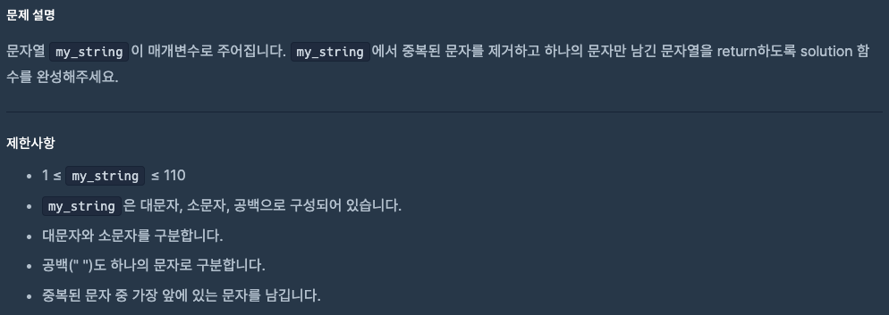
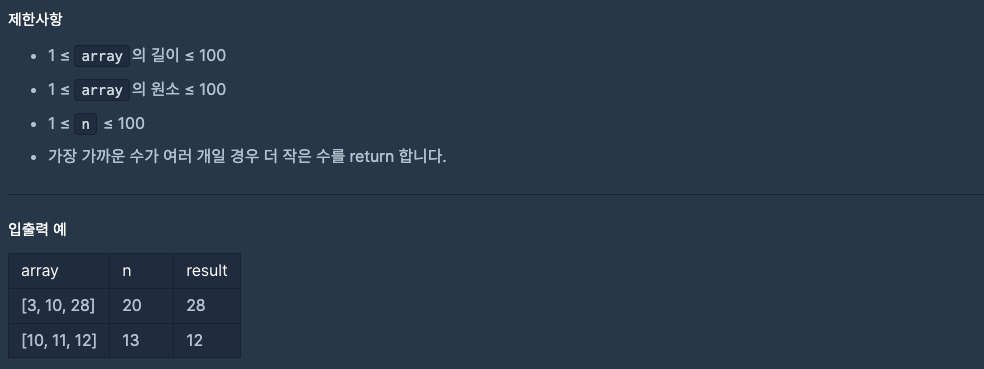

# 0923 공부내용 📖

## 매일매일 1일 면접 대비

### **undefined와 null의 차이점에 대해서 설명해주세요.**

undefined와 null은 **둘 다 '값이 없다'는 의미를 담고 있지만, 그 쓰임새와 의미에는 차이점이 존재한다.** undefined는 자바스크립트에서 자동으로 할당되는 값이다. 변수는 선언했지만 아직 아무 값도 할당하지 않았을 때 자바스크립트는 그 변수에 undefined라는 값을 자동으로 부여한다. 예를 들어

```js
let a;
console.log(a); //undefined
```

처럼 a라는 변수를 선언만 하고 값을 넣지 않으면 자바스크립트가 자동으로 a에 undefined를 할당하게 된다.

null은 개발자가 의도적으로 할당하는 값이다. 특정 변수에 값이 없음을 명확하게 표현하기 위해 개발자가 null을 넣어줄 수 있다.
예를 들어

```js
let b = null;
console.log(b); // null
```

이는 b라는 변수에 의도적으로 값이 비어있다는 것을 나타내기 위해 null을 넣은것이다.

정리해보자면 undefined는 **아직 할당하지 않은 상태를 나타내고 자바스크립트가 자동으로 부여하는 값이다.**

null은 **의도적으로 값을 비워 둔 상태를 나타내며, 개발자가 직접 할당하는 값**이다. 또한 ==(느슨한 비교)에서는 null과 undefined가 같게 처리되지만, ===(엄격한 비교)에서는 다르게 취급된다.

### undefined와 null이 메모리 관리와 관려해서 어떻게 처리되는지 알고 계신가요?

null은 개발자가 명시적으로 메모리를 해제하고자 할 때 사용하는 방법이다. 객체를 참조하던 변수를 null로 설정하면 해당 변수는 더 이상 그 객체를 가리키지 않으므로 참조가 끊어진다. 이렇게 참조가 끊기면 JavaScript와 가비지 컬렉터는 이 객체가 더 이상 사용되지 않는다고 판단해 메모리에서 ㅁ이를 제거할 수 있다. 예를 들어, 다양한 데이터를 담고 있는 객체가 있다고 할 때 더 이상 사용하지 않는다면 그 객체를 null로 설정하여 가비지 컬렉션 대상이 되도록 유도할 수 있다.

반면 undefined는 자바스크립트 엔진이 자동으로 할당하는 값으로 메모리 해제와 직접적인 관련은 없다. 변수가 undefined 상태라고 해서 가비지 컬렉션 대상이 되는것은 아니며, 이 값 자체가 메모리 해제를 유도하는 것은 아니다. undefined는 단지 "값이 정의되지 않음"을 나타낼 뿐이며, 변수 값을 undefined로 설정한다고 해서 자바스크립트가 이를 해제 대상으로 인식하지 않는다. 예를 들어, let a;로 선언된 변수 a는 기본적으로 undefined 상태이지만, 메모리 해제를 유도하지는 않는다.

## 오늘의 알고리즘 문제

### 1번 문제



```js
function solution(my_string) {
  // 1. 문자열을 Set으로 변환 → 중복 자동 제거
  // 2. 전개 연산자(...)로 배열로 변환
  // 3. join("")으로 배열을 다시 문자열로 합침
  return [...new Set(my_string)].join("");
}
```

### 2번 문제



```js
function solution(array, n) {
  return array.reduce((acc, cur) => {
    const accDiff = Math.abs(acc - n);
    const curDiff = Math.abs(cur - n);

    if (curDiff < accDiff) return cur;
    if (curDiff === accDiff && cur < acc) return cur;
    return acc;
  });
}
```

## 리액트 시리즈

## React 리스트 렌더링 정리 + 챌린지 풀이 (Markdown)

### 0. 한눈에 보기

배열 → UI: map() 결과(배열)를 그대로 JSX에 넣어 렌더링함

조건부/부분 렌더링: filter()와 조합

안정적 업데이트: 형제 요소에는 고유한 key 필요 (id 권장, 인덱스 지양)

### 1. 기본 패턴: map()으로 리스트 렌더링

```jsx
const people = [
  "Creola Katherine Johnson: mathematician",
  "Mario José Molina-Pasquel Henríquez: chemist",
  "Mohammad Abdus Salam: physicist",
  "Percy Lavon Julian: chemist",
  "Subrahmanyan Chandrasekhar: astrophysicist",
];

export default function List() {
  const listItems = people.map((person) => <li key={person}>{person}</li>);
  return <ul>{listItems}</ul>;
}
```

map()으로 JSX 배열을 만들고 그대로 반환

문자열 배열처럼 값이 유일하면 값 자체를 key로 쓸 수 있으나, 일반적으로는 객체의 id 사용을 권장

### 2. 데이터 구조화 + 필터링(filter)

```jsx
const people = [
  { id: 0, name: 'Creola Katherine Johnson', profession: 'mathematician' },
  { id: 1, name: 'Mario José Molina-Pasquel Henríquez', profession: 'chemist' },
  { id: 2, name: 'Mohammad Abdus Salam', profession: 'physicist' },
  { id: 3, name: 'Percy Lavon Julian', profession: 'chemist' },
  { id: 4, name: 'Subrahmanyan Chandrasekhar', profession: 'astrophysicist' },
];

export default function ChemistList() {
  const chemists = people.filter((p) => p.profession === 'chemist');
  return (
    <ul>
      {chemists.map((p) => (
        <li key={p.id}>{p.name}</li>
      ))}
    </ul>
  );
}


filter()로 선별 → map()으로 렌더링
```

key는 반복의 최상위 요소(여기서는 <li>)에 부여

### 4. 왜 key가 중요한가

React가 “추가/삭제/이동”을 정확히 파악해 최소 업데이트를 하도록 돕는 식별자

권장: 안정적 고유값(예: DB id)

지양: 배열 인덱스(index)

정렬/삽입/삭제 시 기존 DOM을 잘못 재사용할 위험

### 5. 실전 팁

key는 형제 간 유일하면 충분

리스트 내에서만 의미 있으면 됨(전역 고유까지는 불필요)

중첩 리스트에서도 각 레벨의 반복에 key 지정

큰 리스트에서 비용 큰 계산이 반복되면 메모이제이션 고려

### 챌린지

1. 리스트를 둘로 나누기

목표: 화학자(Chemists) vs 나머지(Everyone Else) 두 그룹 렌더링

```jsx
const people = [
  { id: 0, name: "Creola Katherine Johnson", profession: "mathematician" },
  { id: 1, name: "Mario José Molina-Pasquel Henríquez", profession: "chemist" },
  { id: 2, name: "Mohammad Abdus Salam", profession: "physicist" },
  { id: 3, name: "Percy Lavon Julian", profession: "chemist" },
  { id: 4, name: "Subrahmanyan Chandrasekhar", profession: "astrophysicist" },
];

export default function SplitList() {
  const chemists = people.filter((p) => p.profession === "chemist");
  const others = people.filter((p) => p.profession !== "chemist");

  return (
    <>
      <h2>Chemists</h2>
      <ul>
        {chemists.map((p) => (
          <li key={p.id}>{p.name}</li>
        ))}
      </ul>

      <h2>Everyone Else</h2>
      <ul>
        {others.map((p) => (
          <li key={p.id}>{p.name}</li>
        ))}
      </ul>
    </>
  );
}
```

2. 하나의 컴포넌트에 중첩된 리스트

목표: person.accomplishments 배열을 `<ul><li>`로 렌더링

```jsx
const person = {
  id: 0,
  name: "Creola Katherine Johnson",
  accomplishments: [
    "Calculated trajectories for NASA missions",
    "Awarded Presidential Medal of Freedom",
    "First African-American woman scientist at NASA",
  ],
};

export default function Person() {
  return (
    <section>
      <h2>{person.name}</h2>
      <ul>
        {person.accomplishments.map((item, i) => (
          <li key={i}>{item}</li>
        ))}
      </ul>
    </section>
  );
}
```

데모에서는 인덱스를 key로 사용했지만, 실무에서는 항목별 고유 id 부여 권장

3. 리스트 항목 컴포넌트 추출하기

목표: `<li>` 내용을 Person 컴포넌트로 분리

```jsx
const people = [
  { id: 0, name: "Creola Katherine Johnson", profession: "mathematician" },
  { id: 1, name: "Mario José Molina-Pasquel Henríquez", profession: "chemist" },
  { id: 2, name: "Mohammad Abdus Salam", profession: "physicist" },
];

function Person({ person }) {
  return (
    <li>
      {person.name} ({person.profession})
    </li>
  );
}

export default function PeopleList() {
  return (
    <ul>
      {people.map((p) => (
        <Person key={p.id} person={p} />
      ))}
    </ul>
  );
}
```

항목 UI를 추출하면 가독성/재사용성/테스트 용이성 향상

4. 구분 기호가 있는 리스트

목표: 이름들을 쉼표로 구분해 한 줄로 출력

```jsx
방법 1) join 사용
const people = [
  { id: 0, name: 'Creola Katherine Johnson' },
  { id: 1, name: 'Mario José Molina-Pasquel Henríquez' },
  { id: 2, name: 'Mohammad Abdus Salam' },
];

export default function CommaSeparated() {
  return <p>{people.map((p) => p.name).join(', ')}</p>;
}

방법 2) map + 조건부 구분자
const people = [
  { id: 0, name: 'Creola Katherine Johnson' },
  { id: 1, name: 'Mario José Molina-Pasquel Henríquez' },
  { id: 2, name: 'Mohammad Abdus Salam' },
];

export default function CommaSeparated() {
  return (
    <p>
      {people.map((p, i) => (
        <span key={p.id}>
          {p.name}
          {i < people.length - 1 ? ', ' : ''}
        </span>
      ))}
    </p>
  );
}
```

### 요약

| 주제          | 핵심 포인트                                     |
| ------------- | ----------------------------------------------- |
| 리스트 기본   | `map()`으로 JSX 배열 생성                       |
| 조건부 렌더링 | `filter()`로 데이터 선별                        |
| key 사용      | 형제 간 고유, 보통 `id` 권장                    |
| 인덱스 지양   | 정렬/삽입/삭제 시 재사용 꼬임 방지              |
| 추출/분리     | `<li>` 로직을 컴포넌트로 분리해 유지보수성 향상 |
| 구분자 출력   | `join()` 또는 `map` + 조건문                    |
