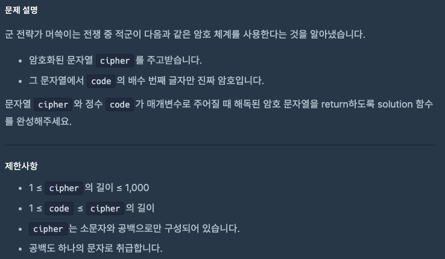

# 0924 공부내용 📖

## 매일매일 1일 면접 대비

### **useEffect가 호출되는 시점에 대해 설명해 주세요.**

React의 useEffect는 컴포넌트의 특정 시점에 자동으로 호출되는 훅으로 크게 컴포넌트가 **마운트, 업데이트, 언마운트**되는 시점에 호출된다.

1. useEffect는 **컴포넌트가 마운트 될 때, 즉, 처음 렌더링되고 나서 호출된다.** 이때, 데이터 초기화나 외부 API호출, 구독 설정 등의 작업을 실행할 수 있다. 이처럼 useEffect는 컴포넌트가 처음 마운트 될때 필요한 초기 작업을 수행할 수 있도록 해준다.

2. useEffect는 **의존성 배열에 지정된 값이 변경될 때마다 다시 호출된다.** 이때, useEffect의 return값으로 지정된 클린업 함수가 이전 props 및 state와 함께 먼저 호출된 후, 본문의 실행 로직이 업데이트 된 props 및 state와 함께 실행된다.

두번째 인자로 주어지는 의존성 배열은 useEffect가 어떤 상태나 props의 변화에 반응할지를 결정한다.
예를 들어,

```jsx
useEffect(() => {...}, [count])
```

위 코드처럼 count상태가 의존성 배열에 있을 경우, count 값이 변경될 때마다 useEffect가 호출된다. 이를 통해 특정 상태나 props가 변경될 때마다 필요한 동작을 수행하도록 할 수 있으며, 컴포넌트의 변화에 따라 동적으로 실행되는 로직을 설정할 수 있다.

**단, 의존성 배열에 넘기지 않을 경우에는 매 렌더링마다 호출**

3. **컴포넌트가 언마운트될 때 useEffect의 return값으로 지정된 클린업 함수가 호출된다.** 이 정리 함수를 이용하여 이벤트 리스너 제거, 타이머 해제, 구독 취소 등의 작업을 수행할 수 있다. 이를 통해 useEffect를 통해 발생한 부수효과를 정리하는 것이다.

즉, useEffect는 컴포넌트가 **처음 렌더링된 후, 의존성 배열의 값이 변경될 때, 컴포넌트가 언마운트 될 때 호출된다.**

## 오늘의 알고리즘 문제

### 1번 문제


```js
function solution(order) {
  // 숫자를 문자열로 변환 후 배열로 쪼갬
  let arr = String(order).split("");

  // 3,6,9가 들어있는 원소만 필터링
  let clap = arr.filter((num) => num === "3" || num === "6" || num === "9");

  // 박수 개수는 남은 원소 개수
  return clap.length;
}
```

### 2번 문제



```js
function solution(cipher, code) {
  return cipher
    .split("") // 문자열 -> 배열
    .filter((_, i) => (i + 1) % code === 0) // code 배수 번째 글자만
    .join(""); // 다시 문자열로 합치기
}
```

## 리액트 시리즈

### 컴포넌트를 순수하게 유지하기

### 학습 목표

- 순수성이란 무엇인지, 버그를 피하는 방법
- 렌더 단계에서 변화를 피하고 컴포넌트를 순수하게 유지하기
- 엄격 모드로 실수 탐지하기

---

### 순수성: 공식으로서의 컴포넌트

- **순수 함수** 특징:
  - 외부 객체/변수 변경하지 않음
  - 같은 입력 → 항상 같은 출력

```js
function double(number) {
  return 2 * number;
}
```

React는 컴포넌트를 순수 함수로 가정

같은 props → 항상 같은 JSX 반환

예시

```jsx

function Recipe({ drinkers }) {
  return (
    <ol>
      <li>Boil {drinkers} cups of water.</li>
      <li>Add {drinkers} spoons of tea and {0.5 * drinkers} spoons of spice.</li>
      <li>Add {0.5 * drinkers} cups of milk to boil and sugar to taste.</li>
    </ol>
  );
}

export default function App() {
  return (
    <section>
      <h1>Spiced Chai Recipe</h1>
      <h2>For two</h2>
      <Recipe drinkers={2} />
      <h2>For a gathering</h2>
      <Recipe drinkers={4} />
    </section>
  );
}
drinkers={2} → 항상 2 cups of water

drinkers={4} → 항상 4 cups of water
```

## 사이드 이펙트(Side Effects)

사이드 이펙트: 함수가 외부 세계에 변화를 주는 것

React 컴포넌트는 렌더링 과정에서 사이드 이펙트 금지

ex) 네트워크 요청, DOM 수정, 로그 출력 등

사이드 이펙트는 이벤트 핸들러나 Effect Hook에 넣어야 함

순수성 깨는 예시

```jsx
let guest = 0;

function Cup() {
  guest++;
  return <h2>Tea cup for guest #{guest}</h2>;
}

export default function TeaSet() {
  return (
    <>
      <Cup />
      <Cup />
      <Cup />
    </>
  );
}
```

위 코드는 매번 다른 결과를 만들어 순수하지 않음

## 순수성 지키는 방법

props와 state만 사용해서 JSX 반환

외부 변수 변경 금지

같은 입력 → 같은 출력 보장

수정된 예시

```jsx
function Cup({ guest }) {
  return <h2>Tea cup for guest #{guest}</h2>;
}

export default function TeaSet() {
  return (
    <>
      <Cup guest={1} />
      <Cup guest={2} />
      <Cup guest={3} />
    </>
  );
}
```

## React 엄격 모드(Strict Mode)

개발 모드에서 컴포넌트를 두 번 렌더링하여 순수성 위반 여부 탐지

실제 배포 환경에는 영향 없음

## 요약

- 컴포넌트는 순수 함수처럼 작성

- 렌더링 시 사이드 이펙트 금지

- 같은 입력 → 같은 출력

- 엄격 모드로 실수 잡기

## 챌린지

1. 컴포넌트에서 사이드 이펙트를 제거하기
   아래 코드는 외부 변수(guest)를 증가시키며 순수성을 깨뜨린다.

```jsx
let guest = 0;

function Cup() {
  guest++;
  return <h2>Tea cup for guest #{guest}</h2>;
}

export default function TeaGathering() {
  return (
    <>
      <Cup />
      <Cup />
      <Cup />
    </>
  );
}
```

문제:

같은 컴포넌트를 여러 번 렌더링하면 매번 다른 결과가 나온다.

외부 변수를 변경하지 않고 props만 사용하도록 고쳐야 한다.

```jsx
function Cup({ guest }) {
  return <h2>Tea cup for guest #{guest}</h2>;
}

export default function TeaGathering() {
  return (
    <>
      <Cup guest={1} />
      <Cup guest={2} />
      <Cup guest={3} />
    </>
  );
}
```

# 챌린지 정답: 컴포넌트에서 사이드 이펙트를 제거하기

## 문제 코드 (순수하지 않은 예시)

1. Cup 컴포넌트

```jsx
function Cup({ guest }) {
  return <h2>Tea cup for guest #{guest}</h2>;
}
```

guest 값을 props로 전달받음

컴포넌트는 외부 변수를 수정하지 않고, 오직 입력(props) 만으로 출력(JSX)을 결정

따라서 순수 함수처럼 동작

2. TeaGathering 컴포넌트

```jsx
export default function TeaGathering() {
  return (
    <>
      <Cup guest={1} />
      <Cup guest={2} />
      <Cup guest={3} />
    </>
  );
}
```

각 Cup 컴포넌트에 서로 다른 guest 값을 props로 전달

결과적으로:

첫 번째 손님 → Tea cup for guest #1

두 번째 손님 → Tea cup for guest #2

세 번째 손님 → Tea cup for guest #3

## 핵심 요약

잘못된 방식: 외부 변수를 직접 수정하여 출력값 변화 발생

올바른 방식: props와 state만 이용하여 결과를 만들기

이 패턴을 따르면 컴포넌트는 항상 같은 입력에 대해 같은 출력을 내는 순수 함수가 됨
