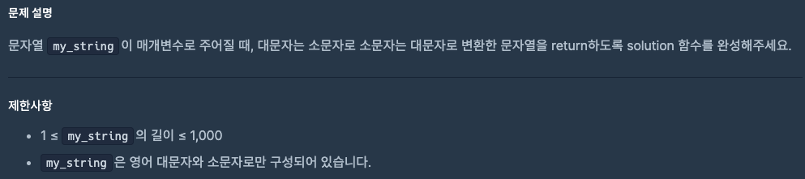
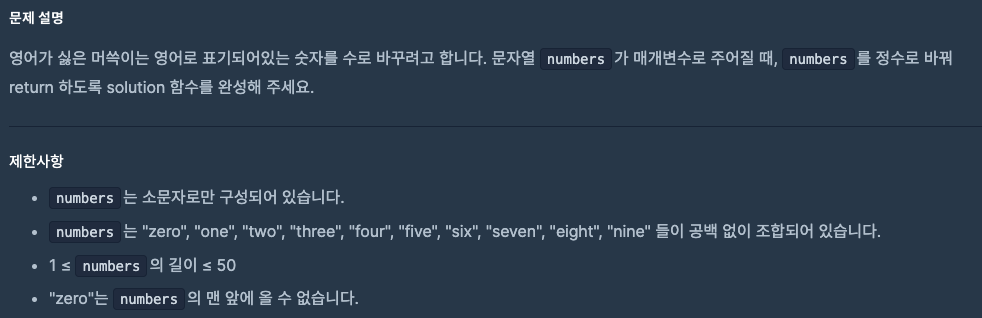
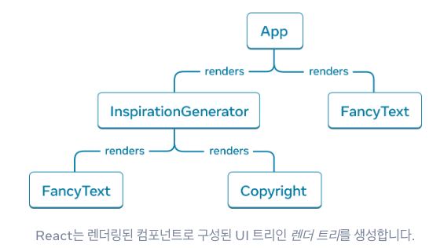
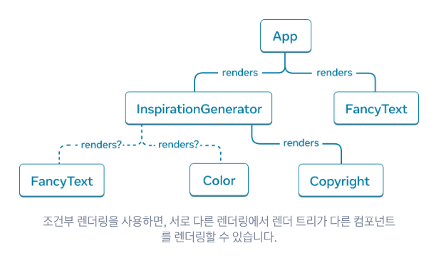

# 0925 공부내용 📖

## 매일매일 1일 면접 대비

### **자바스크립트 Promise에 대해서 아는 대로 설명해주세요.**

자바스크립트의 Promise는 **비동기 작업을 관리하고 해당 작업의 성공 또는 실패 결과를 나중에 사용할 수 있도록 하는 객체**이다. 즉, Promise는 비동기 작업의 완료 여부를 약속해주는 개념이라고 할 수 있다.

자바스크립트는 **비동기 처리를 위한 콜백 함수**를 많이 사용한다. 하지만 콜백함수는 코드가 복잡해짐에 따라 콜백이 중첩되는 **"콜백지옥"**문제를 야기할 수 있다. Promise는 이러한 비동기 처리의 가독성을 높이고 코드의 흐름을 명확하게 관리할 수 있도록 도와주는 방식이다.

Promise는 3가지 상태를 가지게 된다.

1. 비동기 작업이 아직 완료되지 않은 초기 상태를 나타내는 Pendin

2. 비동기 작업이 성공적으로 완료되어 값을 반환한 상태인 Fulfilled

3. 비동기 작업이 실패하여 오류를 반환한 상태인 Rejected

Promise 객체는 비동기 작업을 수행할 함수를 인자로 받아서 실행하며 이 함수는 reslove()와 reject()라는 두가지 콜백을 받는다.

reslove()는 비동기 작업이 성공했을 때 값을 전달하여 Promise를 fulfilled 상태로 전환하고 reject()는 비동기 작업이 실패했을 때 오류를 전달하여 Promise를 rejected 상태로 전환한다.

Pending 상태에서 Fulfilled나 Rejected 상태로 전환되면 이후에는 다른 상태로 전환되지 않으며 그 결과 값을 통해 해당 작업의 성공 여부를 알 수 있다.

Promise는 **코드의 가독성을 높이고 비동기 작업의 흐름을 제어**하는 데에 매우 유용하다. 특히 여러개의 Promise를 순차적으로 연결할수도 있고 Promise.all()이나 allSettled() 같은 메서드를 통해 병렬로 비동기 작업을 처리할 수도 있다.

### Promise의 단점

1. **복잡한 에러 처리**: Promise는 단일 체인에서는 에러 처리가 간단하지만 여러 Promise가 중첩되거나 서로 다른 비동기 흐름에서 에러가 발생할 경우 복잡도가 증가할 수 있다. 예를 들어, then() 체인 내의 중간 단계에서 오류가 발생하면 catch 블록에서 이를 캐치할 수 있지만 특정 단계에서만 발생하는 에러를 세밀하게 다루기가 어렵다. 따라서 비동기 흐름에서 발생하는 다양한 에러를 모두 처리하려면 코드가 복잡해질 수 있다.

2. **콜백 지옥을 완전히 해결하지는 못한다**: Promise는 콜백 지옥 문제를 어느 정도는 해결하지만 비동기 작업이 복잡하게 중첩되면 여전히 콜백과 유사하게 여러 then() 메서드가 연속해서 사용되며 가독성이 떨어질 수 있다. 여러 Promise를 순차적으로 실행해야 할 때 then() 체인을 계속 사용하면 코드의 들여쓰기 구조가 복잡해지고 이해하기 어려워지는 문제점이 있다.
   이는 async/await을 통해 개선할 수 있다.

## 오늘의 알고리즘 문제

### 1번 문제



```js
function solution(my_string) {
  return my_string
    .split("")
    .map((char) =>
      char === char.toLowerCase() ? char.toUpperCase() : char.toLowerCase()
    )
    .join("");
}
```

### 2번 문제



```js
function solution(numbers) {
  // 영어 숫자 단어를 배열로 정의
  const numWords = [
    "zero",
    "one",
    "two",
    "three",
    "four",
    "five",
    "six",
    "seven",
    "eight",
    "nine",
  ];

  // numbers 문자열에서 영어 단어를 숫자로 치환
  numWords.forEach((word, index) => {
    numbers = numbers.replaceAll(word, index);
  });

  // 최종적으로 숫자 문자열을 정수로 변환하여 반환
  return Number(numbers);
}
```

## 리액트 시리즈

## UI를 트리로 이해하기

### 핵심 개념

- **UI = 트리 구조**

  - 웹페이지나 앱의 UI는 트리(tree) 구조로 표현됨.
  - 트리의 루트(root)부터 시작해 여러 개의 자식 노드(children)로 분기.
  - 각 노드는 다른 노드를 포함하거나, 더 이상 쪼개지지 않는 "리프(leaf)" 노드가 될 수 있음.

- **리액트 컴포넌트와 트리**

  - React에서는 컴포넌트들이 모여 트리를 형성함.
  - 루트 컴포넌트(App)가 있고, 그 아래로 여러 개의 자식 컴포넌트들이 중첩됨.
  - UI를 잘게 쪼개서 작은 컴포넌트 단위로 트리를 구축.

- **HTML과의 비교**

  - HTML 자체도 트리 구조(DOM tree)임.
  - `<html>` → `<body>` → `<div>` → `<button>` 같은 계층 구조와 동일한 개념.
  - React의 컴포넌트 트리와 DOM 트리가 연결되어 렌더링 됨.

- **트리 시각화**
  - UI를 트리로 그려보면 구조를 쉽게 이해할 수 있음.
  - 부모-자식 관계를 시각적으로 나타내면 "어떤 컴포넌트가 어디에 속하는지" 명확하게 파악 가능.

---



### 요약 표

| 주제         | 핵심 포인트                                        |
| ------------ | -------------------------------------------------- |
| UI와 트리    | UI는 계층적 구조, 루트에서 시작해 자식 노드로 확장 |
| React와 트리 | 컴포넌트가 모여 트리를 형성, 루트(App) 아래로 중첩 |
| HTML과 비교  | DOM 자체도 트리 구조, React 트리와 매칭되어 렌더링 |
| 트리 시각화  | 컴포넌트 관계를 한눈에 이해 가능                   |

---

### 정리

- React UI는 트리 구조로 표현됨.
- 컴포넌트는 부모-자식 관계를 맺으며 트리를 형성.
- DOM도 트리 구조이므로 React 트리와 잘 맞음.
- 트리로 시각화하면 UI 구조를 쉽게 이해할 수 있음.



## Js async/await, promise, callback

### 자바스크립트 비동기 처리 정리

### 1. 비동기 처리란?

- **비동기(asynchronous)**: 코드 실행이 순차적으로만 진행되지 않고, 특정 작업(예: 네트워크 요청, 파일 읽기, 타이머 등)이 끝날 때까지 기다리지 않고 다음 코드로 넘어가는 방식
- 장점: 프로그램이 **블로킹(blocking)** 되지 않아 성능과 사용자 경험 개선
- 예시: 서버에서 데이터를 받아오는 동안 UI가 멈추지 않고 작동함

---

### 2. 콜백 (Callback)

- 비동기 작업이 끝난 후 실행될 함수를 **매개변수로 전달**하는 방식
- 단점: **콜백 지옥(Callback Hell)** 발생 → 코드 가독성이 떨어짐

```js
function fetchData(callback) {
  setTimeout(() => {
    callback("데이터 도착");
  }, 1000);
}

fetchData((result) => {
  console.log(result); // "데이터 도착"
});
```

### 3. 프로미스 (Promise)

ES6에서 도입된 비동기 처리 객체

3가지 상태를 가짐:

pending: 대기 중

fulfilled: 성공

rejected: 실패

```js
const promise = new Promise((resolve, reject) => {
  setTimeout(() => {
    resolve("성공");
    // reject("실패");
  }, 1000);
});

promise
  .then((result) => console.log(result)) // 성공 시 실행
  .catch((error) => console.error(error)) // 실패 시 실행
  .finally(() => console.log("완료")); // 무조건 실행
```

### 4. async / await

ES8에서 도입

Promise 기반 코드를 동기식처럼 작성 가능

await는 Promise가 처리될 때까지 기다림

```js
async function getData() {
  try {
    const result = await new Promise((resolve) =>
      setTimeout(() => resolve("데이터"), 1000)
    );
    console.log(result); // "데이터"
  } catch (error) {
    console.error(error);
  }
}

getData();
```

### 5. 주요 비교

방식 특징 장점 단점
콜백 함수 인자로 후속 작업 전달 간단, 초창기 방식 콜백 지옥, 에러 처리 어려움
Promise then, catch 체이닝 에러 처리 가능, 가독성 ↑ 체이닝이 길어질 경우 여전히 복잡
async/await Promise 위 문법적 설탕 (syntactic sugar) 동기 코드처럼 작성, 가독성 ↑ 병렬 처리 시 Promise.all 필요

### 6. 병렬 처리 (Promise.all)

여러 비동기 작업을 동시에 실행하고 모두 끝날 때까지 기다림

```js
async function fetchAll() {
  const [a, b] = await Promise.all([
    new Promise((res) => setTimeout(() => res("A"), 1000)),
    new Promise((res) => setTimeout(() => res("B"), 2000)),
  ]);
  console.log(a, b); // "A" "B"
}
fetchAll();
```

### 핵심 요약

콜백 → 초창기 방식, 가독성 낮음

Promise → 상태 관리 및 에러 처리 가능

async/await → 가장 직관적, 동기식 코드처럼 작성 가능

병렬 처리 필요 시 Promise.all 사용
