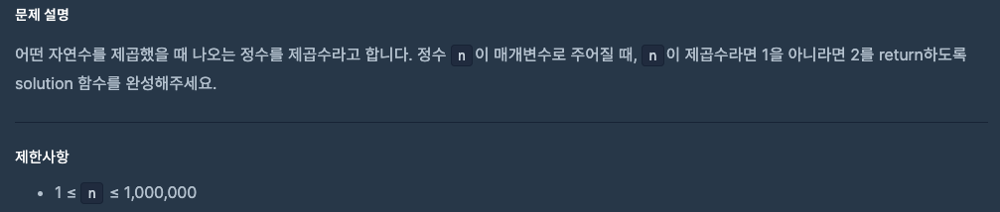
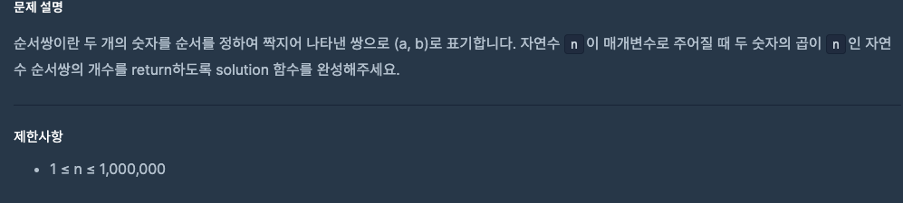

# 0829 공부내용 📖

## 매일매일 1일 면접 대비

### __scipt 태그에서 syncd와 defer의 차이점에 대해서 설명해주세요.__
두 속성 모두 스크립트를 비동기적으로 로드한다는 공통점이 있지만 실행 시점에서 중요한 차이가 있다.

- __async__ 속성
1. 스크립트를 비동기적으로 다운로드한다.
2. 다운로드가 완료되면 즉시 실행된다.
3. HTML 파싱과 병렬로 진행되지만 스크립트 실행 시 HTML 파싱이 잠시 중단된다.
4. 여러 async 스크립트가 있을 경우, 다운로드가 완료되는 순서대로 실행된다.

- defer 속성
1. 스크립트를 비동기적으로 다운로드한다.
2. HTML 문서 파싱이 완전히 끝난 후에 실행된다.
3. DOMContentLoaded 이벤트 발생 직전에 실행된다.
4. 여러 defer 스크립트가 있을 경우 HTML에 작성된 순서대로 실행된다.

따라서, 실행 순서가 중요한 스크립트나 메인 어플리케이션의 로직을 담고 있는 스크립트의 경우 defer를 사용하고, 독립적으로 실행되는 스크립트의 경우 async를 사용하는 것이 적절하다.


## 오늘의 알고리즘 문제

### 1번 문제


```js
function solution(n) {
  for (let i = 1; i * i <= n; i++) {
    if (i * i === n) {
      return 1; // 제곱수
    }
  }
  return 2; // 제곱수 아님
}

// Math.sqrt(n) 과 Number.isInteger()를 사용하면 더 쉽게 구할 수 있다.
Math.sqrt(n)으로 제곱근을 구함

Number.isInteger()로 정수 여부 확인

정수라면 → 제곱수이므로 1 반환

아니면 → 제곱수가 아니므로 2 반환

function solution(n) {
  return Number.isInteger(Math.sqrt(n)) ? 1 : 2;
}

```

### 2번 문제


```js
function solution(n) {
  let count = 0;
  for (let i = 1; i <= n; i++) {
    if (n % i === 0) {
      count++;
    }
  }
  return count;
}
```
  